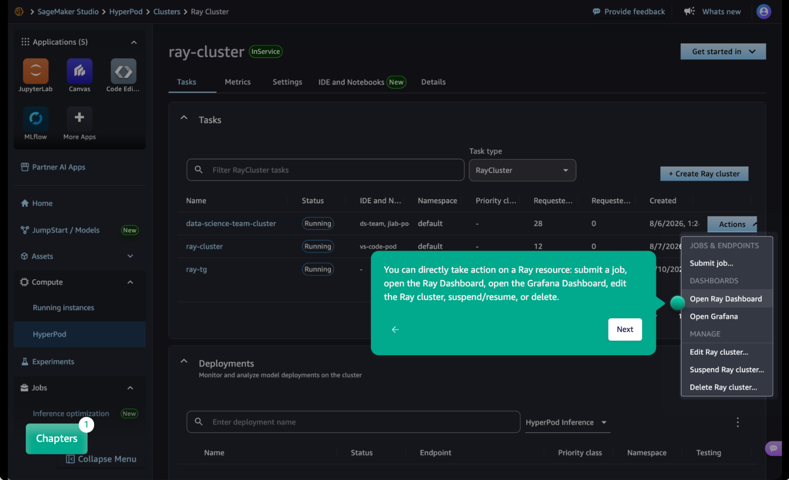

# Amazon SageMaker Studio (web-based development)

Amazon SageMaker Studio is the purpose-built interface for data scientists and ML engineers. From the
**Tasks** tab you can manage
`RayCluster`, `RayJob`, `RayCronJob`, and
`RayService` resources without writing Kubernetes manifests. Studio reads
and writes the same KubeRay custom resources that the operator reconciles, so a resource you
create in Studio is identical to one you apply with `kubectl`.

Studio suits teams that want data scientists productive on Ray without Kubernetes
knowledge. Both surfaces act on the same resources, and you can move between them.

The following screenshot shows the **Tasks** tab with the
**Actions** menu open on a Ray cluster.

## Before you begin

Configure a SageMaker AI domain and grant it access to your cluster once, before anyone uses
the **Tasks** tab. For more information, see [Setting up Studio for Ray](sagemaker-hyperpod-ray-studio-setup.md "sagemaker-hyperpod-ray-studio-setup.md").

###### Topics

- [Setting up Studio for Ray](sagemaker-hyperpod-ray-studio-setup.md "sagemaker-hyperpod-ray-studio-setup.md")
