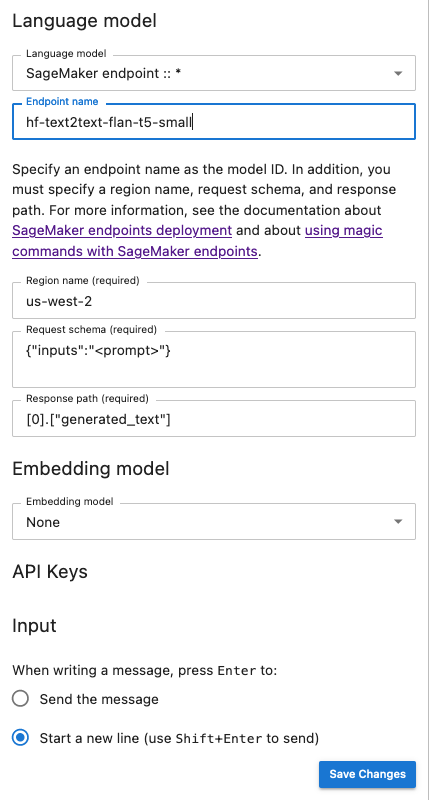

# Configure your model

provider

###### Note

In this section, we assume that the language and embedding models that you plan to use
are already deployed. For models provided by AWS, you should already have the ARN of your
SageMaker AI endpoint or access to Amazon Bedrock. For other model providers, you should have the API key
used to authenticate and authorize requests to your model.

Jupyter AI supports a wide range of model providers and language models, refer to the list
of its [supported models](https://jupyter-ai.readthedocs.io/en/latest/users/index.html#model-providers "https://jupyter-ai.readthedocs.io/en/latest/users/index.html#model-providers") to stay updated on the latest available models. For information
on how to deploy a model provided by JumpStart, see [Deploy a Model](jumpstart-deploy.md "jumpstart-deploy.md") in the
JumpStart documentation. You need to request access to [Amazon Bedrock](https://aws.amazon.com/bedrock/ "https://aws.amazon.com/bedrock/") to use it as your model provider.

The configuration of Jupyter AI varies depending on whether you are using the chat UI or
magic commands.

## Configure your model

provider in the chat UI

###### Note

You can configure several LLMs and embedding models following the same instructions.
However, you must configure at least one **Language model**.

###### To configure your chat UI

1. In JupyterLab, access the chat interface by choosing the chat icon (
   
   ) in the left navigation panel.
2. Choose the configuration icon (
   
   ) in the top right corner of the left pane. This opens the Jupyter AI
   configuration panel.
3. Fill out the fields related to your service provider.
   - **For models provided by JumpStart or
     Amazon Bedrock**
     - In the **language model** dropdown list, select
       `sagemaker-endpoint` for models deployed with JumpStart or
       `bedrock` for models managed by Amazon Bedrock.
     - The parameters differ based on whether your model is deployed on SageMaker AI or
       Amazon Bedrock.
       - For models deployed with JumpStart:
         - Enter the name of your endpoint in **Endpoint
           name**, and then the AWS Region in which your model is
           deployed in [Region name](sagemaker-jupyterai-use.md#sagemaker-jupyterai-region-name "sagemaker-jupyterai-use.md#sagemaker-jupyterai-region-name"). To retrieve the ARN of the
           SageMaker AI endpoints, navigate to [https://console.aws.amazon.com/sagemaker/](https://console.aws.amazon.com/sagemaker/ "https://console.aws.amazon.com/sagemaker/") and
           then choose **Inference** and
           **Endpoints** in the left menu.
         - Paste the JSON of the [Request
           schema](sagemaker-jupyterai-use.md#sagemaker-jupyterai-request-schema "sagemaker-jupyterai-use.md#sagemaker-jupyterai-request-schema") tailored to your model, and the
           corresponding [Response path](sagemaker-jupyterai-use.md#sagemaker-jupyterai-response-path "sagemaker-jupyterai-use.md#sagemaker-jupyterai-response-path") for parsing the model's
           output.

         ###### Note

         You can find the request and response format of various of
         JumpStart foundation models in the following [example notebooks](https://github.com/aws/amazon-sagemaker-examples/tree/main/introduction_to_amazon_algorithms/jumpstart-foundation-models "https://github.com/aws/amazon-sagemaker-examples/tree/main/introduction_to_amazon_algorithms/jumpstart-foundation-models"). Each notebook is named after the model
         it demonstrates.

       - For models managed by Amazon Bedrock: Add the AWS profile storing your AWS
         credentials on your system (optional), and then the AWS Region in which
         your model is deployed in [Region name](sagemaker-jupyterai-use.md#sagemaker-jupyterai-region-name "sagemaker-jupyterai-use.md#sagemaker-jupyterai-region-name").

     - (Optional) Select an [embedding model](sagemaker-jupyterai-overview.md#sagemaker-jupyterai-embedding-model "sagemaker-jupyterai-overview.md#sagemaker-jupyterai-embedding-model") to which you have access. Embedding models are used to
       capture additional information from local documents, enabling the text
       generation model to respond to questions within the context of those
       documents.
     - Choose **Save Changes** and navigate to the left arrow icon (
       
       ) in the top left corner of the left pane. This opens the
       Jupyter AI chat UI. You can start interacting with your model.

   - **For models hosted by third-party
     providers**
     - In the **language model** dropdown list, select your
       provider ID. You can find the details of each provider, including their ID, in
       Jupyter AI [list of model providers](https://jupyter-ai.readthedocs.io/en/latest/users/index.html#model-providers "https://jupyter-ai.readthedocs.io/en/latest/users/index.html#model-providers").
     - (Optional) Select an [embedding model](sagemaker-jupyterai-overview.md#sagemaker-jupyterai-embedding-model "sagemaker-jupyterai-overview.md#sagemaker-jupyterai-embedding-model") to which you have access. Embedding models are used to
       capture additional information from local documents, enabling the text
       generation model to respond to questions within the context of those
       documents.
     - Insert your models' API keys.
     - Choose **Save Changes** and navigate to the left arrow icon (
       
       ) in the top left corner of the left pane. This opens the
       Jupyter AI chat UI. You can start interacting with your model.

The following snapshot is an illustration of the chat UI configuration panel set to
invoke a Flan-t5-small model provided by JumpStart and deployed in SageMaker AI.



### Pass extra model

parameters and custom parameters to your request

Your model may need extra parameters, like a customized attribute for user agreement
approval or adjustments to other model parameters such as temperature or response length.
We recommend configuring these settings as a start up option of your JupyterLab
application using a Lifecycle Configuration. For information on how to create a Lifecycle
Configuration and attach it to your domain, or to a user profile from the [SageMaker AI console](https://console.aws.amazon.com/sagemaker/ "https://console.aws.amazon.com/sagemaker/"), see [Create and associate a lifecycle
configuration](studio-lcc.md "studio-lcc.md"). You can choose your LCC script when creating a space for your
JupyterLab application.

Use the following JSON schema to configure your [extra parameters](sagemaker-jupyterai-use.md#sagemaker-jupyterai-extra-model-params "sagemaker-jupyterai-use.md#sagemaker-jupyterai-extra-model-params"):

```
{
  "AiExtension": {
    "model_parameters": {
      "<provider_id>:<model_id>": { Dictionary of model parameters which is unpacked and passed as-is to the provider.}
      }
    }
  }
}
```

The following script is an example of a JSON configuration file that you can use when
creating a JupyterLab application LCC to set the maximum length of an [AI21
Labs Jurassic-2 model](../../../bedrock/latest/userguide/model-parameters-jurassic2.md "../../../bedrock/latest/userguide/model-parameters-jurassic2.md") deployed on Amazon Bedrock. Increasing the length of the model's
generated response can prevent the systematic truncation of your model's response.

```
#!/bin/bash
set -eux

mkdir -p /home/sagemaker-user/.jupyter

json='{"AiExtension": {"model_parameters": {"bedrock:ai21.j2-mid-v1": {"model_kwargs": {"maxTokens": 200}}}}}'
# equivalent to %%ai bedrock:ai21.j2-mid-v1 -m {"model_kwargs":{"maxTokens":200}}

# File path
file_path="/home/sagemaker-user/.jupyter/jupyter_jupyter_ai_config.json"

#jupyter --paths

# Write JSON to file
echo "$json" > "$file_path"

# Confirmation message
echo "JSON written to $file_path"

restart-jupyter-server

# Waiting for 30 seconds to make sure the Jupyter Server is up and running
sleep 30

```

The following script is an example of a JSON configuration file for creating a
JupyterLab application LCC used to set additional model parameters for an [Anthropic Claude model](../../../bedrock/latest/userguide/model-parameters-claude.md "../../../bedrock/latest/userguide/model-parameters-claude.md") deployed on Amazon Bedrock.

```
#!/bin/bash
set -eux

mkdir -p /home/sagemaker-user/.jupyter

json='{"AiExtension": {"model_parameters": {"bedrock:anthropic.claude-v2":{"model_kwargs":{"temperature":0.1,"top_p":0.5,"top_k":25
0,"max_tokens_to_sample":2}}}}}'
# equivalent to %%ai bedrock:anthropic.claude-v2 -m {"model_kwargs":{"temperature":0.1,"top_p":0.5,"top_k":250,"max_tokens_to_sample":2000}}

# File path
file_path="/home/sagemaker-user/.jupyter/jupyter_jupyter_ai_config.json"

#jupyter --paths

# Write JSON to file
echo "$json" > "$file_path"

# Confirmation message
echo "JSON written to $file_path"

restart-jupyter-server

# Waiting for 30 seconds to make sure the Jupyter Server is up and running
sleep 30

```

Once you have attached your LCC to your domain, or user profile, add your LCC to your
space when launching your JupyterLab application. To ensure that your configuration file
is updated by the LCC, run `more ~/.jupyter/jupyter_jupyter_ai_config.json` in
a terminal. The content of the file should correspond to the content of the JSON file
passed to the LCC.

## Configure your

model provider in a notebook

###### To invoke a model via Jupyter AI within JupyterLab or Studio Classic notebooks using the

`%%ai` and `%ai` magic commands

1. Install the client libraries specific to your model provider in your notebook
   environment. For example, when using OpenAI models, you need to install the
   `openai` client library. You can find the list of the client libraries
   required per provider in the _Python package(s)_ column
   of the Jupyter AI [Model providers list](https://jupyter-ai.readthedocs.io/en/latest/users/index.html#model-providers "https://jupyter-ai.readthedocs.io/en/latest/users/index.html#model-providers").

###### Note

For models hosted by AWS, `boto3` is already installed in the SageMaker AI
Distribution image used by JupyterLab, or any Data Science image used with
Studio Classic. 2. _ **For models hosted by AWS**
Ensure that your execution role has the permission to invoke your SageMaker AI endpoint
for models provided by JumpStart or that you have access to Amazon Bedrock.
_ **For models hosted by third-party
providers**
Export your provider's API key in your notebook environment using environment
variables. You can use the following magic command. Replace the
`provider_API_key` in the command by the environment variable found in
the _Environment variable_ column of the Jupyter AI
[Model providers list](https://jupyter-ai.readthedocs.io/en/latest/users/index.html#model-providers "https://jupyter-ai.readthedocs.io/en/latest/users/index.html#model-providers") for your provider.
`
	%env provider_API_key=your_API_key
	`
