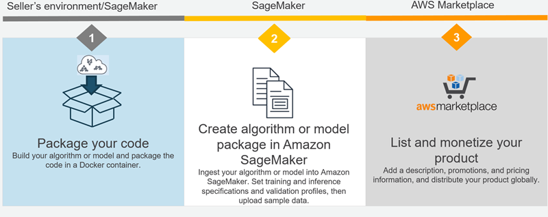

# Listings for your own algorithms and models

with the AWS Marketplace

Selling Amazon SageMaker AI algorithms and model packages is a three-step process:

1. Develop your algorithm or model, and package it in a Docker container. For
   information, see [Develop Algorithms and Models in
   Amazon SageMaker AI](sagemaker-marketplace-develop.md "sagemaker-marketplace-develop.md").
2. Create an algorithm or model package resource in SageMaker AI. For information, see
   [Creation of Algorithm and Model Package
   Resources](sagemaker-mkt-create.md "sagemaker-mkt-create.md").
3. Register as a seller on AWS Marketplace and list your algorithm or model package on
   AWS Marketplace. For information about registering as a seller, see [Getting Started as a Seller](../../../marketplace/latest/userguide/user-guide-for-sellers.md "../../../marketplace/latest/userguide/user-guide-for-sellers.md") in the _User Guide for AWS Marketplace
   Providers_. For information about listing and monetizing your
   algorithms and model packages, see [Listing Algorithms and Model Packages in AWS Marketplace for Machine
   Learning](../../../marketplace/latest/userguide/listing-algorithms-and-model-packages-in-aws-marketplace-for-machine-learning.md "../../../marketplace/latest/userguide/listing-algorithms-and-model-packages-in-aws-marketplace-for-machine-learning.md") in the _User Guide for AWS Marketplace Providers_.

## Topics

- [Develop Algorithms and Models in
  Amazon SageMaker AI](sagemaker-marketplace-develop.md "sagemaker-marketplace-develop.md")
- [Creation of Algorithm and Model Package
  Resources](sagemaker-mkt-create.md "sagemaker-mkt-create.md")
- [List
  Your Algorithm or Model Package on AWS Marketplace](sagemaker-mkt-list.md "sagemaker-mkt-list.md")
