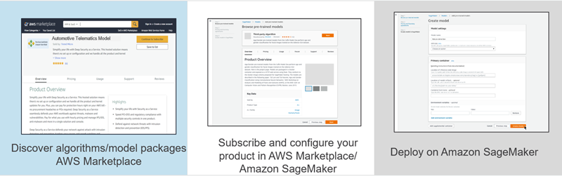

# Find and Subscribe to Algorithms and

Model Packages on AWS Marketplace

With AWS Marketplace, you can browse and search for hundreds of machine learning algorithms and
models in a broad range of categories, such as computer vision, natural language
processing, speech recognition, text, data, voice, image, video analysis, fraud
detection, predictive analysis,
and
more.

###### To find algorithms on AWS Marketplace

1. Open the Amazon SageMaker AI console at [https://console.aws.amazon.com/sagemaker/](https://console.aws.amazon.com/sagemaker/ "https://console.aws.amazon.com/sagemaker/").
2. Choose **Algorithms**, then choose **Find
   algorithms**.

This takes you to the AWS Marketplace algorithms page. For information about finding and
subscribing to algorithms on AWS Marketplace, see [Machine Learning Products](../../../marketplace/latest/buyerguide/aws-machine-learning-marketplace.md "../../../marketplace/latest/buyerguide/aws-machine-learning-marketplace.md") in the
_AWS Marketplace
User Guide for AWS Consumers_.

###### To find model packages on AWS Marketplace

1. Open the SageMaker AI console at [https://console.aws.amazon.com/sagemaker/](https://console.aws.amazon.com/sagemaker/ "https://console.aws.amazon.com/sagemaker/").
2. Choose **Model packages**, then choose **Find
   model packages**.

This takes you to the AWS Marketplace model packages page. For information about
finding and subscribing to model packages on AWS Marketplace, see [Machine Learning Products](../../../marketplace/latest/buyerguide/aws-machine-learning-marketplace.md "../../../marketplace/latest/buyerguide/aws-machine-learning-marketplace.md") in the _AWS Marketplace User Guide for
AWS Consumers_.

## Use

Algorithms and Model Packages

For information about using algorithms and model packages that you subscribe to in
SageMaker AI, see [Usage of Algorithm and Model Package Resources](sagemaker-mkt-buy.md "sagemaker-mkt-buy.md").

###### Note

When you create a training job, inference endpoint, and batch transform job from
an algorithm or model package that you subscribe to on AWS Marketplace, the training and
inference containers do not have access to the internet. Because the containers do
not have access to the internet, the seller of the algorithm or model package does not
have access to your data.
