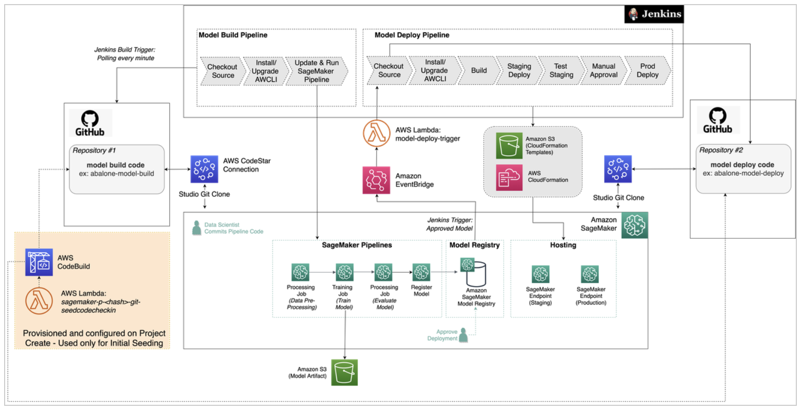

# Use SageMaker AI-Provided Project Templates

###### Important

As of October 28, 2024, the AWS CodeCommit templates have been removed. For new projects,
select from the available project templates that use third-party Git repositories.

Amazon SageMaker AI provides project templates that create the infrastructure you need to create an
MLOps solution for continuous integration and continuous deployment (CI/CD) of ML models. Use
these templates to process data, extract features, train and test models, register the models
in the SageMaker Model Registry, and deploy the models for inference. You can customize the seed code and
the configuration files to suit your requirements.

###### Note

Additional roles are required to use project templates. For a complete list of required
roles and instructions on how to create them, see [Granting SageMaker Studio Permissions
Required to Use
Projects](sagemaker-projects-studio-updates.md "sagemaker-projects-studio-updates.md"). If you do not have the new roles, you
will get the error message **CodePipeline is not authorized to perform
AssumeRole on role
arn:aws:iam::xxx:role/service-role/AmazonSageMakerServiceCatalogProductsCodePipelineRole**
when you try to create a new project and cannot proceed.

SageMaker AI project templates offer you the following choice of code repositories, workflow
automation tools, and pipeline stages:

- **Code repository**: Third-party Git repositories such as
  GitHub and Bitbucket
- **CI/CD workflow automation**: AWS CodePipeline or
  Jenkins
- **Pipeline stages**: Model building and training, model
  deployment, or both
  The following discussion provides an overview of each template you can choose when you
  create your SageMaker AI project. You can also view the available templates in Studio (or
  Studio Classic) by following [Create the Project](sagemaker-projects-walkthrough.md#sagemaker-proejcts-walkthrough-create "sagemaker-projects-walkthrough.md#sagemaker-proejcts-walkthrough-create") of the [Project
  walkthrough](sagemaker-projects-walkthrough.md "sagemaker-projects-walkthrough.md").

For step-by-step instructions on how to create a real project, you can follow one of the
project walkthroughs:

- If you want to use the template [MLOps templates for model
  building, training, and deployment with third-party Git using CodePipeline](#sagemaker-projects-templates-git-code-pipeline "#sagemaker-projects-templates-git-code-pipeline"), see [Walk Through a SageMaker AI MLOps
  Project Using Third-party Git Repos](sagemaker-projects-walkthrough-3rdgit.md "sagemaker-projects-walkthrough-3rdgit.md").
- If you want to use the template [MLOps templates for model
  building, training, and deployment with third-party Git repositories using
  Jenkins](#sagemaker-projects-templates-git-jenkins "#sagemaker-projects-templates-git-jenkins"), see [Create Amazon SageMaker Projects using third-party source control and Jenkins](https://aws.amazon.com/blogs/machine-learning/create-amazon-sagemaker-projects-using-third-party-source-control-and-jenkins/ "https://aws.amazon.com/blogs/machine-learning/create-amazon-sagemaker-projects-using-third-party-source-control-and-jenkins/").

###### Topics

- **Code repository**: Third-party Git.

###### Note

Establish the AWS CodeStar connection from your AWS account to your GitHub user or
organization. Add a tag with the key `sagemaker` and value
`true` to this AWS CodeStar connection.

- **CI/CD workflow automation**: AWS CodePipeline

### Model

building and training

This template provides the following resources:

- Associations with one customer-specified Git repositories. Repository contains
  sample code that creates an Amazon SageMaker AI pipeline in Python code and shows how to create
  and update the SageMaker AI pipeline. This repository also has a sample Python notebook that
  you can open and run in Studio (or Studio Classic).
- An AWS CodePipeline pipeline that has source and build steps. The source step points to
  the third-party Git repository. The build step gets the code from that repository,
  creates and updates the SageMaker AI pipeline, starts a pipeline execution, and waits for
  the pipeline execution to complete.
- An AWS CodeBuild project to populate the Git repositories with the seed code
  information. This requires an AWS CodeStar connection from your AWS account to your
  account on the Git repository host.
- An Amazon S3 bucket to store artifacts, including CodePipeline and CodeBuild artifacts, and
  any artifacts generated from the SageMaker AI pipeline runs.

### Model

deployment

This template provides the following resources:

- Associations with one customer-specified Git repositories. Repository contains
  sample code that deploys models to endpoints in staging and production
  environments.
- An AWS CodePipeline pipeline that has source, build, deploy-to-staging, and
  deploy-to-production steps. The source step points to the third-party Git repository
  and the build step gets the code from that repository and generates AWS CloudFormation stacks to
  deploy. The deploy-to-staging and deploy-to-production steps deploy the AWS CloudFormation stacks
  to their respective environments. There is a manual approval step between the
  staging and production build steps, so that a MLOps engineer must approve the model
  before it is deployed to production.
- An AWS CodeBuild project to populate the Git repositories with the seed code
  information. This requires an AWS CodeStar connection from your AWS account to your
  account on the Git repository host.
- An Amazon S3 bucket to store artifacts, including CodePipeline and CodeBuild artifacts, and
  any artifacts generated from the SageMaker AI pipeline runs.

### Model building, training, and deployment

This template provides the following resources:

- Associations with one or more customer-specified Git repositories.
- An AWS CodePipeline pipeline that has source, build, deploy-to-staging, and
  deploy-to-production steps. The source step points to the third-party Git repository
  and the build step gets the code from that repository and generates CloudFormation
  stacks to deploy. The deploy-to-staging and deploy-to-production steps deploy the
  CloudFormation stacks to their respective environments. There is a manual approval step
  between the staging and production build steps, so that a MLOps engineer must
  approve the model before it is deployed to production.
- An AWS CodeBuild project to populate the Git repositories with the seed code
  information. This requires an AWS CodeStar connection from your AWS account to your
  account on the Git repository host.
- An Amazon S3 bucket to store artifacts, including CodePipeline and CodeBuild artifacts, and any
  artifacts generated from the SageMaker AI pipeline runs.

As previously mentioned, see [Project
Walkthrough Using Third-party Git Repos](sagemaker-projects-walkthrough-3rdgit.md "sagemaker-projects-walkthrough-3rdgit.md") for a demonstration that uses this
template to create a real project.

- **Code repository**: Third-party Git.

###### Note

Establish the AWS CodeStar connection from your AWS account to your GitHub user or
organization. Add a tag with the key `sagemaker` and value
`true` to this AWS CodeStar connection.

- **CI/CD workflow automation**: AWS CodePipeline
  The following templates include an additional Amazon SageMaker Model Monitor template that provides the
  following types of monitoring:

- [Data Quality](model-monitor-data-quality.md "model-monitor-data-quality.md")
  – Monitor drift in data quality.
- [Model Quality](model-monitor-model-quality.md "model-monitor-model-quality.md")
  – Monitor drift in model quality metrics, such as accuracy.
- [Bias Drift for
  Models in Production](clarify-model-monitor-bias-drift.md "clarify-model-monitor-bias-drift.md") – Monitor bias in a model's predictions.

### Model building, training, deployment, and Amazon SageMaker Model Monitor

This template is an extension of the MLOps template for model building, training,
and deployment with Git repositories using CodePipeline. It includes both the model building,
training, and deployment components of the template, and an additional Amazon SageMaker Model Monitor template
that provides the following types of monitoring:

### Monitor a

deployed model

You can use this template for an MLOps solution to deploy one or more of the
Amazon SageMaker AI data quality, model quality, model bias, and model explainability monitors to
monitor a deployed model on a SageMaker AI inference endpoint. This template provides the
following resources:

- Associations with one or more customer-specified Git repositories. Repository
  contains sample Python code that gets the [baselines](model-monitor-create-baseline.md "model-monitor-create-baseline.md")
  used by the monitors from the Amazon SageMaker Model Registry, and updates the template’s parameters for the
  staging and production environments. It also contains a AWS CloudFormation template to create the
  Amazon SageMaker Model Monitors.
- An AWS CodePipeline pipeline that has source, build, and deploy steps. The source step
  points to the CodePipeline repository. The build step gets the code from that repository,
  gets the baseline from the Model Registry, and updates template parameters for the staging
  and production environments. The deploy steps deploy the configured monitors into
  the staging and production environments. The manual approval step, within the
  `DeployStaging` stage, requires you to verify that the production SageMaker AI
  endpoint is `InService` before approving and moving to the
  `DeployProd` stage.
- An AWS CodeBuild project to populate the Git repositories with the seed code
  information. This requires an AWS CodeStar connection from your AWS account to your
  account on the Git repository host.
- The template uses the same Amazon S3 bucket created by the MLOps template for model
  building, training, and deployment to store the monitors' outputs.
- Two Amazon EventBridge events rules initiate the Amazon SageMaker Model Monitor AWS CodePipeline every time the staging
  SageMaker AI endpoint is updated.

- **Code repository**: Third-party Git.

###### Note

Establish the AWS CodeStar connection from your AWS account to your GitHub user or
organization. Add a tag with the key `sagemaker` and value
`true` to this AWS CodeStar connection.

- **CI/CD workflow automation**: Jenkins

### Model building, training, and deployment

This template provides the following resources:

- Associations with one or more customer-specified Git repositories.
- Seed code to generate Jenkins pipelines that have source, build,
  deploy-to-staging, and deploy-to-production steps. The source step points to the
  customer-specified Git repository. The build step gets the code from that repository
  and generates two CloudFormation stacks. The deploy steps deploy the CloudFormation stacks
  to their respective environments. There is an approval step between the staging step
  and the production step.
- An AWS CodeBuild project to populate the Git repositories with the seed code
  information. This requires an AWS CodeStar connection from your AWS account to your
  account on the Git repository host.
- An Amazon S3 bucket to store artifacts of the SageMaker AI project and SageMaker AI pipeline.

The template creates the association between your project and the source control
repositories, but you need to perform additional manual steps to establish communication
between your AWS account and Jenkins. For the detailed steps, see [Create Amazon SageMaker Projects using third-party source control and Jenkins](https://aws.amazon.com/blogs/machine-learning/create-amazon-sagemaker-projects-using-third-party-source-control-and-jenkins/ "https://aws.amazon.com/blogs/machine-learning/create-amazon-sagemaker-projects-using-third-party-source-control-and-jenkins/").

The instructions help you build the architecture shown in the following diagram,
with GitHub as the source control repository in this example. As shown, you are
attaching your Git repository to the project to check in and manage code versions.
Jenkins initiates the model build pipeline when it detects changes to the model build
code in the Git repository. You are also connecting the project to Jenkins to
orchestrate your model deployment steps, which start when you approve the model
registered in the model registry, or when Jenkins detects changes to the model
deployment code.



In summary, the steps guide you through the following tasks:

1. Establish the connection between your AWS and GitHub accounts.
2. Create the Jenkins account and import needed plugins.
3. Create the Jenkins IAM user and permissions policy.
4. Set the AWS credentials for the Jenkins IAM user on your Jenkins
   server.
5. Create an API token for communication with your Jenkins server.
6. Use a CloudFormation template to set up an EventBridge rule to monitor the model registry
   for newly-approved models.
7. Create the SageMaker AI project, which seeds your GitHub repositories with model build
   and deploy code.
8. Create your Jenkins model build pipeline with the model build seed code.
9. Create your Jenkins model deploy pipeline with the model deploy seed
   code.

This template is an extension of the [MLOps templates for model
building, training, and deployment with third-party Git using CodePipeline](#sagemaker-projects-templates-git-code-pipeline "#sagemaker-projects-templates-git-code-pipeline"). It includes both the
model building, training, and deployment components of that template and the following
options:

- Include processing image–building pipeline
- Include training image–building pipeline
- Include inference image–building pipeline
  For each of the components selected during project creation, the following are created
  by using the template:

- An Amazon ECR repository
- [A SageMaker Image](../APIReference/API_CreateImage.md "../APIReference/API_CreateImage.md")
- A CodeCommit repository containing a Dockerfile that you can customize
- A CodePipeline that is initiated by changes to the CodePipeline repository
- A CodeBuild project that builds a Docker image and registers it in the Amazon ECR
  repository
- An EventBridge rule that initiates the CodePipeline on a schedule
  When the CodePipeline is initiated, it builds a new Docker container and registers it with an
  Amazon ECR repository. When a new container is registered with the Amazon ECR repository, a new
  `ImageVersion` is added to the SageMaker image. This initiates the model building
  pipeline, which in turn initiates the deployment pipeline.

The newly created image is used in the model building, training, and deployment
portions of the workflow where applicable.

The managed policy attached to the
`AmazonSageMakerServiceCatalogProductsUseRole` role was updated on July 27,
2021 for use with the third-party Git templates. Users who onboard to Amazon SageMaker Studio (or
Studio Classic) after this date and enable project templates use the new policy. Users who
onboarded prior to this date must update the policy to use these templates. Use one of the
following options to update the policy:

- Delete role and toggle Studio (or Studio Classic) settings
  1.  In the IAM console, delete
      `AmazonSageMakerServiceCatalogProductsUseRole`.
  2.  In the Studio (or Studio Classic) control panel, choose **Edit
      Settings**.
  3.  Toggle both settings and then choose **Submit**.

- In the IAM console, add the following permissions to
  `AmazonSageMakerServiceCatalogProductsUseRole`:

```
{
      "Effect": "Allow",
      "Action": [
          "codestar-connections:UseConnection"
      ],
      "Resource": "arn:aws:codestar-connections:*:*:connection/*",
      "Condition": {
          "StringEqualsIgnoreCase": {
              "aws:ResourceTag/sagemaker": "true"
          }
      }
  },
  {
      "Effect": "Allow",
      "Action": [
          "s3:PutObjectAcl"
      ],
      "Resource": [
          "arn:aws:s3:::sagemaker-*"
      ]
  }
```
