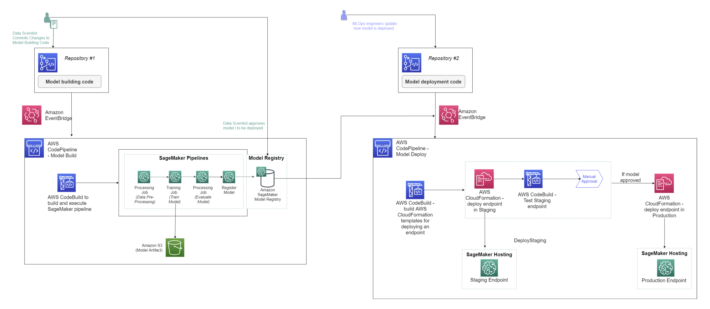
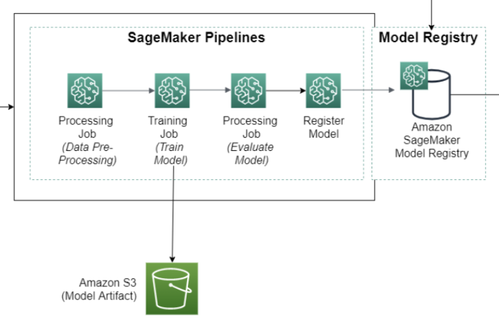

# What is a SageMaker AI Project?

SageMaker Projects help organizations set up
and standardize developer environments for data scientists and CI/CD systems for MLOps
engineers. Projects also help organizations set up dependency management, code repository
management, build reproducibility, and artifact sharing.

You can provision SageMaker Projects from the AWS Service Catalog using
custom or SageMaker AI-provided templates. For information
about the AWS Service Catalog, see [What Is AWS Service
Catalog](../../../servicecatalog/latest/dg/what-is-service-catalog.md "../../../servicecatalog/latest/dg/what-is-service-catalog.md"). With SageMaker Projects, MLOps engineers and organization admins can
define their own templates or use SageMaker AI-provided templates. The SageMaker AI-provided templates
bootstrap the ML workflow
with source version control, automated ML pipelines,
and a set of code to quickly start iterating over ML use cases.

## When Should You Use a SageMaker AI

Project?

###### Important

Effective September 9, 2024, project templates that use the AWS CodeCommit repository are no longer supported.
For new projects, select from the available project templates that use third-party Git repositories.

While notebooks are helpful for model building and experimentation, a team of data
scientists and ML engineers sharing code needs a more scalable way to maintain code
consistency and strict version control.

Every organization has its own set of standards and practices that provide
security and governance for its AWS environment. SageMaker AI provides a set of
first-party templates for organizations that want to quickly get started with ML
workflows and CI/CD. The templates include projects that use AWS-native services
for CI/CD, such as AWS CodeBuild, AWS CodePipeline, and
AWS CodeCommit.
The templates also offer the option to create projects that use third-party tools,
such as Jenkins and GitHub. For a list of the project templates that SageMaker AI provides,
see [Use SageMaker AI-Provided Project Templates](sagemaker-projects-templates-sm.md "sagemaker-projects-templates-sm.md").

Organizations often need tight control over the MLOps resources that they
provision and manage. Such responsibility assumes certain tasks, including
configuring IAM roles and policies, enforcing resource tags, enforcing encryption,
and decoupling resources across multiple accounts. SageMaker Projects can support all
these tasks through custom template offerings
where organizations use AWS CloudFormation templates to define the resources needed for an
ML workflow. Data Scientists can choose a template to bootstrap and pre-configure
their ML workflow. These custom templates are created as Service Catalog products and you can
provision them in the Studio or Studio Classic UI under **Organization
Templates**. The Service Catalog is a service that helps organizations create and
manage catalogs of products that are approved for use on AWS. For more information
about creating custom templates, see [Build Custom SageMaker AI Project Templates – Best Practices](https://aws.amazon.com/blogs/machine-learning/build-custom-sagemaker-project-templates-best-practices/ "https://aws.amazon.com/blogs/machine-learning/build-custom-sagemaker-project-templates-best-practices/").

SageMaker Projects can help you manage your Git repositories so that you can
collaborate more efficiently across teams, ensure code consistency, and support
CI/CD. SageMaker Projects can help you with the following tasks:

- Organize all entities of the ML lifecycle under one project.
- Establish a single-click approach to set up standard ML infrastructure for
  model training and deployment that incorporates best practices.
- Create and share templates for ML infrastructure to serve multiple use
  cases.
- Leverage SageMaker AI-provided pre-built templates to quickly start focusing on
  model building, or create custom templates with organization-specific
  resources and guidelines.
- Integrate with tools of your choice by extending the project
  templates. For an example, see [Create a SageMaker AI Project to integrate with GitLab and GitLab
  Pipelines](https://aws.amazon.com/blogs/machine-learning/build-mlops-workflows-with-amazon-sagemaker-projects-gitlab-and-gitlab-pipelines/ "https://aws.amazon.com/blogs/machine-learning/build-mlops-workflows-with-amazon-sagemaker-projects-gitlab-and-gitlab-pipelines/").
- Organize all entities of the ML lifecycle under one project.

## What is in a SageMaker AI Project?

Customers have the flexibility to set up their projects with the resources that
best serve their use case. The example below showcases the MLOps setup for an ML
workflow, including model training and deployment.

A typical project with a SageMaker AI-provided template might include the
following:

- One or more repositories with sample code to build and deploy ML
  solutions. These are working examples that you can modify
  for your needs. You own this code and can take advantage of the
  version-controlled repositories for your tasks.
- A SageMaker AI pipeline that defines steps for data preparation, training, model
  evaluation, and model deployment, as shown in the following diagram.

- A CodePipeline or Jenkins pipeline that runs your SageMaker AI pipeline every time you check in a
  new version of the code. For information about CodePipeline,
  see [What is AWS CodePipeline.](../../../codepipeline/latest/userguide/welcome.md "../../../codepipeline/latest/userguide/welcome.md")
  For information about Jenkins, see [Jenkins User Documentation](https://www.jenkins.io/doc/ "https://www.jenkins.io/doc/").
- A model group that contains model versions.
  Every time you approve the resulting model version from a SageMaker AI pipeline run,
  you can deploy it to a SageMaker AI endpoint.

Each SageMaker AI project has a unique name and ID that are applied as tags to all of the
SageMaker AI and AWS resources created in the project. With the name and ID, you can view
all of the entities associated with your project. These include:

- Pipelines
- Registered models
- Deployed models (endpoints)
- Datasets
- Service Catalog products
- CodePipeline and Jenkins pipelines
- CodeCommit and third-party Git repositories

## Do I Need to Create a Project to Use SageMaker AI

Pipelines?

No. SageMaker pipelines are standalone entities just like training jobs, processing
jobs, and other SageMaker AI jobs. You can create, update, and run pipelines directly within
a notebook by using the SageMaker Python SDK without using a SageMaker AI project.

Projects provide an additional layer to help you organize your code and adopt
operational best practices that you need for a production-quality system.
