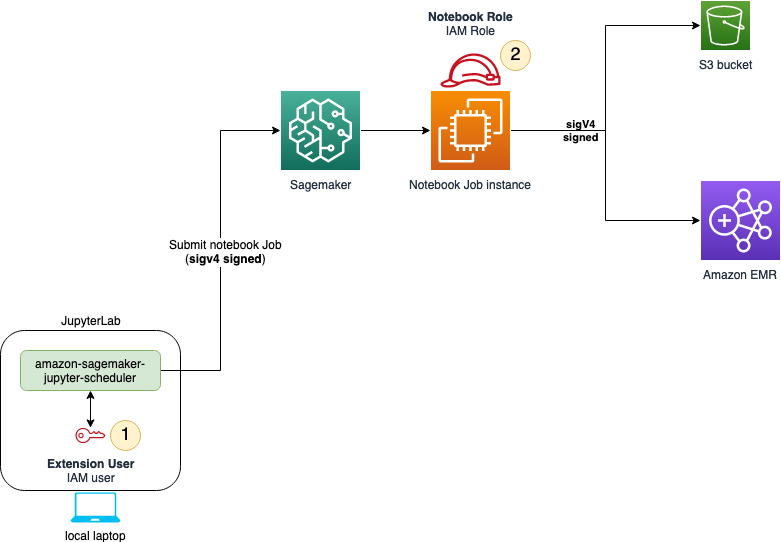

# Install policies and permissions for

local Jupyter environments

You will need to set up the necessary permissions and policies to schedule notebook jobs
in a local Jupyter environment. The IAM user needs permissions to submit jobs to SageMaker AI and
the IAM role that the notebook job itself assumes needs permissions to access resources,
depending on the job tasks. The following will provide instructions on how to set up the
necessary permissions and policies.

You will need to install two sets of permissions. The following diagram shows the
permission structure for you to schedule notebook jobs in a local Jupyter environment. The
IAM user needs to set up IAM permissions in order to submit jobs to SageMaker AI.
Once the user submits the notebook job, the job itself assumes an IAM role that has
permissions to access resources depending on the job tasks.


The following sections help you install necessary policies and permissions for both the
IAM user and the job execution role.

## IAM user permissions

**Permissions to submit jobs to SageMaker AI**

To add permissions to submit jobs, complete the following steps:

1. Open the [IAM
   console](https://console.aws.amazon.com/iam/ "https://console.aws.amazon.com/iam/").
2. Select **Users** in the left panel.
3. Find the IAM user for your notebook job and choose the user name.
4. Choose **Add Permissions**, and choose **Create inline
   policy** from the dropdown menu.
5. Choose the **JSON** tab.
6. Copy and paste the following policy:

JSON

```
`{
 "Version":"2012-10-17",
 "Statement": [
 {
 "Sid": "EventBridgeSchedule",
 "Effect": "Allow",
 "Action": [
 "events:TagResource",
 "events:DeleteRule",
 "events:PutTargets",
 "events:DescribeRule",
 "events:EnableRule",
 "events:PutRule",
 "events:RemoveTargets",
 "events:DisableRule"
 ],
 "Resource": "*",
 "Condition": {
 "StringEquals": {
 "aws:ResourceTag/sagemaker:is-scheduling-notebook-job": "true"
 }
 }
 },
 {
 "Sid": "IAMPassrole",
 "Effect": "Allow",
 "Action": "iam:PassRole",
 "Resource": "arn:aws:iam::*:role/*",
 "Condition": {
 "StringLike": {
 "iam:PassedToService": [
 "sagemaker.amazonaws.com",
 "events.amazonaws.com"
 ]
 }
 }
 },
 {
 "Sid": "IAMListRoles",
 "Effect": "Allow",
 "Action": "iam:ListRoles",
 "Resource": "*"
 },
 {
 "Sid": "S3ArtifactsAccess",
 "Effect": "Allow",
 "Action": [
 "s3:PutEncryptionConfiguration",
 "s3:CreateBucket",
 "s3:PutBucketVersioning",
 "s3:ListBucket",
 "s3:PutObject",
 "s3:GetObject",
 "s3:GetEncryptionConfiguration",
 "s3:DeleteObject",
 "s3:GetBucketLocation"
 ],
 "Resource": [
 "arn:aws:s3:::sagemaker-automated-execution-*"
 ]
 },
 {
 "Sid": "S3DriverAccess",
 "Effect": "Allow",
 "Action": [
 "s3:ListBucket",
 "s3:GetObject",
 "s3:GetBucketLocation"
 ],
 "Resource": [
 "arn:aws:s3:::sagemakerheadlessexecution-*"
 ]
 },
 {
 "Sid": "SagemakerJobs",
 "Effect": "Allow",
 "Action": [
 "sagemaker:DescribeTrainingJob",
 "sagemaker:StopTrainingJob",
 "sagemaker:DescribePipeline",
 "sagemaker:CreateTrainingJob",
 "sagemaker:DeletePipeline",
 "sagemaker:CreatePipeline"
 ],
 "Resource": "*",
 "Condition": {
 "StringEquals": {
 "aws:ResourceTag/sagemaker:is-scheduling-notebook-job": "true"
 }
 }
 },
 {
 "Sid": "AllowSearch",
 "Effect": "Allow",
 "Action": "sagemaker:Search",
 "Resource": "*"
 },
 {
 "Sid": "SagemakerTags",
 "Effect": "Allow",
 "Action": [
 "sagemaker:ListTags",
 "sagemaker:AddTags"
 ],
 "Resource": [
 "arn:aws:sagemaker:*:*:pipeline/*",
 "arn:aws:sagemaker:*:*:space/*",
 "arn:aws:sagemaker:*:*:training-job/*",
 "arn:aws:sagemaker:*:*:user-profile/*"
 ]
 },
 {
 "Sid": "ECRImage",
 "Effect": "Allow",
 "Action": [
 "ecr:GetAuthorizationToken",
 "ecr:BatchGetImage"
 ],
 "Resource": "*"
 }
 ]
}`

```

**AWS KMS permission policy (optional)**

By default, the input and output Amazon S3 buckets are encrypted using server side
encryption, but you can specify a custom KMS key to encrypt your data in the output Amazon S3
bucket and the storage volume attached to the notebook job.

If you want to use a custom KMS key, repeat the previous instructions, attaching the
following policy, and supply your own KMS key ARN.

JSON

```
`{
 "Version":"2012-10-17",
 "Statement": [
 {
 "Effect":"Allow",
 "Action":[
 "kms:Encrypt",
 "kms:Decrypt",
 "kms:ReEncrypt*",
 "kms:GenerateDataKey*",
 "kms:DescribeKey",
 "kms:CreateGrant"
 ],
 "Resource":"arn:aws:kms:`us-east-1`:`111122223333`:key/`key-id`"
 }
 ]
}`

```

## Job execution role

permissions

**Trust relationships**

To modify the job execution role trust relationships, complete the following
steps:

1. Open the [IAM
   console](https://console.aws.amazon.com/iam/ "https://console.aws.amazon.com/iam/").
2. Select **Roles** in the left panel.
3. Find the job execution role for your notebook job and choose the role name.
4. Choose the **Trust relationships** tab.
5. Choose **Edit trust policy**.
6. Copy and paste the following policy:

JSON

```
`{
 "Version":"2012-10-17",
 "Statement": [
 {
 "Effect": "Allow",
 "Principal": {
 "Service": [
 "sagemaker.amazonaws.com",
 "events.amazonaws.com"
 ]
 },
 "Action": "sts:AssumeRole"
 }
 ]
}`

```

**Additional permissions**

Once submitted, the notebook job needs permissions to access resources. The following
instructions show you how to add a minimal set of permissions. If needed, add more
permissions based on your notebook job needs. To add permissions to your job execution
role, complete the following steps:

1. Open the [IAM
   console](https://console.aws.amazon.com/iam/ "https://console.aws.amazon.com/iam/").
2. Select **Roles** in the left panel.
3. Find the job execution role for your notebook job and choose the role name.
4. Choose **Add Permissions**, and choose **Create inline
   policy** from the dropdown menu.
5. Choose the **JSON** tab.
6. Copy and paste the following policy:

JSON

```
`{
 "Version":"2012-10-17",
 "Statement": [
 {
 "Sid": "PassroleForJobCreation",
 "Effect": "Allow",
 "Action": "iam:PassRole",
 "Resource": "arn:aws:iam::*:role/*",
 "Condition": {
 "StringLike": {
 "iam:PassedToService": "sagemaker.amazonaws.com"
 }
 }
 },
 {
 "Sid": "S3ForStoringArtifacts",
 "Effect": "Allow",
 "Action": [
 "s3:PutObject",
 "s3:GetObject",
 "s3:ListBucket",
 "s3:GetBucketLocation"
 ],
 "Resource": "arn:aws:s3:::sagemaker-automated-execution-*"
 },
 {
 "Sid": "S3DriverAccess",
 "Effect": "Allow",
 "Action": [
 "s3:ListBucket",
 "s3:GetObject",
 "s3:GetBucketLocation"
 ],
 "Resource": [
 "arn:aws:s3:::sagemakerheadlessexecution-*"
 ]
 },
 {
 "Sid": "SagemakerJobs",
 "Effect": "Allow",
 "Action": [
 "sagemaker:StartPipelineExecution",
 "sagemaker:CreateTrainingJob"
 ],
 "Resource": "*"
 },
 {
 "Sid": "ECRImage",
 "Effect": "Allow",
 "Action": [
 "ecr:GetDownloadUrlForLayer",
 "ecr:BatchGetImage",
 "ecr:GetAuthorizationToken",
 "ecr:BatchCheckLayerAvailability"
 ],
 "Resource": "*"
 }
 ]
}`

```

7. Add permissions to other resources your notebook job accesses.
8. Choose **Review policy**.
9. Enter a name for your policy.
10. Choose **Create policy**.
