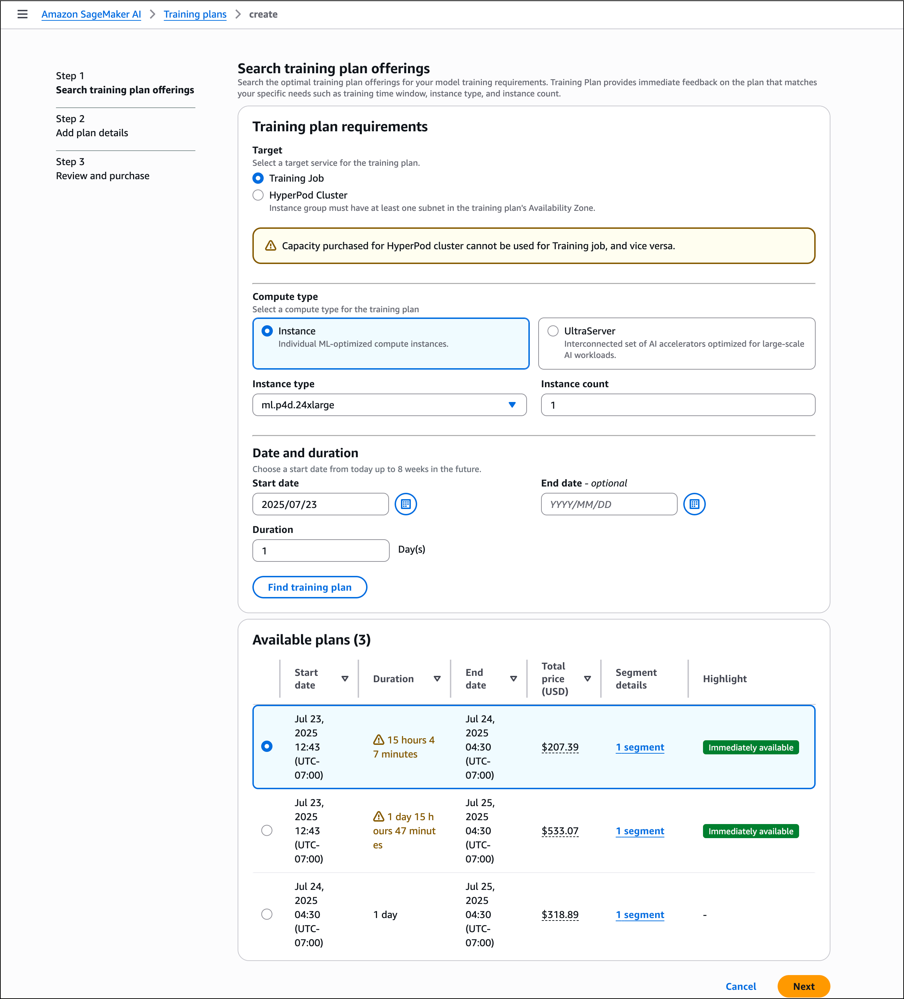

# Search training plan offerings

After you choose **Training Plans** in the left pane of the SageMaker AI
console, and then **Create training plan**, a **Find training
plan** form opens up. This form allows you to specify your requirements and
search for suitable training plan offerings.

Follow these steps to complete the form:

1. Identify your **Target**: Training plans are specific to their
   target resource. Specify whether you want to use a plan to run SageMaker training jobs or
   SageMaker HyperPod clusters.
2. For **Compute type**, you can choose between **Instance** or
   **UltraServer**. UltraServers are connect multiple Amazon EC2 instances using a low-latency,
   high-bandwidth accelerator interconnect.
   For more information, see [Amazon EC2 UltraServers](https://aws.amazon.com/ec2/ultraservers/ "https://aws.amazon.com/ec2/ultraservers/"). To learn about how you can use
   UltraServers with SageMaker AI, see [UltraServers in SageMaker AI](reserve-capacity-with-training-plans.md#training-plans-ultraservers "reserve-capacity-with-training-plans.md#training-plans-ultraservers").
3. Choose your preferred **Instance type** and **Instance
   count**: For available instance types in a given AWS Region, duration, and
   quantity options, see [Supported instance types,
   AWS Regions, and pricing](reserve-capacity-with-training-plans.md#training-plans-supported-instances-and-regions "reserve-capacity-with-training-plans.md#training-plans-supported-instances-and-regions").
4. Define your time parameters: Choose your desired start and end dates, and specify
   the plan duration within this window.
5. Choose **Find training plans**.

SageMaker training plans search for offerings that match your capacity requirements. When
matches are found within your specified time frame, they appear at the bottom of the page.
Each training plan offering includes the following details:

- Total plan duration
- Start and end dates
- Total upfront price:

Hover over the price to view the detailed breakdown of instance hourly rate,
instance count, and total hours

- Total number of plan segments
  Clicking the segment detail link opens a modal view with segment-specific
  details:

- Duration
- Start and end dates
- Availability zone

If no suitable plans are found or the available plans don't meet your needs, adjust your
search criteria by modifying the parameters in the
**Training plans requirements** form. Once you find a
suitable offering, select it and choose **Next** to continue to the plan
reservation page. On this page, you can name your plan, and then review and confirm your
selection before finalizing your reservation.

###### Note

Plans marked `Immediately available` will start within 30 minutes, provided
payment is completed no less than 5 minutes before the scheduled start time.
