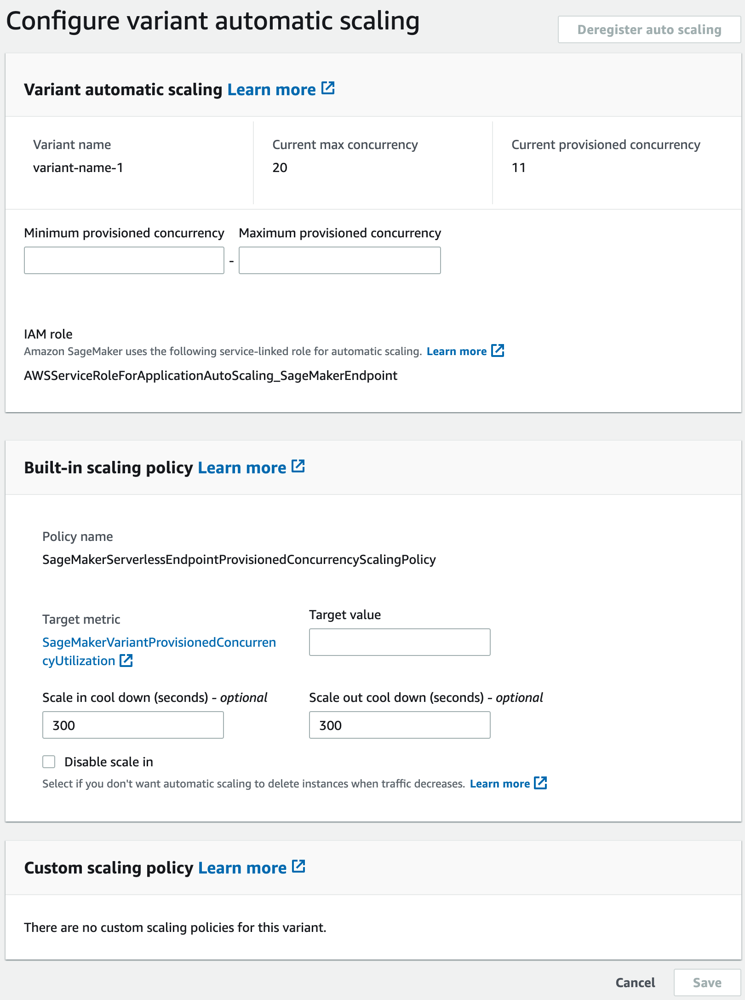

# Automatically scale Provisioned Concurrency for a serverless endpoint

Amazon SageMaker AI automatically scales in or out on-demand serverless endpoints. For serverless
endpoints with Provisioned Concurrency you can use Application Auto Scaling to scale up or down the
Provisioned Concurrency based on your traffic profile, thus optimizing costs.

The following are the prerequisites to autoscale Provisioned Concurrency on serverless
endpoints:

- [Register a model](#serverless-endpoints-autoscale-register "#serverless-endpoints-autoscale-register")
- [Define a scaling policy](#serverless-endpoints-autoscale-define "#serverless-endpoints-autoscale-define")
- [Apply a scaling policy](#serverless-endpoints-autoscale-apply "#serverless-endpoints-autoscale-apply")

Before you can use autoscaling, you must have already deployed a model to a serverless
endpoint with Provisioned Concurrency. Deployed models are referred to as [production
variants](../APIReference/API_ProductionVariant.md "../APIReference/API_ProductionVariant.md"). See [Create an endpoint configuration](serverless-endpoints-create-config.md "serverless-endpoints-create-config.md") and [Create an endpoint](serverless-endpoints-create-endpoint.md "serverless-endpoints-create-endpoint.md") for more information about deploying
a model to a serverless endpoint with Provisioned Concurrency. To specify the metrics and
target values for a scaling policy, you must configure a scaling policy. For more
information on how to define a scaling policy, see [Define a scaling policy](#serverless-endpoints-autoscale-define "#serverless-endpoints-autoscale-define"). After registering your model and
defining a scaling policy, apply the scaling policy to the registered model. For information
on how to apply the scaling policy, see [Apply a scaling policy](#serverless-endpoints-autoscale-apply "#serverless-endpoints-autoscale-apply").

For details on other prerequisites and components used with autoscaling, see the [Auto scaling prerequisites](endpoint-auto-scaling-prerequisites.md "endpoint-auto-scaling-prerequisites.md") section in the [SageMaker AI autoscaling documentation](endpoint-auto-scaling.md "endpoint-auto-scaling.md").

## Register a model

To add autoscaling to a serverless endpoint with Provisioned Concurrency, you first must
register your model (production variant) using AWS CLI or Application Auto Scaling API.

### Register a model (AWS CLI)

To register your model, use the `register-scalable-target` AWS CLI command
with the following parameters:

- `--service-namespace` – Set this value to
  `sagemaker`.
- `--resource-id` – The resource identifier for the model
  (specifically the production variant). For this parameter, the resource type
  is `endpoint` and the unique identifier is the name of the
  production variant. For example
  `endpoint/MyEndpoint/variant/MyVariant`.
- `--scalable-dimension` – Set this value to
  `sagemaker:variant:DesiredProvisionedConcurrency`.
- `--min-capacity` – The minimum number of Provisioned
  Concurrency for the model. Set `--min-capacity` to at least 1. It
  must be equal to or less than the value specified for
  `--max-capacity`.
- `--max-capacity` – The maximum number of Provisioned
  Concurrency that should be enabled through Application Auto Scaling. Set
  `--max-capacity` to a minimum of 1. It must be greater than or
  equal to the value specified for `--min-capacity`.

The following example shows how to register a model named `MyVariant`
that is dynamically scaled to have 1 to 10 Provisioned Concurrency value:

```
aws application-autoscaling register-scalable-target \
    --service-namespace sagemaker \
    --scalable-dimension sagemaker:variant:DesiredProvisionedConcurrency \
    --resource-id endpoint/MyEndpoint/variant/MyVariant \
    --min-capacity 1 \
    --max-capacity 10

```

### Register a model (Application Auto Scaling API)

To register your model, use the `RegisterScalableTarget` Application Auto Scaling API
action with the following parameters:

- `ServiceNamespace` – Set this value to
  `sagemaker`.
- `ResourceId` – The resource identifier for the model
  (specifically the production variant). For this parameter, the resource type
  is `endpoint` and the unique identifier is the name of the
  production variant. For example
  `endpoint/MyEndpoint/variant/MyVariant`.
- `ScalableDimension` – Set this value to
  `sagemaker:variant:DesiredProvisionedConcurrency`.
- `MinCapacity` – The minimum number of Provisioned
  Concurrency for the model. Set `MinCapacity` to at least 1. It
  must be equal to or less than the value specified for
  `MaxCapacity`.
- `MaxCapacity` – The maximum number of Provisioned
  Concurrency that should be enabled through Application Auto Scaling. Set
  `MaxCapacity` to a minimum of 1. It must be greater than or
  equal to the value specified for `MinCapacity`.

The following example shows how to register a model named `MyVariant`
that is dynamically scaled to have 1 to 10 Provisioned Concurrency value:

```
POST / HTTP/1.1
Host: autoscaling.us-east-2.amazonaws.com
Accept-Encoding: identity
X-Amz-Target: AnyScaleFrontendService.RegisterScalableTarget
X-Amz-Date: 20160506T182145Z
User-Agent: aws-cli/1.10.23 Python/2.7.11 Darwin/15.4.0 botocore/1.4.8
Content-Type: application/x-amz-json-1.1
Authorization: AUTHPARAMS

{
    "ServiceNamespace": "sagemaker",
    "ResourceId": "endpoint/MyEndPoint/variant/MyVariant",
    "ScalableDimension": "sagemaker:variant:DesiredProvisionedConcurrency",
    "MinCapacity": 1,
    "MaxCapacity": 10
}

```

## Define a scaling policy

To specify the metrics and target values for a scaling policy, you can configure a
target-tracking scaling policy. Define the scaling policy as a JSON block in a text
file. You can then use that text file when invoking the AWS CLI or the Application Auto Scaling API. To
quickly define a target-tracking scaling policy for a serverless endpoint, use the
`SageMakerVariantProvisionedConcurrencyUtilization` predefined metric.

```
{
    "TargetValue": 0.5,
    "PredefinedMetricSpecification":
    {
        "PredefinedMetricType": "SageMakerVariantProvisionedConcurrencyUtilization"
    },
    "ScaleOutCooldown": 1,
    "ScaleInCooldown": 1
}

```

## Apply a scaling policy

After registering your model, you can apply a scaling policy to your serverless endpoint
with Provisioned Concurrency. See [Apply a target-tracking scaling policy](#serverless-endpoints-autoscale-apply-target "#serverless-endpoints-autoscale-apply-target") to apply a target-tracking
scaling policy that you have defined. If the traffic flow to your serverless endpoint
has a predictable routine then instead of applying a target-tracking scaling policy you
might want to schedule scaling actions at specific times. For more information on
scheduling scaling actions, see [Scheduled scaling](#serverless-endpoints-autoscale-apply-scheduled "#serverless-endpoints-autoscale-apply-scheduled").

### Apply a target-tracking scaling policy

You can use the AWS Management Console, AWS CLI or the Application Auto Scaling API to apply a target-tracking scaling policy
to your serverless endpoint with Provisioned Concurrency.

#### Apply a target-tracking scaling policy (AWS CLI)

To apply a scaling policy to your model, use the `put-scaling-policy`
AWS CLI; command with the following parameters:

- `--policy-name` – The name of the scaling policy.
- `--policy-type` – Set this value to
  `TargetTrackingScaling`.
- `--resource-id` – The resource identifier for the
  variant. For this parameter, the resource type is `endpoint`
  and the unique identifier is the name of the variant. For example
  `endpoint/MyEndpoint/variant/MyVariant`.
- `--service-namespace` – Set this value to
  `sagemaker`.
- `--scalable-dimension` – Set this value to
  `sagemaker:variant:DesiredProvisionedConcurrency`.
- `--target-tracking-scaling-policy-configuration` – The
  target-tracking scaling policy configuration to use for the model.

The following example shows how to apply a target-tracking scaling policy named
`MyScalingPolicy` to a model named `MyVariant`. The policy
configuration is saved in a file named `scaling-policy.json`.

```
aws application-autoscaling put-scaling-policy \
    --policy-name MyScalingPolicy \
    --policy-type TargetTrackingScaling \
    --service-namespace sagemaker \
    --scalable-dimension sagemaker:variant:DesiredProvisionedConcurrency \
    --resource-id endpoint/MyEndpoint/variant/MyVariant \
    --target-tracking-scaling-policy-configuration file://[file-localtion]/scaling-policy.json

```

#### Apply a target-tracking scaling policy (Application Auto Scaling API)

To apply a scaling policy to your model, use the `PutScalingPolicy`
Application Auto Scaling API action with the following parameters:

- `PolicyName` – The name of the scaling policy.
- `PolicyType` – Set this value to
  `TargetTrackingScaling`.
- `ResourceId` – The resource identifier for the
  variant. For this parameter, the resource type is `endpoint`
  and the unique identifier is the name of the variant. For example
  `endpoint/MyEndpoint/variant/MyVariant`.
- `ServiceNamespace` – Set this value to
  `sagemaker`.
- `ScalableDimension` – Set this value to
  `sagemaker:variant:DesiredProvisionedConcurrency`.
- `TargetTrackingScalingPolicyConfiguration` – The
  target-tracking scaling policy configuration to use for the model.

The following example shows how to apply a target-tracking scaling policy named
`MyScalingPolicy` to a model named `MyVariant`. The policy
configuration is saved in a file named `scaling-policy.json`.

```
POST / HTTP/1.1
Host: autoscaling.us-east-2.amazonaws.com
Accept-Encoding: identity
X-Amz-Target: AnyScaleFrontendService.PutScalingPolicy
X-Amz-Date: 20160506T182145Z
User-Agent: aws-cli/1.10.23 Python/2.7.11 Darwin/15.4.0 botocore/1.4.8
Content-Type: application/x-amz-json-1.1
Authorization: AUTHPARAMS

{
    "PolicyName": "MyScalingPolicy",
    "ServiceNamespace": "sagemaker",
    "ResourceId": "endpoint/MyEndpoint/variant/MyVariant",
    "ScalableDimension": "sagemaker:variant:DesiredProvisionedConcurrency",
    "PolicyType": "TargetTrackingScaling",
    "TargetTrackingScalingPolicyConfiguration":
    {
        "TargetValue": 0.5,
        "PredefinedMetricSpecification":
        {
            "PredefinedMetricType": "SageMakerVariantProvisionedConcurrencyUtilization"
        }
    }
}

```

#### Apply a target-tracking scaling policy (AWS Management Console)

To apply a target-tracking scaling policy with the AWS Management Console:

1. Sign in to the [Amazon SageMaker AI
   console](https://console.aws.amazon.com/sagemaker/ "https://console.aws.amazon.com/sagemaker/").
2. In the navigation panel, choose **Inference**.
3. Choose **Endpoints** to view a list of all of your endpoints.
4. Choose the endpoint to which you want to apply the scaling policy. A page with
   the settings of the endpoint will appear, with the models (production variant)
   listed under **Endpoint runtime settings section**.
5. Select the production variant to which you want to apply the scaling policy,
   and choose **Configure auto scaling**. The
   **Configure variant automatic scaling** dialog box appears.

 6. Enter the minimum and maximum Provisioned Concurrency values in the
**Minimum provisioned concurrency** and
**Maximum provisioned concurrency** fields, respectively, in
the **Variant automatic scaling** section. Minimum Provisioned
Concurrency must be less than or equal to maximum Provisioned Concurrency. 7. Enter the target value in the **Target value** field for the
target metric, `SageMakerVariantProvisionedConcurrencyUtilization`. 8. (Optional) Enter scale in cool down and scale out cool down values (in seconds)
in **Scale in cool down** and **Scale out cool down**
fields respectively. 9. (Optional) Select **Disable scale in** if you don’t want auto scaling
to delete instance when traffic decreases. 10. Select **Save**.

### Scheduled scaling

If the traffic to your serverless endpoint with Provisioned Concurrency follows a
routine pattern you might want to schedule scaling actions at specific times, to
scale in or scale out Provisioned Concurrency. You can use the AWS CLI or the Application Auto Scaling
to schedule scaling actions.

#### Scheduled scaling (AWS CLI)

To apply a scaling policy to your model, use the
`put-scheduled-action` AWS CLI; command with the following parameters:

- `--schedule-action-name` – The name of the scaling
  action.
- `--schedule` – A cron expression that specifies the
  start and end times of the scaling action with a recurring schedule.
- `--resource-id` – The resource identifier for the
  variant. For this parameter, the resource type is `endpoint`
  and the unique identifier is the name of the variant. For example
  `endpoint/MyEndpoint/variant/MyVariant`.
- `--service-namespace` – Set this value to
  `sagemaker`.
- `--scalable-dimension` – Set this value to
  `sagemaker:variant:DesiredProvisionedConcurrency`.
- `--scalable-target-action` – The target of the scaling
  action.

The following example shows how to add a scaling action named
`MyScalingAction` to a model named `MyVariant` on a
recurring schedule. On the specified schedule (every day at 12:15 PM UTC), if
the current Provisioned Concurrency is below the value specified for
`MinCapacity`. Application Auto Scaling scales out the Provisioned Concurrency to the
value specified by `MinCapacity`.

```
aws application-autoscaling put-scheduled-action \
    --scheduled-action-name 'MyScalingAction' \
    --schedule 'cron(15 12 * * ? *)' \
    --service-namespace sagemaker \
    --resource-id endpoint/MyEndpoint/variant/MyVariant \
    --scalable-dimension sagemaker:variant:DesiredProvisionedConcurrency \
    --scalable-target-action 'MinCapacity=10'

```

#### Scheduled scaling (Application Auto Scaling API)

To apply a scaling policy to your model, use the `PutScheduledAction`
Application Auto Scaling API action with the following parameters:

- `ScheduleActionName` – The name of the scaling action.
- `Schedule` – A cron expression that specifies the
  start and end times of the scaling action with a recurring schedule.
- `ResourceId` – The resource identifier for the
  variant. For this parameter, the resource type is `endpoint`
  and the unique identifier is the name of the variant. For example
  `endpoint/MyEndpoint/variant/MyVariant`.
- `ServiceNamespace` – Set this value to
  `sagemaker`.
- `ScalableDimension` – Set this value to
  `sagemaker:variant:DesiredProvisionedConcurrency`.
- `ScalableTargetAction` – The target of the scaling
  action.

The following example shows how to add a scaling action named
`MyScalingAction` to a model named `MyVariant` on a
recurring schedule. On the specified schedule (every day at 12:15 PM UTC), if
the current Provisioned Concurrency is below the value specified for
`MinCapacity`. Application Auto Scaling scales out the Provisioned Concurrency to the
value specified by `MinCapacity`.

```
POST / HTTP/1.1
Host: autoscaling.us-east-2.amazonaws.com
Accept-Encoding: identity
X-Amz-Target: AnyScaleFrontendService.PutScheduledAction
X-Amz-Date: 20160506T182145Z
User-Agent: aws-cli/1.10.23 Python/2.7.11 Darwin/15.4.0 botocore/1.4.8
Content-Type: application/x-amz-json-1.1
Authorization: AUTHPARAMS

{
    "ScheduledActionName": "MyScalingAction",
    "Schedule": "cron(15 12 * * ? *)",
    "ServiceNamespace": "sagemaker",
    "ResourceId": "endpoint/MyEndpoint/variant/MyVariant",
    "ScalableDimension": "sagemaker:variant:DesiredProvisionedConcurrency",
    "ScalableTargetAction": "MinCapacity=10"
        }
    }
}

```
