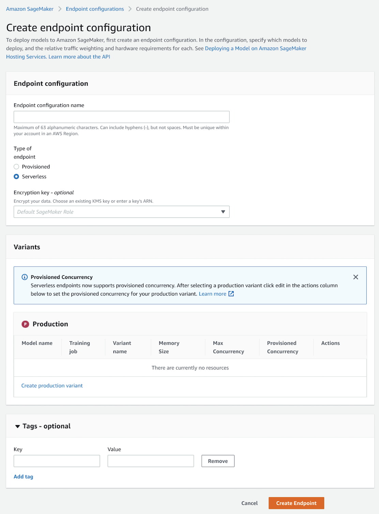
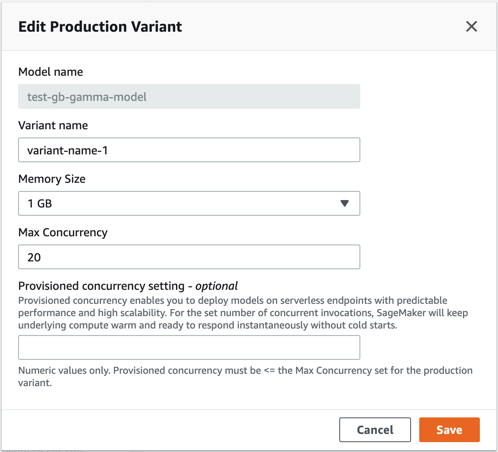

# Create an endpoint configuration

After you create a model, create an endpoint configuration. You can then deploy your model
using the specifications in your endpoint configuration. In the configuration, you specify
whether you want a real-time or serverless endpoint. To create a serverless endpoint
configuration, you can use the [Amazon SageMaker AI console](https://console.aws.amazon.com/sagemaker/home "https://console.aws.amazon.com/sagemaker/home"), the [CreateEndpointConfig](../APIReference/API_CreateEndpointConfig.md "../APIReference/API_CreateEndpointConfig.md")
API, or the AWS CLI. The API and console approaches are outlined in the following sections.

## To create an endpoint configuration

(using API)

The following example uses the [AWS SDK for Python (Boto3)](https://boto3.amazonaws.com/v1/documentation/api/latest/index.html "https://boto3.amazonaws.com/v1/documentation/api/latest/index.html") to call the [CreateEndpointConfig](../APIReference/API_CreateEndpointConfig.md "../APIReference/API_CreateEndpointConfig.md") API. Specify the following values:

- For `EndpointConfigName`, choose a name for the endpoint configuration. The
  name should be unique within your account in a Region.
- (Optional) For `KmsKeyId`, use the key ID, key ARN, alias name, or alias ARN
  for an AWS KMS key that you want to use. SageMaker AI uses this key to encrypt your Amazon ECR image.
- For `ModelName`, use the name of the model you want to deploy. It should be
  the same model that you used in the [Create a model](serverless-endpoints-create-model.md "serverless-endpoints-create-model.md") step.
- For `ServerlessConfig`:
  - Set `MemorySizeInMB` to `2048`. For this example, we set the
    memory size to 2048 MB, but you can choose any of the following values for your memory
    size: 1024 MB, 2048 MB, 3072 MB, 4096 MB, 5120 MB, or 6144 MB.
  - Set `MaxConcurrency` to `20`. For this example, we set the
    maximum concurrency to 20. The maximum number of concurrent invocations you can set for a
    serverless endpoint is 200, and the minimum value you can choose is 1.
  - (Optional) To use Provisioned Concurrency, set `ProvisionedConcurrency` to 10.
    For this example, we set the Provisioned Concurrency to 10. The `ProvisionedConcurrency` number
    for a serverless endpoint must be lower than or equal to the `MaxConcurrency` number. You can
    leave it empty if you want to use on-demand Serverless Inference endpoint. You can dynamically scale Provision Concurrency.
    For more information, see [Automatically scale Provisioned Concurrency for a serverless endpoint](serverless-endpoints-autoscale.md "serverless-endpoints-autoscale.md").

```
response = client.create_endpoint_config(
   EndpointConfigName="`<your-endpoint-configuration>`",
   KmsKeyId="arn:aws:kms:us-east-1:123456789012:key/143ef68f-76fd-45e3-abba-ed28fc8d3d5e",
   ProductionVariants=[
        {
            "ModelName": "`<your-model-name>`",
            "VariantName": "AllTraffic",
            "ServerlessConfig": {
                "MemorySizeInMB": 2048,
                "MaxConcurrency": 20,
                "ProvisionedConcurrency": 10,
            }
        }
    ]
)
```

## To create an endpoint

configuration (using the console)

1. Sign in to the [Amazon SageMaker AI
   console](https://console.aws.amazon.com/sagemaker/home "https://console.aws.amazon.com/sagemaker/home").
2. In the navigation tab, choose **Inference**.
3. Next, choose **Endpoint configurations**.
4. Choose **Create endpoint configuration**.
5. For **Endpoint configuration name**, enter a name that is unique within
   your account in a Region.
6. For **Type of endpoint**, select **Serverless**.

 7. For **Production variants**, choose **Add
model**. 8. Under **Add model**, select the model you want to use from the list of
models and then choose **Save**. 9. After adding your model, under **Actions**, choose
**Edit**. 10. For **Memory size**, choose the memory size you want in GB.

 11. For **Max Concurrency**, enter your desired maximum concurrent
invocations for the endpoint. The maximum value you can enter is 200 and the minimum is

1.
2. (Optional) To use Provisioned Concurrency, enter the desired number of concurrent invocations in the
   **Provisioned Concurrency setting** field. The number of provisioned concurrent invocations
   must be less than or equal to the number of maximum concurrent invocations.
3. Choose **Save**.
4. (Optional) For **Tags**, enter key-value pairs if you want to create
   metadata for your endpoint configuration.
5. Choose **Create endpoint configuration**.
