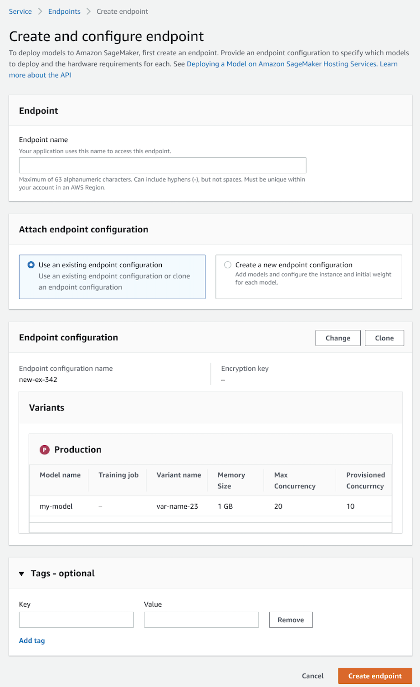

# Create an endpoint

To create a serverless endpoint, you can use the [Amazon SageMaker AI console](https://console.aws.amazon.com/sagemaker/home "https://console.aws.amazon.com/sagemaker/home"), the [CreateEndpoint](../APIReference/API_CreateEndpoint.md "../APIReference/API_CreateEndpoint.md") API, or the AWS CLI. The API and console approaches are outlined in the
following sections. Once you create your endpoint, it can take a few minutes for the endpoint
to become available.

## To create an endpoint (using

API)

The following example uses the [AWS SDK for Python (Boto3)](https://boto3.amazonaws.com/v1/documentation/api/latest/index.html "https://boto3.amazonaws.com/v1/documentation/api/latest/index.html") to call the [CreateEndpoint](../APIReference/API_CreateEndpoint.md "../APIReference/API_CreateEndpoint.md") API.
Specify the following values:

- For `EndpointName`, enter a name for the endpoint that is unique within a
  Region in your account.
- For `EndpointConfigName`, use the name of the endpoint configuration that
  you created in the previous section.

```
response = client.create_endpoint(
    EndpointName="`<your-endpoint-name>`",
    EndpointConfigName="`<your-endpoint-config>`"
)
```

## To create an endpoint (using the

console)

1. Sign in to the [Amazon SageMaker AI
   console](https://console.aws.amazon.com/sagemaker/home "https://console.aws.amazon.com/sagemaker/home").
2. In the navigation tab, choose **Inference**.
3. Next, choose **Endpoints**.
4. Choose **Create endpoint**.
5. For **Endpoint name**, enter a name than is unique within a
   Region in your account.
6. For **Attach endpoint configuration**, select **Use an existing
   endpoint configuration**.
7. For **Endpoint configuration**, select the name of the endpoint
   configuration you created in the previous section and then choose **Select endpoint
   configuration**.
8. (Optional) For **Tags**, enter key-value pairs if you want to create
   metadata for your endpoint.
9. Choose **Create endpoint**.


