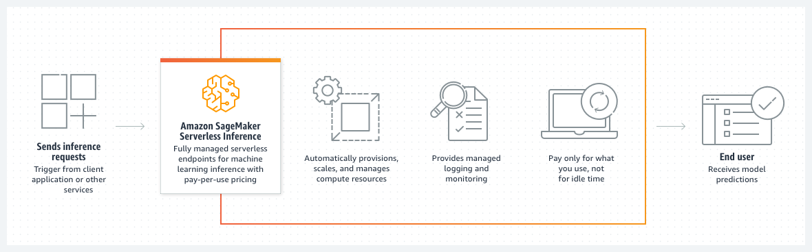

# Deploy models with Amazon SageMaker Serverless Inference

Amazon SageMaker Serverless Inference is a purpose-built inference option that enables you to deploy and scale ML models
without configuring or managing any of the underlying infrastructure. On-demand Serverless Inference is ideal for
workloads which have idle periods between traffic spurts and can tolerate cold starts. Serverless
endpoints automatically launch compute resources and scale them in and out depending on traffic,
eliminating the need to choose instance types or manage scaling policies. This takes away the
undifferentiated heavy lifting of selecting and managing servers. Serverless Inference integrates with
AWS Lambda to offer you high availability, built-in fault tolerance and automatic
scaling. With a pay-per-use model, Serverless Inference is a cost-effective option if you have an infrequent or
unpredictable traffic pattern. During times when there are no requests, Serverless Inference scales your endpoint
down to 0, helping you to minimize your costs. For more information about pricing for on-demand
Serverless Inference, see [Amazon SageMaker Pricing](https://aws.amazon.com/sagemaker/pricing/ "https://aws.amazon.com/sagemaker/pricing/").

Optionally, you can also use Provisioned Concurrency with Serverless Inference. Serverless Inference with provisioned
concurrency is a cost-effective option when you have predictable bursts in your traffic.
Provisioned Concurrency allows you to deploy models on serverless endpoints with predictable
performance, and high scalability by keeping your endpoints warm. SageMaker AI ensures that for the number
of Provisioned Concurrency that you allocate, the compute resources are initialized and ready to
respond within milliseconds. For Serverless Inference with Provisioned Concurrency, you pay for the compute
capacity used to process inference requests, billed by the millisecond, and the amount of data
processed. You also pay for Provisioned Concurrency usage, based on the memory configured,
duration provisioned, and the amount of concurrency enabled. For more information about pricing
for Serverless Inference with Provisioned Concurrency, see [Amazon SageMaker Pricing](https://aws.amazon.com/sagemaker/pricing/ "https://aws.amazon.com/sagemaker/pricing/").

You can integrate Serverless Inference with your MLOps Pipelines to streamline your ML workflow, and you can
use a serverless endpoint to host a model registered with [Model
Registry](model-registry.md "model-registry.md").

Serverless Inference is generally available in 21 AWS Regions: US East (N. Virginia), US East (Ohio),
US West (N. California), US West (Oregon), Africa (Cape Town), Asia Pacific (Hong Kong),
Asia Pacific (Mumbai), Asia Pacific (Tokyo), Asia Pacific (Seoul), Asia Pacific (Osaka),
Asia Pacific (Singapore), Asia Pacific (Sydney), Canada (Central), Europe (Frankfurt),
Europe (Ireland), Europe (London), Europe (Paris), Europe (Stockholm),
Europe (Milan), Middle East (Bahrain), South America (São Paulo). For more information about Amazon SageMaker AI
regional availability, see the [AWS Regional Services
List](https://aws.amazon.com/about-aws/global-infrastructure/regional-product-services/ "https://aws.amazon.com/about-aws/global-infrastructure/regional-product-services/").

## How it works

The following diagram shows the workflow of on-demand Serverless Inference and the benefits of using a
serverless endpoint.

When you create an on-demand serverless endpoint, SageMaker AI provisions and manages the compute
resources for you. Then, you can make inference requests to the endpoint and receive model
predictions in response. SageMaker AI scales the compute resources up and down as needed to handle your
request traffic, and you only pay for what you use.

For Provisioned Concurrency, Serverless Inference also integrates with Application Auto Scaling, so that you can manage
Provisioned Concurrency based on a target metric or on a schedule. For more information, see
[Automatically scale Provisioned Concurrency for a serverless endpoint](serverless-endpoints-autoscale.md "serverless-endpoints-autoscale.md").

The following sections provide additional details about Serverless Inference and how it works.

###### Topics

- [Container support](#serverless-endpoints-how-it-works-containers "#serverless-endpoints-how-it-works-containers")
- [Memory size](#serverless-endpoints-how-it-works-memory "#serverless-endpoints-how-it-works-memory")
- [Concurrent invocations](#serverless-endpoints-how-it-works-concurrency "#serverless-endpoints-how-it-works-concurrency")
- [Minimizing cold starts](#serverless-endpoints-how-it-works-cold-starts "#serverless-endpoints-how-it-works-cold-starts")
- [Feature exclusions](#serverless-endpoints-how-it-works-exclusions "#serverless-endpoints-how-it-works-exclusions")

### Container support

For your endpoint container, you can choose either a SageMaker AI-provided container or bring your
own. SageMaker AI provides containers for its built-in algorithms and prebuilt Docker images for some of
the most common machine learning frameworks, such as Apache MXNet, TensorFlow, PyTorch, and Chainer.
For a list of available SageMaker images, see [Available
Deep Learning Containers Images](https://github.com/aws/deep-learning-containers/blob/master/available_images.md "https://github.com/aws/deep-learning-containers/blob/master/available_images.md"). If you are bringing your own container, you must
modify it to work with SageMaker AI. For more information about bringing your own container, see [Adapt your own inference container for
Amazon SageMaker AI](adapt-inference-container.md "adapt-inference-container.md").

The maximum size of the container image you can use is 10 GB. For serverless endpoints, we
recommend creating only one worker in the container and only loading one copy of the model. Note
that this is unlike real-time endpoints, where some SageMaker AI containers may create a worker for each
vCPU to process inference requests and load the model in each worker.

If you already have a container for a real-time endpoint, you can use the same container
for your serverless endpoint, though some capabilities are excluded. To learn more about the
container capabilities that are not supported in Serverless Inference, see [Feature exclusions](#serverless-endpoints-how-it-works-exclusions "#serverless-endpoints-how-it-works-exclusions"). If you choose to use the same
container, SageMaker AI escrows (retains) a copy of your container image until you delete all endpoints
that use the image. SageMaker AI encrypts the copied image at rest with a SageMaker AI-owned AWS KMS key.

### Memory size

Your serverless endpoint has a minimum RAM size of 1024 MB (1 GB), and the maximum RAM size
you can choose is 6144 MB (6 GB). The memory sizes you can choose are 1024 MB, 2048 MB, 3072 MB,
4096 MB, 5120 MB, or 6144 MB. Serverless Inference auto-assigns compute resources proportional to the memory
you select. If you choose a larger memory size, your container has access to more vCPUs. Choose
your endpoint’s memory size according to your model size. Generally, the memory size should be
at least as large as your model size. You may need to benchmark in order to choose the right
memory selection for your model based on your latency SLAs. For a step by step guide to
benchmark, see [Introducing the Amazon SageMaker Serverless Inference Benchmarking Toolkit](https://aws.amazon.com/blogs/machine-learning/introducing-the-amazon-sagemaker-serverless-inference-benchmarking-toolkit/ "https://aws.amazon.com/blogs/machine-learning/introducing-the-amazon-sagemaker-serverless-inference-benchmarking-toolkit/"). The memory size increments have
different pricing; see the [Amazon SageMaker AI
pricing page](https://aws.amazon.com/sagemaker/pricing/ "https://aws.amazon.com/sagemaker/pricing/") for more information.

Regardless of the memory size you choose, your serverless endpoint has 5 GB of ephemeral
disk storage available. For help with container permissions issues when working with storage,
see [Troubleshooting](serverless-endpoints-troubleshooting.md "serverless-endpoints-troubleshooting.md").

### Concurrent invocations

On-demand Serverless Inference manages predefined scaling policies and quotas for the capacity of your
endpoint. Serverless endpoints have a quota for how many concurrent invocations can be processed
at the same time. If the endpoint is invoked before it finishes processing the first request,
then it handles the second request concurrently.

The total concurrency that you can share between all serverless endpoints in your account
depends on your region:

- For the US East (Ohio), US East (N. Virginia), US West (Oregon),
  Asia Pacific (Singapore), Asia Pacific (Sydney), Asia Pacific (Tokyo),
  Europe (Frankfurt), and Europe (Ireland) Regions, the total concurrency you can share
  between all serverless endpoints per Region in your account is 1000.
- For the US West (N. California), Africa (Cape Town), Asia Pacific (Hong Kong), Asia Pacific (Mumbai),
  Asia Pacific (Osaka), Asia Pacific (Seoul), Canada (Central), Europe (London),
  Europe (Milan), Europe (Paris), Europe (Stockholm), Middle East (Bahrain), and
  South America (São Paulo) Regions, the total concurrency per Region in your account
  is 500.

You can set the maximum concurrency for a single endpoint up to 200, and the total number
of serverless endpoints you can host in a Region is 50. The maximum concurrency for an
individual endpoint prevents that endpoint from taking up all of the invocations allowed for
your account, and any endpoint invocations beyond the maximum are throttled.

###### Note

Provisioned Concurrency that you assign to a serverless endpoint should always be less
than or equal to the maximum concurrency that you assigned to that endpoint.

To learn how to set the maximum concurrency for your endpoint, see [Create an endpoint configuration](serverless-endpoints-create-config.md "serverless-endpoints-create-config.md"). For more information about quotas and limits, see [Amazon SageMaker AI endpoints and quotas](../../../general/latest/gr/sagemaker.md "../../../general/latest/gr/sagemaker.md") in the _AWS General Reference_. To request a service limit increase, contact [AWS Support](https://console.aws.amazon.com/support "https://console.aws.amazon.com/support"). For instructions on how to request a
service limit increase, see [Supported Regions and Quotas](regions-quotas.md "regions-quotas.md").

### Minimizing cold starts

If your on-demand Serverless Inference endpoint does not receive traffic for a while and then your
endpoint suddenly receives new requests, it can take some time for your endpoint to spin up the
compute resources to process the requests. This is called a _cold
start_. Since serverless endpoints provision compute resources on demand, your
endpoint may experience cold starts. A cold start can also occur if your concurrent requests
exceed the current concurrent request usage. The cold start time depends on your model size, how
long it takes to download your model, and the start-up time of your container.

To monitor how long your cold start time is, you can use the Amazon CloudWatch metric
`OverheadLatency` to monitor your serverless endpoint. This metric tracks the time
it takes to launch new compute resources for your endpoint. To learn more about using CloudWatch
metrics with serverless endpoints, see [Alarms and logs for tracking metrics from serverless endpoints](serverless-endpoints-monitoring.md "serverless-endpoints-monitoring.md").

You can minimize cold starts by using Provisioned Concurrency. SageMaker AI keeps the endpoint warm
and ready to respond in milliseconds, for the number of Provisioned Concurrency that you
allocated.

### Feature exclusions

Some of the features currently available for SageMaker AI Real-time Inference are not supported for
Serverless Inference, including GPUs, AWS marketplace model packages, private Docker registries, Multi-Model Endpoints, VPC
configuration, network isolation, data capture, multiple production variants, Model Monitor, and
inference pipelines.

You cannot convert your instance-based, real-time endpoint to a serverless endpoint. If you
try to update your real-time endpoint to serverless, you receive a `ValidationError`
message. You can convert a serverless endpoint to real-time, but once you make the update, you
cannot roll it back to serverless.

## Getting started

You can create, update, describe, and delete a serverless endpoint using the SageMaker AI console,
the AWS SDKs, the [Amazon SageMaker Python SDK](https://sagemaker.readthedocs.io/en/stable/overview.html#sagemaker-serverless-inference "https://sagemaker.readthedocs.io/en/stable/overview.html#sagemaker-serverless-inference"), and the AWS CLI. You can invoke your endpoint using the AWS SDKs,
the [Amazon SageMaker Python SDK](https://sagemaker.readthedocs.io/en/stable/overview.html#sagemaker-serverless-inference "https://sagemaker.readthedocs.io/en/stable/overview.html#sagemaker-serverless-inference"), and the AWS CLI. For serverless endpoints with Provisioned
Concurrency, you can use Application Auto Scaling to auto scale Provisioned Concurrency based on a target metric
or a schedule. For more information about how to set up and use a serverless endpoint, read the
guide [Serverless endpoint operations](serverless-endpoints-create-invoke-update-delete.md "serverless-endpoints-create-invoke-update-delete.md"). For more information on auto
scaling serverless endpoints with Provisioned Concurrency, see [Automatically scale Provisioned Concurrency for a serverless endpoint](serverless-endpoints-autoscale.md "serverless-endpoints-autoscale.md").

###### Note

Application Auto Scaling for Serverless Inference with Provisioned Concurrency is currently not supported on AWS CloudFormation.

### Example notebooks and blogs

For Jupyter notebook examples that show end-to-end serverless endpoint workflows, see the
[Serverless Inference example notebooks](https://github.com/aws/amazon-sagemaker-examples/tree/master/serverless-inference "https://github.com/aws/amazon-sagemaker-examples/tree/master/serverless-inference").
