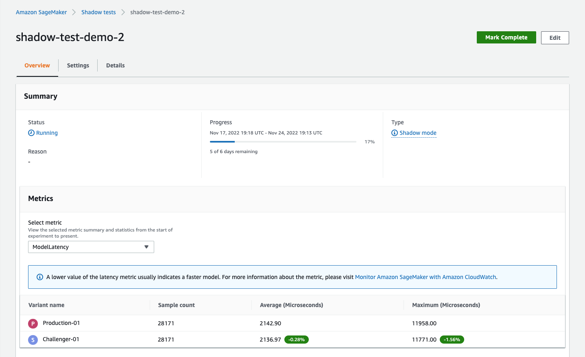
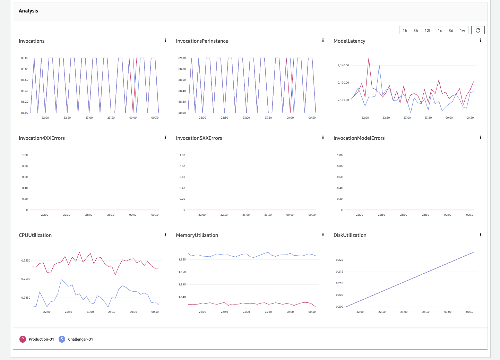
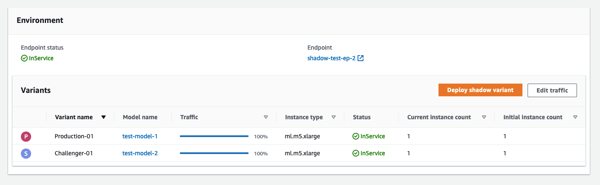

# Monitor a shadow test

You can view the details of a shadow test and monitor it while it is in progress or after it has
completed. SageMaker AI presents a live dashboard comparing the operational metrics like model latency, and error
rate aggregated, of the production and shadow variants.

To view the details of an individual test in the console, do the following:

1. Select the test you want to monitor from the **Shadow test** section on the
   **Shadow tests** page.
2. From the **Actions** dropdown list, choose **View**. An overview
   page with the details of the test and a metrics dashboard appears.

The overview page has the following three sections.

**Summary**

This section summarizes the progress and status of the test. It also shows the summary
statistics of the metric chosen from the **Select metric** dropdown list in the
**Metrics** subsection. The following screenshot shows this section.

In the preceding screenshot, the **Settings**, and **Details**
tabs show the settings that you selected, and the details that you entered when creating the
test.

**Analysis**

This section shows a metrics dashboard with separate graphs for the following metrics:

- `Invocations`
- `InvocationsPerInstance`
- `ModelLatency`
- `Invocation4XXErrors`
- `Invocation5XXErrors`
- `InvocationModelErrors`
- `CPUUtilization`
- `MemoryUtilization`
- `DiskUtilization`

The last three metrics monitor the model container runtime resource usage. The rest are CloudWatch
metrics that you can use to analyse the performance of your variant. In general, fewer errors
indicate a more stable model. A lower latency indicates either a faster model or a faster
infrastructure. For more information about CloudWatch metrics, see [SageMaker AI endpoint invocation
metrics](monitoring-cloudwatch.md#cloudwatch-metrics-endpoint-invocation "monitoring-cloudwatch.md#cloudwatch-metrics-endpoint-invocation"). The following screenshot shows the
metrics dashboard.

**Environment**

This section shows the variants that you compared in the test. If you are satisfied by the
performance of the shadow variant, based on the aforementioned metrics, you can promote the
shadow variant to production, by choosing **Deploy shadow variant**. For more
details about deploying a shadow variant, see [Promote a shadow variant](shadow-tests-complete.md#shadow-tests-complete-promote "shadow-tests-complete.md#shadow-tests-complete-promote"). You can also change the traffic sampling
percentage, and continue testing, by choosing **Edit traffic**. For more
details about editing a shadow variant, see [Edit a shadow test](shadow-tests-view-monitor-edit-individual.md "shadow-tests-view-monitor-edit-individual.md"). The following screenshot shows this
section.

