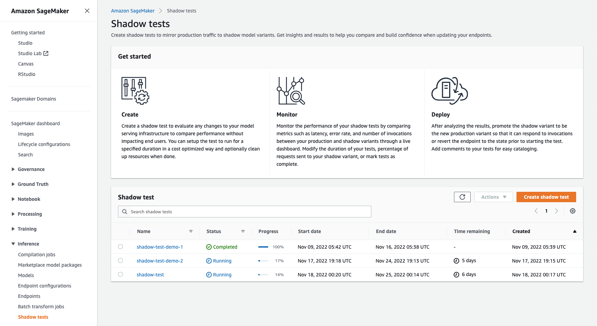

# View shadow tests

You can view the statuses of all of your shadow tests on the **Shadow tests** page on the
SageMaker AI console.

To view your tests in the console, do the following:

1. Open the [SageMaker AI console](https://console.aws.amazon.com/sagemaker/ "https://console.aws.amazon.com/sagemaker/").
2. In the navigation panel, choose **Inference**.
3. Choose **Shadow tests** to view the page that lists all of your shadow tests. The
   page should look like the following screenshot, with all the tests listed under the **Shadow
   test** section.

You can see the status of a test in the console on the **Shadow tests** page by checking
the **Status** field for the test.

The following are the possible statuses for a test:

- `Creating` – SageMaker AI is creating your test.
- `Created` – SageMaker AI has finished creating your test, and it will begin at
  the scheduled time.
- `Updating` – When you make changes to your test, your test shows
  as updating.
- `Starting` – SageMaker AI is beginning your test.
- `Running` – Your test is in progress.
- `Stopping` – SageMaker AI is stopping your test.
- `Completed` – Your test has completed.
- `Cancelled` – When you conclude your test early, it shows as cancelled.
