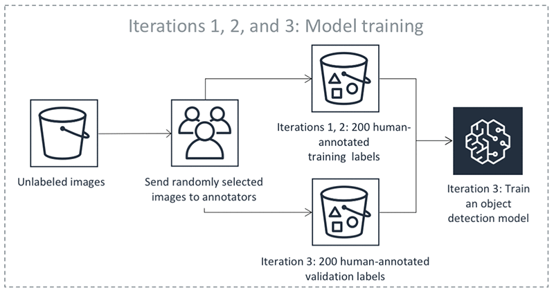
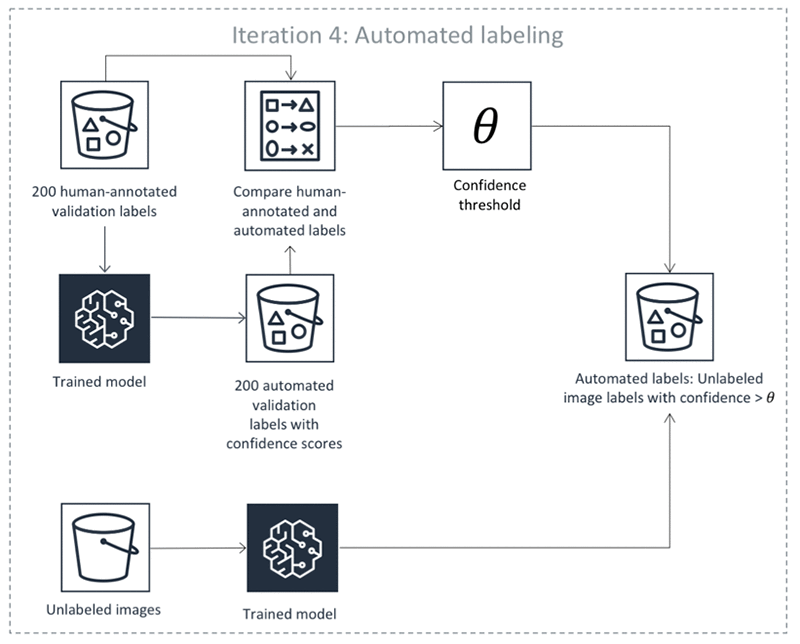
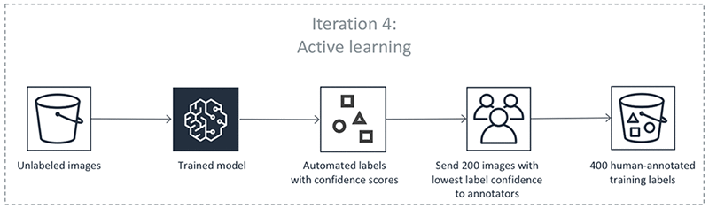

# Automate data labeling

If you choose, Amazon SageMaker Ground Truth can use active learning to automate the labeling of your
input data for certain built-in task types. _Active learning_ is a
machine learning technique that identifies data that should be labeled by your workers.
In Ground Truth, this functionality is called automated data labeling. Automated data labeling
helps to reduce the cost and time that it takes to label your dataset compared to using
only humans. When you use automated labeling, you incur SageMaker training and inference
costs.

We recommend using automated data labeling on large datasets because the neural
networks used with active learning require a significant amount of data for every new
dataset. Typically, as you provide more data, the potential for high accuracy
predictions goes up. Data will only be auto-labeled if the neural network used in the
auto-labeling model can achieve an acceptably high level of accuracy. Therefore, with
larger datasets, there is more potential to automatically label the data because the
neural network can achieve high enough accuracy for auto-labeling. Automated data
labeling is most appropriate when you have thousands of data objects. The minimum number
of objects allowed for automated data labeling is 1,250, but we strongly suggest
providing a minimum of 5,000 objects.

Automated data labeling is available only for the following Ground Truth built-in task types:

- [Create an image classification job (Single
  Label)](sms-image-classification.md "sms-image-classification.md")
- [Identify image contents using semantic
  segmentation](sms-semantic-segmentation.md "sms-semantic-segmentation.md")
- Object detection ([Classify image objects using a bounding box](sms-bounding-box.md "sms-bounding-box.md"))
- [Categorize text with text classification (Single
  Label)](sms-text-classification.md "sms-text-classification.md")
  [Streaming labeling jobs](sms-streaming-labeling-job.md "sms-streaming-labeling-job.md") do not support automated data labeling.

To learn how to create a custom active learning workflow using your own model, see
[Set up an active learning workflow
with your own model](#samurai-automated-labeling-byom "#samurai-automated-labeling-byom").

Input data quotas apply for automated data labeling jobs. See [Input Data Quotas](input-data-limits.md "input-data-limits.md") for information
about dataset size, input data size and resolution limits.

###### Note

Before you use an the automated-labeling model in production, you need to
fine-tune or test it, or both. You might fine-tune the model (or create and tune
another supervised model of your choice) on the dataset produced by your labeling
job to optimize the model’s architecture and hyperparameters. If you decide to use
the model for inference without fine-tuning it, we strongly recommend making sure
that you evaluate its accuracy on a representative (for example, randomly selected)
subset of the dataset labeled with Ground Truth and that it matches your
expectations.

## How it works

You enable automated data labeling when you create a labeling job. This is how it
works:

1. When Ground Truth starts an automated data labeling job, it selects a random
   sample of input data objects and sends them to human workers. If more than
   10% of these data objects fail, the labeling job will fail. If the labeling
   job fails, in addition to reviewing any error message Ground Truth returns, check
   that your input data is displaying correctly in the worker UI, instructions
   are clear, and that you have given workers enough time to complete
   tasks.
2. When the labeled data is returned, it is used to create a training set and
   a validation set. Ground Truth uses these datasets to train and validate the model
   used for auto-labeling.
3. Ground Truth runs a batch transform job, using the validated model for inference
   on the validation data. Batch inference produces a confidence score and
   quality metric for each object in the validation data.
4. The auto labeling component will use these quality metrics and confidence
   scores to create a _confidence score
   threshold_ that ensures quality labels.
5. Ground Truth runs a batch transform job on the unlabeled data in the dataset,
   using the same validated model for inference. This produces a confidence
   score for each object.
6. The Ground Truth auto labeling component determines if the confidence score
   produced in step 5 for each object meets the required threshold determined
   in step 4. If the confidence score meets the threshold, the expected quality
   of automatically labeling exceeds the requested level of accuracy and that
   object is considered auto-labeled.
7. Step 6 produces a dataset of unlabeled data with confidence scores. Ground Truth
   selects data points with low confidence scores from this dataset and sends
   them to human workers.
8. Ground Truth uses the existing human-labeled data and this additional labeled
   data from human workers to update the model.
9. The process is repeated until the dataset is fully labeled or until
   another stopping condition is met. For example, auto-labeling stops if your
   human annotation budget is reached.

The preceding steps happen in iterations. Select each tab in the following table
to see an example of the processes that happen in each iteration for an object
detection automated labeling job. The number of data objects used in a given step in
these images (for example, 200) is specific to this example. If there are fewer than
5,000 objects to label, the validation set size is 20% of the whole dataset. If
there are more than 5,000 objects in your input dataset, the validation set size is
10% of the whole dataset. You can control the number of human labels collected per
active learning iteration by changing the value for [`MaxConcurrentTaskCount`](../APIReference/API_HumanTaskConfig.md#sagemaker-Type-HumanTaskConfig-MaxConcurrentTaskCount "../APIReference/API_HumanTaskConfig.md#sagemaker-Type-HumanTaskConfig-MaxConcurrentTaskCount") when using the API operation
[`CreateLabelingJob`](../APIReference/API_CreateLabelingJob.md "../APIReference/API_CreateLabelingJob.md"). This value is set to 1,000 when you
create a labeling job using the console. In the active learning flow illustrated
under the **Active Learning** tab, this value is set to 200.

Model Training



Automated Labeling



Active Learning



### Accuracy of automated

labels

The definition of _accuracy_ depends on the built-in task
type that you use with automated labeling. For all task types, these accuracy
requirements are pre-determined by Ground Truth and cannot be manually
configured.

- For image classification and text classification, Ground Truth uses logic to
  find a label-prediction confidence level that corresponds to at least
  95% label accuracy. This means Ground Truth expects the accuracy of the
  automated labels to be at least 95% when compared to the labels that
  human labelers would provide for those examples.
- For bounding boxes, the expected mean [Intersection Over Union (IoU)](https://www.pyimagesearch.com/2016/11/07/intersection-over-union-iou-for-object-detection/ "https://www.pyimagesearch.com/2016/11/07/intersection-over-union-iou-for-object-detection/") of the auto-labeled images
  is 0.6. To find the mean IoU, Ground Truth calculates the mean IoU of all the
  predicted and missed boxes on the image for every class, and then
  averages these values across classes.
- For semantic segmentation, the expected mean IoU of the auto-labeled
  images is 0.7. To find the mean IoU, Ground Truth takes the mean of the IoU
  values of all the classes in the image (excluding the
  background).

At every iteration of Active Learning (steps 3-6 in the list above), the
confidence threshold is found using the human-annotated validation set so that
the expected accuracy of the auto-labeled objects satisfies certain predefined
accuracy requirements.

## Create an automated data

labeling job (console)

To create a labeling job that uses automated labeling in the SageMaker AI console, use the
following procedure.

###### To create an automated data labeling job (console)

1. Open the Ground Truth **Labeling jobs** section of the SageMaker AI
   console: [https://console.aws.amazon.com/sagemaker/groundtruth](https://console.aws.amazon.com/sagemaker/groundtruth "https://console.aws.amazon.com/sagemaker/groundtruth").
2. Using [Create a Labeling Job (Console)](sms-create-labeling-job-console.md "sms-create-labeling-job-console.md") as a guide, complete
   the **Job overview** and **Task type**
   sections. Note that auto labeling is not supported for custom task
   types.
3. Under **Workers**, choose your workforce type.
4. In the same section, choose **Enable automated data
   labeling**.
5. Using [Configure the Bounding Box
   Tool](sms-getting-started.md#sms-getting-started-step4 "sms-getting-started.md#sms-getting-started-step4") as a guide, create worker
   instructions in the section **`Task Type`
   labeling tool**. For example, if you chose **Semantic
   segmentation** as your labeling job type, this section is
   called **Semantic segmentation labeling tool**.
6. To preview your worker instructions and dashboard, choose
   **Preview**.
7. Choose **Create**. This creates and starts your labeling
   job and the auto labeling process.

You can see your labeling job appear in the **Labeling jobs**
section of the SageMaker AI console. Your output data appears in the Amazon S3 bucket that you
specified when creating the labeling job. For more information about the format and
file structure of your labeling job output data, see [Labeling job output data](sms-data-output.md "sms-data-output.md").

## Create an automated data

labeling job (API)

To create an automated data labeling job using the SageMaker API, use the [`LabelingJobAlgorithmsConfig`](../APIReference/API_LabelingJobAlgorithmsConfig.md "../APIReference/API_LabelingJobAlgorithmsConfig.md") parameter of the [`CreateLabelingJob`](../APIReference/API_CreateLabelingJob.md "../APIReference/API_CreateLabelingJob.md") operation. To learn how to start a
labeling job using the `CreateLabelingJob` operation, see [Create a Labeling Job (API)](sms-create-labeling-job-api.md "sms-create-labeling-job-api.md").

Specify the Amazon Resource Name (ARN) of the algorithm that you are using for
automated data labeling in the [LabelingJobAlgorithmSpecificationArn](../APIReference/API_LabelingJobAlgorithmsConfig.md#SageMaker-Type-LabelingJobAlgorithmsConfig-LabelingJobAlgorithmSpecificationArn "../APIReference/API_LabelingJobAlgorithmsConfig.md#SageMaker-Type-LabelingJobAlgorithmsConfig-LabelingJobAlgorithmSpecificationArn") parameter. Choose from one of the
four Ground Truth built-in algorithms that are supported with automated labeling:

- [Create an image classification job (Single
  Label)](sms-image-classification.md "sms-image-classification.md")
- [Identify image contents using semantic
  segmentation](sms-semantic-segmentation.md "sms-semantic-segmentation.md")
- Object detection ([Classify image objects using a bounding box](sms-bounding-box.md "sms-bounding-box.md"))
- [Categorize text with text classification (Single
  Label)](sms-text-classification.md "sms-text-classification.md")

When an automated data labeling job finishes, Ground Truth returns the ARN of the model
it used for the automated data labeling job. Use this model as the starting model
for similar auto-labeling job types by providing the ARN, in string format, in the
[InitialActiveLearningModelArn](../APIReference/API_LabelingJobAlgorithmsConfig.md#SageMaker-Type-LabelingJobAlgorithmsConfig-InitialActiveLearningModelArn "../APIReference/API_LabelingJobAlgorithmsConfig.md#SageMaker-Type-LabelingJobAlgorithmsConfig-InitialActiveLearningModelArn") parameter. To retrieve the model's ARN,
use an AWS Command Line Interface (AWS CLI) command similar to the following.

```
# Fetch the mARN of the model trained in the final iteration of the previous labeling job.Ground Truth
pretrained_model_arn = sagemaker_client.describe_labeling_job(LabelingJobName=`job_name`)['LabelingJobOutput']['FinalActiveLearningModelArn']
```

To encrypt data on the storage volume attached to the ML compute instance(s) that
are used in automated labeling, include an AWS Key Management Service (AWS KMS) key in the
`VolumeKmsKeyId` parameter. For information about AWS KMS keys, see
[What
is AWS Key Management Service?](../../../kms/latest/developerguide/overview.md "../../../kms/latest/developerguide/overview.md") in the _AWS Key
Management Service Developer Guide_.

For an example that uses the [`CreateLabelingJob`](../APIReference/API_CreateLabelingJob.md "../APIReference/API_CreateLabelingJob.md") operation to create an automated data
labeling job, see the **object_detection_tutorial** example in the
**SageMaker AI Examples**, **Ground Truth Labeling
Jobs** section of a SageMaker AI notebook instance. To learn how to create and
open a notebook instance, see [Create an Amazon SageMaker notebook instance](howitworks-create-ws.md "howitworks-create-ws.md").

## Amazon EC2 instances required for automated data

labeling

The following table lists the Amazon Elastic Compute Cloud (Amazon EC2) instances that you need to run
automated data labeling for training and batch inference jobs.

| Automated Data Labeling Job Type | Training Instance Type | Inference Instance Type |
| -------------------------------- | ---------------------- | ----------------------- |
| Image classification             | ml.p3.2xlarge\*        | ml.c5.xlarge            |
| Object detection (bounding box)  | ml.p3.2xlarge\*        | ml.c5.4xlarge           |
| Text classification              | ml.c5.2xlarge          | ml.m4.xlarge            |
| Semantic segmentation            | ml.p3.2xlarge\*        | ml.p3.2xlarge\*         |

\* In the Asia Pacific (Mumbai) Region (ap-south-1) use ml.p2.8xlarge instead.

Ground Truth manages the instances that you use for automated data labeling jobs. It
creates, configures, and terminates the instances as needed to perform your job.
These instances don't appear in your Amazon EC2 instance dashboard.

## Set up an active learning workflow

with your own model

You can create an active learning workflow with your own algorithm to run training
and inferences in that workflow to auto-label your data. The notebook
bring_your_own_model_for_sagemaker_labeling_workflows_with_active_learning.ipynb
demonstrates this using the SageMaker AI built-in algorithm, [BlazingText](blazingtext.md "blazingtext.md"). This notebook
provides an CloudFormation stack that you can use to execute this workflow using AWS Step Functions.
You can find the notebook and supporting files in this [GitHub repository](https://github.com/awslabs/amazon-sagemaker-examples/tree/master/ground_truth_labeling_jobs/bring_your_own_model_for_sagemaker_labeling_workflows_with_active_learning "https://github.com/awslabs/amazon-sagemaker-examples/tree/master/ground_truth_labeling_jobs/bring_your_own_model_for_sagemaker_labeling_workflows_with_active_learning").
