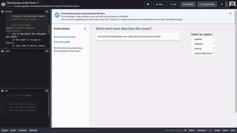

# Creating a custom worker task template

To create a custom labeling job, you need to update the worker task template, map the input data from your manifest file to the variables used in the template, and map the output data to Amazon S3. To learn more about advanced features that use Liquid automation, see [Adding automation with Liquid](sms-custom-templates-step2-automate.md "sms-custom-templates-step2-automate.md").

The following sections describe each of the required steps.

## Worker task template

A _worker task template_ is a file used by Ground Truth to customize the worker user interface (UI). You can create a worker task template using HTML, CSS, JavaScript, [Liquid template language](https://shopify.github.io/liquid/ "https://shopify.github.io/liquid/"), and [Crowd HTML Elements](sms-ui-template-reference.md "sms-ui-template-reference.md"). Liquid is used to automate the template. Crowd HTML Elements are used to include common annotation tools and provide the logic to submit to Ground Truth.

Use the following topics to learn how you can create a worker task template. You can see a repository of example Ground Truth worker task templates on [GitHub](https://github.com/aws-samples/amazon-sagemaker-ground-truth-task-uis "https://github.com/aws-samples/amazon-sagemaker-ground-truth-task-uis").

### Using the base worker task template in the SageMaker AI console

You can use a template editor in the Ground Truth console to start creating a
template. This editor includes a number of pre-designed base templates. It
supports autofill for HTML and Crowd HTML Element code.

###### To access the Ground Truth custom template editor:

1. Following the instructions in [Create a Labeling Job (Console)](sms-create-labeling-job-console.md "sms-create-labeling-job-console.md").
2. Then select **Custom** for the labeling job **Task type**.
3. Choose **Next**, and then you can access the template editor and base templates in the **Custom labeling task setup** section.
4. (Optional) Select a base template from the drop-down menu under **Templates**. If you prefer to create a template from scratch, choose **Custom** from the drop down-menu for a minimal template skeleton.

Use the following section to learn how to visualize a template developed in the console locally.

#### Visualizing your worker task templates locally

You must use the console to test how your template processes incoming data. To test the look and feel of your template's HTML and custom elements you can use your browser.

###### Note

Variables will not be parsed. You may need to replace them with sample content while viewing your content locally.

The following example code snippet loads the necessary code to render the custom HTML elements. Use this if you want to develop your template's look and feel in your preferred editor rather than in the console.

###### Example

```
<script src="https://assets.crowd.aws/crowd-html-elements.js"></script>
```

### Creating a simple HTML task sample

Now that you have the base worker task template, you can use this topic to create a simple HTML-based task template.

The following is an example entry from an input manifest file.

```
{
  "source": "This train is really late.",
  "labels": [ "angry" , "sad", "happy" , "inconclusive" ],
  "header": "What emotion is the speaker feeling?"
}
```

In the HTML task template we need to map the variables from input manifest file to the template. The variable from the example input manifest would be mapped using the following syntax `task.input.source`, `task.input.labels`, and `task.input.header`.

The following is a simple example HTML worker task template for tweet-analysis. All tasks begin and end with the `<crowd-form> </crowd-form>` elements. Like standard HTML `<form>` elements, all of your form code should go between them. Ground Truth generates the workers' tasks directly from the context specified in the template, unless you implement a pre-annotation Lambda. The `taskInput` object returned by Ground Truth or [Pre-annotation Lambda](sms-custom-templates-step3-lambda-requirements.md#sms-custom-templates-step3-prelambda "sms-custom-templates-step3-lambda-requirements.md#sms-custom-templates-step3-prelambda") is the `task.input` object in your templates.

For a simple tweet-analysis task, use the `<crowd-classifier>` element. It requires the following attributes:

- _name_ - The name of your output variable. Worker annotations are saved to this variable name in your output manifest.
- _categories_ - a JSON formatted array of the possible answers.
- _header_ - a title for the annotation tool

The `<crowd-classifier>` element requires at least the three following child elements.

- _<classification-target>_ - The text the worker will classify based on the options specified in the `categories` attribute above.
- _<full-instructions>_ - Instructions that are available from the "View full instructions" link in the tool. This can be left blank, but it is recommended that you give good instructions to get better results.
- _<short-instructions>_ - A more brief description of the task that appears in the tool's sidebar. This can be left blank, but it is recommended that you give good instructions to get better results.

A simple version of this tool would look like the following. The variable `{{ task.input.source }}` is what specifies the source data from your input manifest file. The `{{ task.input.labels | to_json }}` is an example of a variable filter to turn the array into a JSON representation. The `categories` attribute must be JSON.

###### Example of using `crowd-classifier` with the sample input manifest json

```
<script src="https://assets.crowd.aws/crowd-html-elements.js"></script>
<crowd-form>
  <crowd-classifier
    name=`"tweetFeeling"`
    categories="`='{{ task.input.labels | to_json }}'`"
    header="{{ task.input.header }}'"
  >
     <classification-target>
       `{{ task.input.source }}`
     </classification-target>

    <full-instructions header="Sentiment Analysis Instructions">
      Try to determine the sentiment the author
      of the tweet is trying to express.
      If none seem to match, choose "cannot determine."
    </full-instructions>

    <short-instructions>
      Pick the term that best describes the sentiment of the tweet.
    </short-instructions>

  </crowd-classifier>
</crowd-form>
```

You can copy and paste the code into the editor in the Ground Truth labeling job creation workflow to preview the tool, or try out a [demo of this code on CodePen.](https://codepen.io/MTGT/full/OqBvJw "https://codepen.io/MTGT/full/OqBvJw")

[](https://codepen.io/MTGT/full/OqBvJw "https://codepen.io/MTGT/full/OqBvJw")

## Input data, external assets and your task template

Following sections describe the use of external assets, input data format requirements, and when to consider using pre-annotation Lambda functions.

### Input data format requirements

When you create an input manifest file to use in your custom Ground Truth labeling job, you must store the data in Amazon S3. The input manifest files must also be saved in the same AWS Region in which your custom Ground Truth labeling job is to be run. Furthermore, it can be stored in any Amazon S3 bucket that is accessible to the IAM service role that you use to run your custom labeling job in Ground Truth.

Input manifest files must use the newline-delimited JSON or JSON lines format. Each line is delimited by a standard line break, `\n` or `\r\n`. Each line must also be a valid JSON object.

Furthermore, each JSON object in the manifest file must contain one of the following keys: `source-ref` or `source`. The value of the keys are interpreted as follows:

- `source-ref` – The source of the object is the Amazon S3 object
  specified in the value. Use this value when the object is a binary object, such
  as an image.
- `source` – The source of the object is the value. Use this
  value when the object is a text value.

To learn more about formatting your input manifest files, see [Input manifest files](sms-input-data-input-manifest.md "sms-input-data-input-manifest.md").

### Pre-annotation Lambda function

You can optionally specify a _pre-annotation Lambda_ function to manage how data from
your input manifest file is handled prior to labeling. If you have specified the
`isHumanAnnotationRequired` key-value pair you must us a
pre-annotation Lambda function. When Ground Truth sends the pre-annotation Lambda
function a JSON formatted request it uses the following schemas.

###### Example data object identified with the `source-ref` key-value pair

```
{
  "version": "2018-10-16",
  "labelingJobArn": `arn:aws:lambda:us-west-2:555555555555:function:my-function`
  "dataObject" : {
    "source-ref": `s3://input-data-bucket/data-object-file-name`
  }
}
```

###### Example data object identified with the `source` key-value pair

```
{
      "version": "2018-10-16",
      "labelingJobArn" : `arn:aws:lambda:us-west-2:555555555555:function:my-function`
      "dataObject" : {
        "source": `Sue purchased 10 shares of the stock on April 10th, 2020`
      }
    }
```

The following is the expected response from the Lambda function when `isHumanAnnotationRequired` is used.

```
{
  "taskInput": `{
 "source": "This train is really late.",
 "labels": [ "angry" , "sad" , "happy" , "inconclusive" ],
 "header": "What emotion is the speaker feeling?"
 }`,
  "isHumanAnnotationRequired": `False`
}
```

### Using External Assets

Amazon SageMaker Ground Truth custom templates allow external scripts and style sheets to be embedded. For example, the following code block demonstrates how you would add a style sheet located at `https://www.example.com/my-enhancement-styles.css` to your template.

###### Example

```
<script src="https://www.example.com/my-enhancment-script.js"></script>
<link rel="stylesheet" type="text/css" href="https://www.example.com/my-enhancement-styles.css">
```

If you encounter errors, ensure that your originating server is sending the correct MIME type and encoding headers with the assets.

For example, the MIME and encoding types for remote scripts are: `application/javascript;CHARSET=UTF-8`.

The MIME and encoding type for remote stylesheets are: `text/css;CHARSET=UTF-8`.

## Output data and your task template

The following sections describe the output data from a custom labeling job, and when to consider using a post-annotation Lambda function.

### Output data

When your custom labeling job is finished, the data is saved in the Amazon S3 bucket specified when the labeling job was created. The data is saved in an `output.manifest` file.

###### Note

`labelAttributeName` is a placeholder variable. In your output it is either the name of your labeling job, or the label attribute name you specify when you create the labeling job.

- `source` or `source-ref` – Either the string or an S3 URI workers were asked to label.
- `labelAttributeName` – A dictionary containing consolidated label content from the [post-annotation Lambda function](sms-custom-templates-step3-lambda-requirements.md#sms-custom-templates-step3-postlambda "sms-custom-templates-step3-lambda-requirements.md#sms-custom-templates-step3-postlambda"). If a post-annotation Lambda function is not specified, this dictionary will be empty.
- `labelAttributeName-metadata` – Metadata from your custom labeling job added by Ground Truth.
- `worker-response-ref` – The S3 URI of the bucket where the data is saved. If a post-annotation Lambda function is specified this key-value pair will not present.

In this example the JSON object is formatted for readability, in the actual output file the JSON object is on a single line.

```
{
  "source" : "`This train is really late.`",
  "labelAttributeName" : {},
  "labelAttributeName-metadata": { # These key values pairs are added by Ground Truth
    "job_name": "`test-labeling-job`",
    "type": "groundTruth/custom",
    "human-annotated": "yes",
    "creation_date": "2021-03-08T23:06:49.111000",
    "worker-response-ref": "`s3://amzn-s3-demo-bucket/test-labeling-job/annotations/worker-response/iteration-1/0/2021-03-08_23:06:49.json`"
  }
}
```

### Using a post annotation Lambda to consolidate the results from your workers

By default Ground Truth saves worker responses unprocessed in Amazon S3. To have more fine-grained control over how responses are handled, you can specify a _post-annotation Lambda function_. For example, a post-annotation Lambda function could be used to consolidate annotation if multiple workers have labeled the same data object. To learn more about creating post-annotation Lambda functions, see [Post-annotation Lambda](sms-custom-templates-step3-lambda-requirements.md#sms-custom-templates-step3-postlambda "sms-custom-templates-step3-lambda-requirements.md#sms-custom-templates-step3-postlambda").

If you want to use a post-annotation Lambda function, it must be specified as part of the [`AnnotationConsolidationConfig`](../APIReference/API_AnnotationConsolidationConfig.md "../APIReference/API_AnnotationConsolidationConfig.md") in a `CreateLabelingJob` request.

To learn more about how annotation consolidation works, see [Annotation consolidation](sms-annotation-consolidation.md "sms-annotation-consolidation.md").
