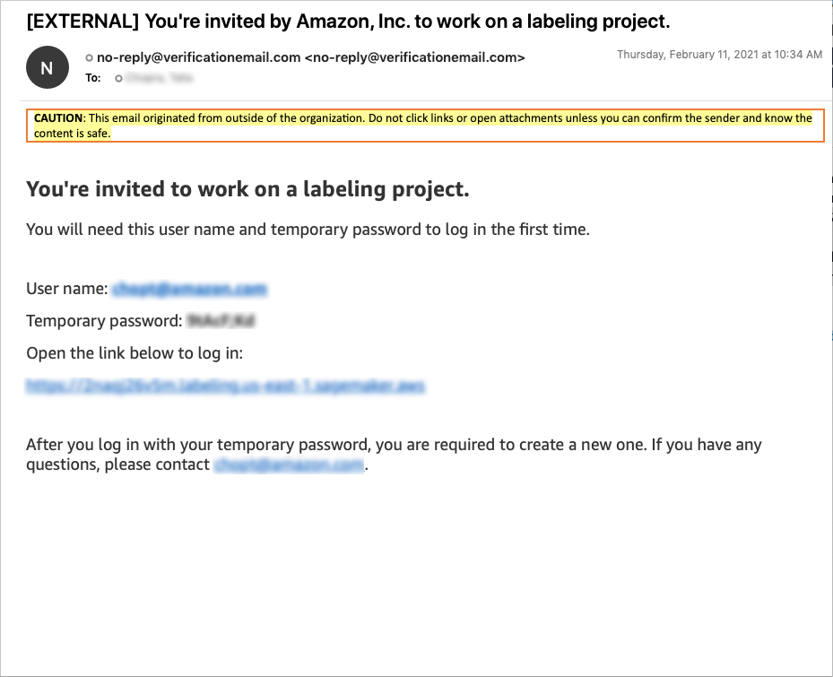

# Getting started: Create a bounding box labeling job

with Ground Truth

To get started using Amazon SageMaker Ground Truth, follow the instructions in the following sections. The
sections here explain how to use the console to create a bounding box labeling job, assign a
public or private workforce, and send the labeling job to your workforce. You can also learn
how to monitor the progress of a labeling job.

This video shows you how to setup and use Amazon SageMaker Ground Truth. (Length: 9:37)

If you want to create a custom labeling workflow, see [Custom labeling workflows](sms-custom-templates.md "sms-custom-templates.md") for instructions.

Before you create a labeling job, you must upload your dataset to an Amazon S3 bucket. For more
information, see [Use input and output data](sms-data.md "sms-data.md").

###### Topics

- [Before You Begin](#sms-getting-started-step1 "#sms-getting-started-step1")
- [Create a Labeling Job](#sms-getting-started-step2 "#sms-getting-started-step2")
- [Select Workers](#sms-getting-started-step3 "#sms-getting-started-step3")
- [Configure the Bounding Box
  Tool](#sms-getting-started-step4 "#sms-getting-started-step4")
- [Monitoring Your Labeling Job](sms-getting-started-step5.md "sms-getting-started-step5.md")

## Before You Begin

Before you begin using the SageMaker AI console to create a labeling job, you must set up the
dataset for use. Do this:

1. Save two images at publicly available HTTP URLs. The images are used when
   creating instructions for completing a labeling task. The images should have an
   aspect ratio of around 2:1. For this exercise, the content of the images is not
   important.
2. Create an Amazon S3 bucket to hold the input and output files. The bucket must be
   in the same Region where you are running Ground Truth. Make a note of the bucket name
   because you use it during step 2.

Ground Truth requires all S3 buckets that contain
labeling job input image data have a CORS policy attached. To learn more about
this change, see [CORS Requirement for Input Image Data](sms-cors-update.md "sms-cors-update.md"). 3. You can create an IAM role or let SageMaker AI create a role with the [AmazonSageMakerFullAccess](security-iam-awsmanpol.md#security-iam-awsmanpol-AmazonSageMakerFullAccess "security-iam-awsmanpol.md#security-iam-awsmanpol-AmazonSageMakerFullAccess") IAM policy. Refer to [Creating IAM roles](../../../IAM/latest/UserGuide/id_roles_create.md "../../../IAM/latest/UserGuide/id_roles_create.md") and assign the following permissions policy to the user that is creating the
labeling job:

JSON

```
`{
 "Version":"2012-10-17",
 "Statement": [
 {
 "Sid": "sagemakergroundtruth",
 "Effect": "Allow",
 "Action": [
 "cognito-idp:CreateGroup",
 "cognito-idp:CreateUserPool",
 "cognito-idp:CreateUserPoolDomain",
 "cognito-idp:AdminCreateUser",
 "cognito-idp:CreateUserPoolClient",
 "cognito-idp:AdminAddUserToGroup",
 "cognito-idp:DescribeUserPoolClient",
 "cognito-idp:DescribeUserPool",
 "cognito-idp:UpdateUserPool"
 ],
 "Resource": "*"
 }
 ]
}`

```

## Create a Labeling Job

In this step you use the console to create a labeling job. You tell Amazon SageMaker Ground Truth the Amazon S3
bucket where the manifest file is stored and configure the parameters for the job. For
more information about storing data in an Amazon S3 bucket, see [Use input and output data](sms-data.md "sms-data.md").

###### To create a labeling job

1. Open the SageMaker AI console at [https://console.aws.amazon.com/sagemaker/](https://console.aws.amazon.com/sagemaker/ "https://console.aws.amazon.com/sagemaker/").
2. From the left navigation, choose **Labeling jobs**.
3. Choose **Create labeling job** to start the job creation
   process.
4. In the **Job overview** section, provide the following
   information:
   - **Job name** – Give the labeling job a name
     that describes the job. This name is shown in your job list. The name
     must be unique in your account in an AWS Region.
   - **Label attribute name** – Leave this
     unchecked as the default value is the best option for this introductory
     job.
   - **Input data setup** – Select
     **Automated data setup**. This option allows you to
     automatically connect to your input data in S3.
   - **S3 location for input datasets** – Enter the
     S3 location where you added the images in step 1.
   - **S3 location for output datasets** – The
     location where your output data is written in S3.
   - **Data type** – Use the drop down menu to
     select **Image**. Ground Truth will use all images found in
     the S3 location for input datasets as input for your labeling
     job.
   - **IAM role** – Create or choose an IAM role
     with the AmazonSageMakerFullAccess IAM policy attached.

5. In the **Task type** section, for the **Task
   category** field, choose **Image**.
6. In the **Task selection** choose **Bounding
   box**.
7. Choose **Next** to move on to configuring your labeling
   job.

## Select Workers

In this step you choose a workforce for labeling your dataset. It is recommended that
you create a private workforce to test Amazon SageMaker Ground Truth. Use email addresses to invite the
members of your workforce. If you create a private workforce in this step you won't be
able to import your Amazon Cognito user pool later. If you want to create a private workforce
using an Amazon Cognito user pool, see [Manage a Private Workforce
(Amazon Cognito)](sms-workforce-management-private.md "sms-workforce-management-private.md") and use the Mechanical Turk workforce
instead in this tutorial.

###### Tip

To learn about the other workforce options you can use with Ground Truth, see [Workforces](sms-workforce-management.md "sms-workforce-management.md").

###### To create a private workforce:

1. In the **Workers** section, choose
   **Private**.
2. If this is your first time using a private workforce, in the **Email
   addresses** field, enter up to 100 email addresses. The addresses
   must be separated by a comma. You should include your own email address so
   that you are part of the workforce and can see data object labeling
   tasks.
3. In the **Organization name** field, enter the name of your
   organization. This information is used to customize the email sent to invite a
   person to your private workforce. You can change the organization name after the user pool is created through the console.
4. In the **Contact email** field enter an email address that
   members of the workforce use to report problems with the task.

If you add yourself to the private workforce, you will receive an email that looks
similar to the following. **Amazon, Inc.** is replaced by the
organization you enter in step 3 of the preceding procedure. Select the link in the
email to log in using the temporary password provided. If prompted, change your
password. When you successfully log in, you see the worker portal where your labeling
tasks appear.



###### Tip

You can find the link to your private workforce's worker portal in the
**Labeling workforces** section of the Ground Truth area of the SageMaker AI
console. To see the link, select the **Private** tab. The link is
under the **Labeling portal sign-in URL** header in
**Private workforce summary**.

If you choose to use the Amazon Mechanical Turk workforce to label the dataset, you are charged for
labeling tasks completed on the dataset.

###### To use the Amazon Mechanical Turk workforce:

1. In the **Workers** section, choose
   **Public**.
2. Set a **Price per task**.
3. If applicable, choose **The dataset does not contain adult
   content** to acknowledge that the sample dataset has no adult
   content. This information enables Amazon SageMaker Ground Truth to warn external
   workers on Mechanical Turk that they might encounter potentially offensive
   content in your dataset.
4. Choose the check box next to the following statement to acknowledge that the
   sample dataset does not contain any personally identifiable information (PII).
   This is a requirement to use Mechanical Turk with Ground Truth. If your input data does contain
   PII, use the private workforce for this tutorial.

**You understand and agree that the Amazon Mechanical Turk workforce
consists of independent contractors located worldwide and that you should
not share confidential information, personal information or protected health
information with this workforce.**

## Configure the Bounding Box

Tool

Finally you configure the bounding box tool to give instructions to your workers. You
can configure a task title that describes the task and provides high-level instructions
for the workers. You can provide both quick instructions and full instructions. Quick
instructions are displayed next to the image to be labeled. Full instructions contain
detailed instructions for completing the task. In this example, you only provide quick
instructions. You can see an example of full instructions by choosing **Full
instructions** at the bottom of the section.

###### To configure the bounding box tool

1. In the **Task description** field type in brief instructions
   for the task. For example:

`Draw a box around any `objects` in the
 image.`

Replace `objects` with the name of an object that
appears in your images. 2. In the **Labels** field, type a category name for the objects
that the worker should draw a bounding box around. For example, if you are
asking the worker to draw boxes around football players, you could use "Football
Player" in this field. 3. The **Short instructions** section enables you to create
instructions that are displayed on the page with the image that your workers are
labeling. We suggest that you include an example of a correctly drawn bounding
box and an example of an incorrectly drawn box. To create your own instructions,
use these steps:

    1. Select the text between **GOOD EXAMPLE** and the
     image placeholder. Replace it with the following text:


    `Draw the box around the object with a small
     border.`
    2. Select the first image placeholder and delete it.
    3. Choose the image button and then enter the HTTPS URL of one of the
     images that you created in step 1. It is also possible to embed images
     directly in the short instructions section, however this section has a
     quota of 100 kilobytes (including text). If your images and text exceed
     100 kilobytes, you receive an error.
    4. Select the text between **BAD EXAMPLE** and the image
     placeholder. Replace it with the following text:


    `Don't make the bounding box too large or cut into the
     object.`
    5. Select the second image placeholder and delete it.
    6. Choose the image button and then enter the HTTPS URL of the other
     image that you created in step 1.

4. Select **Preview** to preview the worker UI. The preview
   opens in a new tab, and so if your browser blocks pop ups you may need to
   manually enable the tab to open. When you add one or more annotations to the
   preview and then select **Submit** you can see a preview of the
   output data your annotation would created.
5. After you have configured and verified your instructions, select
   **Create** to create the labeling job.

If you used a private workforce, you can navigate to the worker portal that you logged
into in [Select Workers](#sms-getting-started-step3 "#sms-getting-started-step3") of this tutorial to see your labeling
tasks. The tasks may take a few minutes to appear.

Now that you've created a labeling job, you can [monitor it, or stop it](sms-getting-started-step5.md "sms-getting-started-step5.md").
