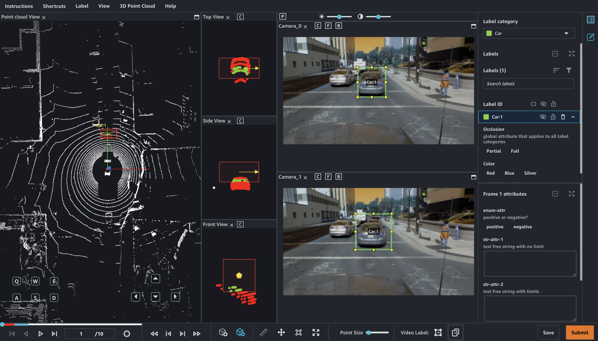
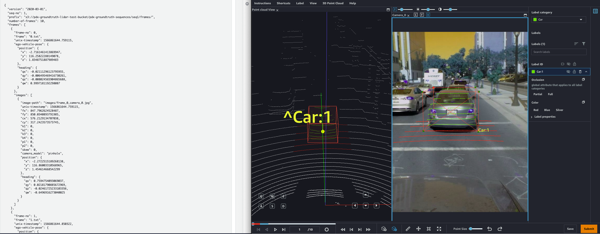

# View the worker task

interface for a 3D-2D object tracking labeling job

Ground Truth provides workers with a web portal and tools to complete your 3D-2D object
tracking annotation tasks. When you create the labeling job, you provide the Amazon
Resource Name (ARN) for a pre-built Ground Truth UI in the `HumanTaskUiArn`
parameter. To use the UI when you create a labeling job for this task type using the
API, you need to provide the `HumanTaskUiArn`. You can preview and interact
with the worker UI when you create a labeling job through the API. The annotating tools
are a part of the worker task interface. They are not available for the preview
interface. The following image demonstrates the worker task interface used for the 3D-2D
point cloud object tracking annotation task.

When interpolation is enabled by default. After a worker adds a single cuboid, that
cuboid is replicated in all frames of the sequence with the same ID. If the worker
adjusts the cuboid in another frame, Ground Truth interpolates the movement of that object and
adjust all cuboids between the manually adjusted frames. Additionally, using the camera
view section, a cuboid can be shown with a projection (using to B button for "toggle
labels" in the camera view) that provides the worker with a reference from the camera
images. The accuracy of the cuboid to image projection is based on accuracy of
calibrations captured in the extrinsic and intrinsinc data.

If you provide camera data for sensor fusion, images are matched up with scenes in
point cloud frames. Note that the camera data should be time synchronized with the point
cloud data to ensure an accurate depiction of point cloud to imagery over each frame in
the sequence as shown in the following image.

The manifest file holds the extrinsic and intrinsic data and the pose to allow the
cuboid projection on the camera image to be shown by using the **P
button**.

Worker can navigate in the 3D scene using their keyboard and mouse. They can:

- Double click on specific objects in the point cloud to zoom into them.
- Use a mouse-scroller or trackpad to zoom in and out of the point cloud.
- Use both keyboard arrow keys and Q, E, A, and D keys to move Up, Down, Left,
  Right. Use keyboard keys W and S to zoom in and out.
  Once a worker places a cuboids in the 3D scene, a side-view appears with the three
  projected side views: top, side, and front. These side-views show points in and around
  the placed cuboid and help workers refine cuboid boundaries in that area. Workers can
  zoom in and out of each of those side-views using their mouse.

The worker should first select the cuboid to draw a corresponding bounding box on any
of the camera views. This links the cuboid and the bounding box with a common name and
unique ID.

The worker can also first draw a bounding box, select it and draw the corresponding
cuboid to link them.

Additional view options and features are available. See the [worker instruction page](sms-point-cloud-worker-instructions-object-tracking.md "sms-point-cloud-worker-instructions-object-tracking.md") for a comprehensive overview of the Worker UI.

## Worker tools

Workers can navigate through the 3D point cloud by zooming in and out, and moving
in all directions around the cloud using the mouse and keyboard shortcuts. If
workers click on a point in the point cloud, the UI automatically zooms into that
area. Workers can use various tools to draw 3D cuboid around objects. For more
information, see **Assistive Labeling Tools** in the following
discussion.

After workers have placed a 3D cuboid in the point cloud, they can adjust these
cuboids to fit tightly around cars using a variety of views: directly in the 3D
point cloud, in a side-view featuring three zoomed-in perspectives of the point
cloud around the box, and if you include images for sensor fusion, directly in the
2D image.

Additional view options enable workers to easily hide or view label text, a ground
mesh, and additional point attributes. Workers can also choose between perspective
and orthogonal projections.

###### Assistive Labeling Tools

Ground Truth helps workers annotate 3D point clouds faster and more accurately using
UX, machine learning and computer vision powered assistive labeling tools for 3D
point cloud object tracking tasks. The following assistive labeling tools are
available for this task type:

- **Label autofill** – When a worker
  adds a cuboid to a frame, a cuboid with the same dimensions, orientation and
  xyz position is automatically added to all frames in the sequence.
- **Label interpolation** – After a
  worker has labeled a single object in two frames, Ground Truth uses those
  annotations to interpolate the movement of that object between all the
  frames. Label interpolation can be turned on and off. It is on by default.
  For example, if a worker working with 5 frames adds a cuboid in frame 2, it
  is copied to all the 5 frames. If the worker then makes adjustments in frame
  4, frame 2 and 4 now act as two points, through which a line is fit. The
  cuboid is then interpolated in frames 1,3 and 5.
- **Bulk label and attribute management**
  – Workers can add, delete, and rename annotations, label category
  attributes, and frame attributes in bulk.
  - Workers can manually delete annotations for a given object before
    and after a frame, or in all frames. For example, a worker can
    delete all labels for an object after frame 10 if that object is no
    longer located in the scene after that frame.
  - If a worker accidentally bulk deletes all annotations for a
    object, they can add them back. For example, if a worker deletes all
    annotations for an object before frame 100, they can bulk add them
    to those frames.
  - Workers can rename a label in one frame and all 3D cuboids
    assigned that label are updated with the new name across all frames.
  - Workers can use bulk editing to add or edit label category
    attributes and frame attributes in multiple frames.

- **Snapping** – Workers can add a
  cuboid around an object and use a keyboard shortcut or menu option to have
  Ground Truth's autofit tool snap the cuboid tightly around the object's boundaries.
- **Fit to ground** – After a worker
  adds a cuboid to the 3D scene, the worker can automatically snap the cuboid
  to the ground. For example, the worker can use this feature to snap a cuboid
  to the road or sidewalk in the scene.
- **Multi-view labeling** – After a
  worker adds a 3D cuboid to the 3D scene, a side-panel displays front and two
  side perspectives to help the worker adjust the cuboid tightly around the
  object. Workers can annotation the 3D point cloud, the side panel and the
  adjustments appear in the other views in real time.
- **Sensor fusion** – If you provide
  data for sensor fusion, workers can adjust annotations in the 3D scenes and
  in 2D images, and the annotations are projected into the other view in real
  time. To learn more about the data for sensor fusion, see [Understand Coordinate Systems and Sensor Fusion](sms-point-cloud-sensor-fusion-details.md#sms-point-cloud-sensor-fusion "sms-point-cloud-sensor-fusion-details.md#sms-point-cloud-sensor-fusion").
- **Auto-merge cuboids** – Workers can
  automatically merge two cuboids across all frames if they determine that
  cuboids with different labels actually represent a single object.
- **View options** – Enables workers to
  easily hide or view label text, a ground mesh, and additional point
  attributes like color or intensity. Workers can also choose between
  perspective and orthogonal projections.
