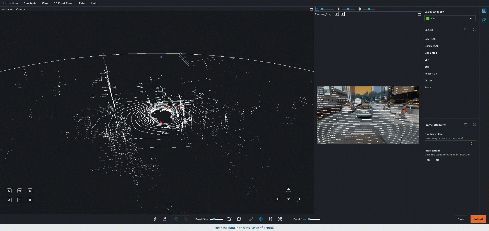
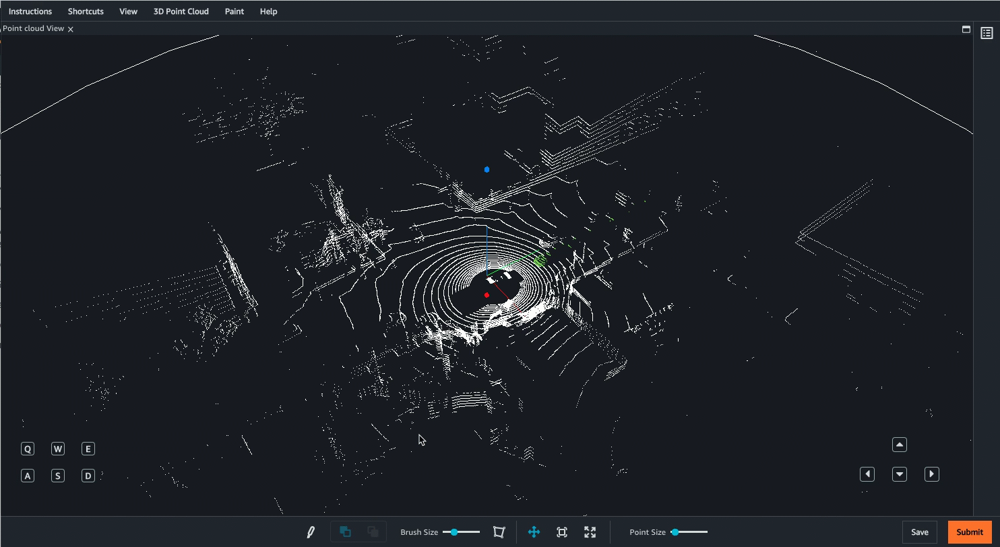
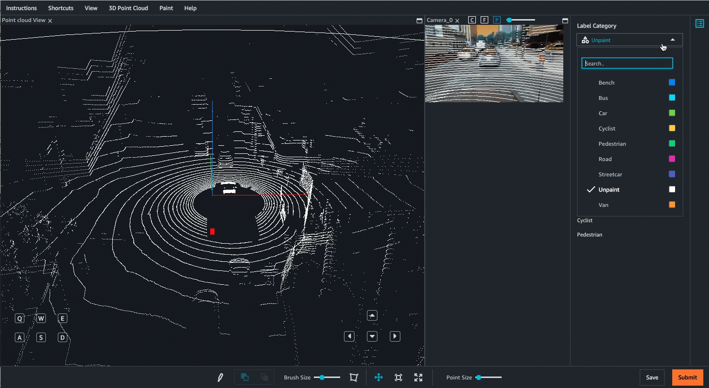

# View the worker task

interface for a 3D point cloud semantic segmentation job

Ground Truth provides workers with a web portal and tools to complete your 3D point cloud
semantic segmentation annotation tasks. When you create the labeling job, you provide
the Amazon Resource Name (ARN) for a pre-built Ground Truth UI in the
`HumanTaskUiArn` parameter. When you create a labeling job using this task
type in the console, this UI is automatically used. You can preview and interact with
the worker UI when you create a labeling job in the console. If you are a new use, it is
recommended that you create a labeling job using the console to ensure your label
attributes, point cloud frames, and if applicable, images, appear as expected.

The following is a GIF of the 3D point cloud semantic segmentation worker task
interface. If you provide camera data for sensor fusion, images are matched with scenes
in the point cloud frame. Workers can paint objects in either the 3D point cloud or the
2D image, and the paint appears in the corresponding location in the other medium. These
images appear in the worker portal as shown in the following GIF.

Worker can navigate in the 3D scene using their keyboard and mouse. They can:

- Double click on specific objects in the point cloud to zoom into them.
- Use a mouse-scroller or trackpad to zoom in and out of the point cloud.
- Use both keyboard arrow keys and Q, E, A, and D keys to move Up, Down, Left,
  Right. Use keyboard keys W and S to zoom in and out.
  The following video demonstrates movements around the 3D point cloud. Workers can hide
  and re-expand all side views and menus. In this GIF, the side-views and menus have been
  collapsed.

The following GIF demonstrates how a worker can label multiple objects quickly, refine
painted objects using the Unpaint option and then view only points that have been
painted.

Additional view options and features are available. See the [worker instruction page](sms-point-cloud-worker-instructions-semantic-segmentation.md "sms-point-cloud-worker-instructions-semantic-segmentation.md") for a comprehensive overview of the Worker UI.

###### Worker Tools

Workers can navigate through the 3D point cloud by zooming in and out, and moving
in all directions around the cloud using the mouse and keyboard shortcuts. When you
create a semantic segmentation job, workers have the following tools available to
them:

- A paint brush to paint and unpaint objects. Workers paint objects by selecting
  a label category and then painting in the 3D point cloud. Workers unpaint
  objects by selecting the Unpaint option from the label category menu and using
  the paint brush to erase paint.
- A polygon tool that workers can use to select and paint an area in the point
  cloud.
- A background paint tool, which enables workers to paint behind objects they
  have already annotated without altering the original annotations. For example,
  workers might use this tool to paint the road after painting all of the cars on
  the road.
- View options that enable workers to easily hide or view label text, a ground
  mesh, and additional point attributes like color or intensity. Workers can also
  choose between perspective and orthogonal projections.
