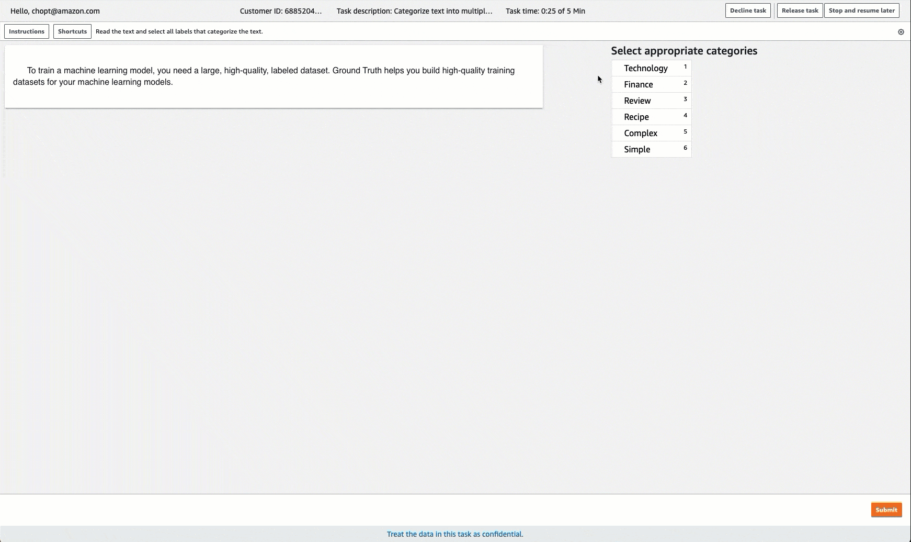

# Categorize text with text

classification (Multi-label)

To categorize articles and text into multiple predefined categories, use the multi-label
text classification task type. For example, you can use this task type to identify more than
one emotion conveyed in text. The following sections give information about how to create a
multi-label text classification task from the console and API.

When working on a multi-label text classification task, workers should choose all
applicable labels, but must choose at least one. When creating a job using this task type,
you can provide up to 50 label categories.

Amazon SageMaker Ground Truth doesn't provide a "none" category for when none of the labels applies. To
provide this option to workers, include a label similar to "none" or "other" when you create
a multi-label text classification job.

To restrict workers to choosing a single label for each document or text selection, use
the [Categorize text with text classification (Single
Label)](sms-text-classification.md "sms-text-classification.md") task
type.

###### Important

If you manually create an input manifest file, use `"source"` to identify
the text that you want labeled. For more information, see [Input data](sms-data-input.md "sms-data-input.md").

## Create a Multi-Label Text

Classification Labeling Job (Console)

You can follow the instructions [Create a Labeling Job (Console)](sms-create-labeling-job-console.md "sms-create-labeling-job-console.md") to learn how to create a
multi-label text classification labeling job in the Amazon SageMaker AI console. In Step 10, choose
**Text** from the **Task
category** drop down menu, and choose **Text
Classification (Multi-label)** as the task type.

Ground Truth provides a worker UI similar to the following for labeling tasks. When you
create the labeling job with the console, you specify instructions to help workers
complete the job and labels that workers can choose from.



## Create a Multi-Label

Text Classification Labeling Job (API)

To create a multi-label text classification labeling job, use the SageMaker API operation
`CreateLabelingJob`. This API defines this operation for all AWS SDKs.
To see a list of language-specific SDKs supported for this operation, review the
**See Also** section of [`CreateLabelingJob`](../APIReference/API_CreateLabelingJob.md "../APIReference/API_CreateLabelingJob.md").

Follow the instructions on [Create a Labeling Job (API)](sms-create-labeling-job-api.md "sms-create-labeling-job-api.md") and do the following while you
configure your request:

- Pre-annotation Lambda functions for this task type end with
  `PRE-TextMultiClassMultiLabel`. To find the pre-annotation Lambda
  ARN for your Region, see [PreHumanTaskLambdaArn](API_HumanTaskConfig.md#SageMaker-Type-HumanTaskConfig-PreHumanTaskLambdaArn "API_HumanTaskConfig.md#SageMaker-Type-HumanTaskConfig-PreHumanTaskLambdaArn") .
- Annotation-consolidation Lambda functions for this task type end with
  `ACS-TextMultiClassMultiLabel`. To find the
  annotation-consolidation Lambda ARN for your Region, see [AnnotationConsolidationLambdaArn](API_AnnotationConsolidationConfig.md#SageMaker-Type-AnnotationConsolidationConfig-AnnotationConsolidationLambdaArn "API_AnnotationConsolidationConfig.md#SageMaker-Type-AnnotationConsolidationConfig-AnnotationConsolidationLambdaArn").

The following is an example of an [AWS Python SDK (Boto3) request](https://boto3.amazonaws.com/v1/documentation/api/latest/reference/services/sagemaker.html#SageMaker.Client.create_labeling_job "https://boto3.amazonaws.com/v1/documentation/api/latest/reference/services/sagemaker.html#SageMaker.Client.create_labeling_job") to create a labeling job in the
US East (N. Virginia) Region. All parameters in red should be replaced with your
specifications and resources.

```
response = client.create_labeling_job(
    LabelingJobName=`'example-multi-label-text-classification-labeling-job`,
    LabelAttributeName=`'label'`,
    InputConfig={
        'DataSource': {
            'S3DataSource': {
                'ManifestS3Uri': `'s3://bucket/path/manifest-with-input-data.json'`
            }
        },
        'DataAttributes': {
            'ContentClassifiers': [
                `'FreeOfPersonallyIdentifiableInformation'|'FreeOfAdultContent'`,
            ]
        }
    },
    OutputConfig={
        'S3OutputPath': `'s3://bucket/path/file-to-store-output-data'`,
        'KmsKeyId': `'string'`
    },
    RoleArn=`'arn:aws:iam::*:role/*`,
    LabelCategoryConfigS3Uri=`'s3://bucket/path/label-categories.json'`,
    StoppingConditions={
        'MaxHumanLabeledObjectCount': `123`,
        'MaxPercentageOfInputDatasetLabeled': `123`
    },
    HumanTaskConfig={
        'WorkteamArn': `'arn:aws:sagemaker:region:*:workteam/private-crowd/*'`,
        'UiConfig': {
            'UiTemplateS3Uri': `'s3://bucket/path/custom-worker-task-template.html'`
        },
        'PreHumanTaskLambdaArn': 'arn:aws:lambda::function:PRE-TextMultiClassMultiLabel,
        'TaskKeywords': [
            `'Text Classification'`,
        ],
        'TaskTitle': `'Multi-label text classification task'`,
        'TaskDescription': `'Select all labels that apply to the text shown'`,
        'NumberOfHumanWorkersPerDataObject': `123`,
        'TaskTimeLimitInSeconds': `123`,
        'TaskAvailabilityLifetimeInSeconds': `123`,
        'MaxConcurrentTaskCount': `123`,
        'AnnotationConsolidationConfig': {
            'AnnotationConsolidationLambdaArn': 'arn:aws:lambda:`us-east-1:432418664414`:function:ACS-TextMultiClassMultiLabel'
        },
    Tags=[
        {
            'Key': `'string'`,
            'Value': `'string'`        },
    ]
)
```

### Create a Template for Multi-label Text Classification

If you create a labeling job using the API, you must supply a worker task template
in `UiTemplateS3Uri`. Copy and modify the following template. Only modify
the [`short-instructions`](sms-creating-instruction-pages.md#sms-creating-quick-instructions "sms-creating-instruction-pages.md#sms-creating-quick-instructions"), [`full-instructions`](sms-creating-instruction-pages.md#sms-creating-full-instructions "sms-creating-instruction-pages.md#sms-creating-full-instructions"), and `header`.

Upload this template to S3, and provide the S3 URI for this file in
`UiTemplateS3Uri`.

```
<script src="https://assets.crowd.aws/crowd-html-elements.js"></script>
<crowd-form>
  <crowd-classifier-multi-select
    name="crowd-classifier-multi-select"
    categories="{{ task.input.labels | to_json | escape }}"
    header="Please identify all classes in the below text"
  >
    <classification-target style="white-space: pre-wrap">
      {{ task.input.taskObject }}
    </classification-target>
    <full-instructions header="Classifier instructions">
      <ol><li><strong>Read</strong> the text carefully.</li>
      <li><strong>Read</strong> the examples to understand more about the options.</li>
      <li><strong>Choose</strong> the appropriate labels that best suit the text.</li></ol>
    </full-instructions>
    <short-instructions>
      <p>Enter description of the labels that workers have to choose from</p>
      <p><br></p>
      <p><br></p><p>Add examples to help workers understand the label</p>
      <p><br></p><p><br></p><p><br></p><p><br></p><p><br></p>
    </short-instructions>
  </crowd-classifier-multi-select>
  </crowd-form>
```

To learn how to create a custom template, see [Custom labeling workflows](sms-custom-templates.md "sms-custom-templates.md").

## Multi-label Text

Classification Output Data

Once you have created a multi-label text classification labeling job, your output data
will be located in the Amazon S3 bucket specified in the `S3OutputPath` parameter
when using the API or in the **Output dataset location** field of the
**Job overview** section of the console.

To learn more about the output manifest file generated by Ground Truth and the file structure
the Ground Truth uses to store your output data, see [Labeling job output data](sms-data-output.md "sms-data-output.md").

To see an example of output manifest files for multi-label text classification
labeling job, see [Multi-label classification job output](sms-data-output.md#sms-output-multi-label-classification "sms-data-output.md#sms-output-multi-label-classification").
