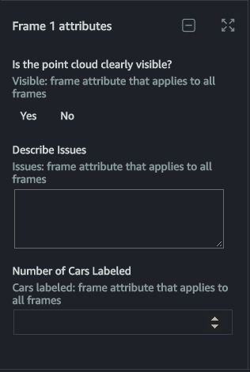

# Your Task

When you work on a video frame object tracking task, you need to select a
category from the **Label category** menu on the right side of
your worker portal to start annotating. After you've chosen a category, use the
tools provided to annotate the objects that the category applies to. This
annotation will be associated with a unique label ID that should only be used
for that object. Use this same label ID to create additional annotations for the
same object in all of the video frames that it appears in. Refer to [Tool Guide](sms-video-worker-instructions-tool-guide.md "sms-video-worker-instructions-tool-guide.md") to
learn more about the tools provided.

After you've added a label, you may see a downward pointing arrow next to the
label in the **Labels** menu. Select this arrow and then select
one option for each label attribute you see to provide more information about
that label.

You may see frame attributes under the **Labels** menu. These
attributes will appear on each frame in your task. Use these attribute prompts
to enter additional information about each frame.

After you've added a label, you can quickly add and edit a label category
attribute value by using the downward pointing arrow next to the label in the
**Labels** menu. If you select the pencil icon next to the
label in the **Labels** menu, the **Edit
instance** menu will appear. You can edit the label ID, label
category, and label category attributes using this menu.

To edit an annotation, select the label of the annotation that you want to
edit in the **Labels** menu or select the annotation in the
frame. When you edit or delete an annotation, the action will only modify the
annotation in a single frame.

If you are working on a task that includes a bounding box tool, use the
predict next icon to predict the location of all bounding boxes that you have
drawn in a frame in the next frame. If you select a single box and then select
the predict next icon, only that box will be predicted in the next frame. If you
have not added any boxes to the current frame, you will receive an error. You
must add at least one box to the frame before using this feature.

After you've used the predict next icon, review the location of each box in
the next frame and make adjustments to the box location and size if necessary.

The following graphic demonstrates how to use the predict next tool:

For all other tools, you can use the **Copy to next** and
**Copy to all** tools to copy your annotations to the next
or all frames respectively.
