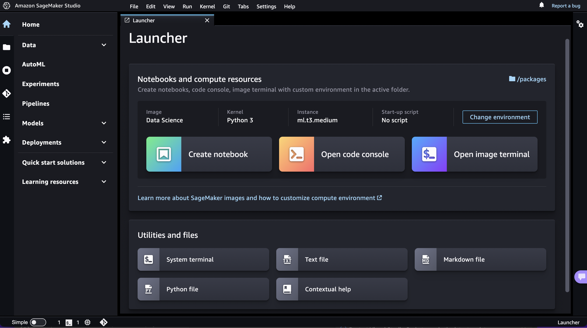

# Launch a Custom SageMaker Image in Amazon SageMaker Studio Classic

###### Important

As of November 30, 2023, the previous Amazon SageMaker Studio experience is now named
Amazon SageMaker Studio Classic. The following section is specific to using the Studio Classic application. For
information about using the updated Studio experience, see [Amazon SageMaker Studio](studio-updated.md "studio-updated.md").

Studio Classic is still maintained for existing
workloads but is no longer available for onboarding. You can only stop or delete existing Studio Classic
applications and cannot create new ones. We recommend that you [migrate your workload to the new Studio experience](studio-updated-migrate.md "studio-updated-migrate.md").

After you create your custom SageMaker image and attach it to your domain or shared space, the
custom image and kernel appear in selectors in the **Change environment**
dialog box of the Studio Classic Launcher.

###### To launch and select your custom image and kernel

1. In Amazon SageMaker Studio Classic, open the Launcher. To open the Launcher, choose
   **Amazon SageMaker Studio Classic** at the top left of the Studio Classic interface or use the
   keyboard shortcut `Ctrl + Shift + L`.

To learn about all the available ways to open the Launcher, see [Use the Amazon SageMaker Studio Classic Launcher](studio-launcher.md "studio-launcher.md")

 2. In the Launcher, in the **Notebooks and compute resources** section,
choose **Change environment**. 3. In the **Change environment** dialog, use the dropdown menus to select
your **Image** from the **Custom Image** section, and your
**Kernel**, then choose **Select**. 4. In the Launcher, choose **Create notebook** or **Open image
terminal**. Your notebook or terminal launches in the selected custom image and
kernel.
To change your image or kernel in an open notebook, see [Change the Image or a Kernel for an Amazon SageMaker Studio Classic Notebook](notebooks-run-and-manage-change-image.md "notebooks-run-and-manage-change-image.md").

###### Note

If you encounter an error when launching the image, check your Amazon CloudWatch logs. The name of
the log group is `/aws/sagemaker/studio`. The name of the log stream is
`$domainID/$userProfileName/KernelGateway/$appName`.
