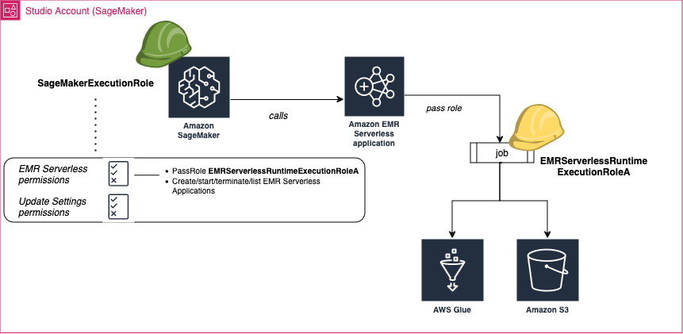
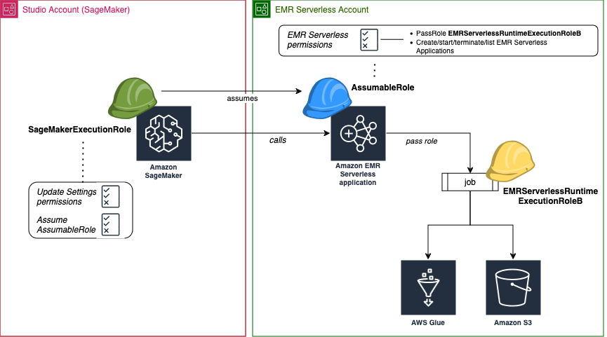

# Set up the permissions to enable

listing and launching Amazon EMR applications from SageMaker Studio

In this section, we detail the roles and permissions required to list and connect to
EMR Serverless applications from SageMaker Studio, considering scenarios where
Studio and the EMR Serverless applications are deployed in the same AWS account
or across different accounts.

The roles to which you must add the necessary permissions depend on whether
Studio and your EMR Serverless applications reside in the same AWS account
(_Single Account_) or in separate accounts
(_Cross Account_). There are two types of roles
involved:

- Execution roles:
  - [Runtime execution roles](../../../http:/emr/latest/EMR-Serverless-UserGuide/jobs-spark.md#spark-defaults-executionRoleArn "../../../http:/emr/latest/EMR-Serverless-UserGuide/jobs-spark.md#spark-defaults-executionRoleArn") (Role-Based Access Control roles)
    used by EMR Serverless: These are the IAM roles used by the
    EMR Serverless job execution environments to access other AWS
    services and resources needed during runtime, such as Amazon S3 for data
    access, CloudWatch for logging, access to the AWS Glue Data Catalog or other
    services based on your workload requirements. We recommend creating
    these roles in the account where the EMR Serverless applications are
    running.

  To learn more about runtime roles, see [Job runtime roles](../../../emr/latest/EMR-Serverless-UserGuide/security-iam-runtime-role.md "../../../emr/latest/EMR-Serverless-UserGuide/security-iam-runtime-role.md") in the _EMR Serverless User Guide_.

  ###### Note

  You can define several RBAC roles for your EMR Serverless
  application. These roles can be based on the responsibilities and
  access levels needed by different users or groups within your
  organization. For more information about RBAC permissions, see
  [Security best practices for Amazon Amazon EMR
  Serverless](../../../emr/latest/EMR-Serverless-UserGuide/security-best-practices.md#security-practice-rbac "../../../emr/latest/EMR-Serverless-UserGuide/security-best-practices.md#security-practice-rbac").
  - SageMaker AI execution role: The execution role allowing SageMaker AI to perform
    certain tasks like reading data from Amazon S3 buckets, writing logs to CloudWatch,
    and accessing other AWS services that your workflow might need. The
    SageMaker AI execution role also has the special permission called
    `iam:PassRole` which allows SageMaker AI to pass temporary
    runtime execution roles to the EMR Serverless applications. These roles
    give the EMR Serverless applications the permissions they need to
    interact with other AWS resources while they are running.

- Assumable roles (Also referred to as _Service Access
  Roles_):

      + These are the IAM roles that SageMaker AI's execution role can assume to
       perform operations related to managing EMR Serverless applications.
       These roles define the permissions and access policies required when
       listing, connecting to, or managing EMR Serverless applications. They
       are typically used in cross-account scenarios, where the EMR Serverless
       applications are located in a different AWS account than the SageMaker AI
       domain. Having a dedicated IAM role for your EMR Serverless
       applications helps to follow the principle of least privilege and
       ensures that Amazon EMR has only the required permissions to run your jobs
       while protecting other resources in your AWS account.

  By understanding and configuring these roles correctly, you can ensure that SageMaker
  Studio has the necessary permissions to interact with EMR Serverless applications,
  regardless of whether they are deployed in the same account or across different
  accounts.

## Single

account

The following diagrams illustrate the roles and permissions required to list and
connect to EMR Serverless applications from Studio when Studio and the
applications are deployed in the same AWS account.



If your Amazon EMR applications and Studio are deployed in the same AWS account,
follow these steps:

1. **Step 1**: Retrieve the ARN of the Amazon S3
   bucket you use for data sources and output data storage in the [Amazon S3 console](https://console.aws.amazon.com/S3 "https://console.aws.amazon.com/S3").

To learn about how to find a bucket by name, see [Accessing and
listing an Amazon S3 bucket](../../../AmazonS3/latest/userguide/access-bucket-intro.md "../../../AmazonS3/latest/userguide/access-bucket-intro.md"). For information on how to create an Amazon S3
bucket, see [Creating a
bucket](../../../AmazonS3/latest/userguide/create-bucket-overview.md "../../../AmazonS3/latest/userguide/create-bucket-overview.md"). 2. **Step 2**: Create at least one job runtime
execution role for your EMR Serverless application in your account (The
`EMRServerlessRuntimeExecutionRoleA` in the _Single account_ use case diagram above). Choose
**Custom trust policy** as the trusted entity. Add the
permissions required by your job. At a minimum, you need full access to an
Amazon S3 bucket, and create and read access to AWS Glue Data Catalog.

For detailed instructions about how to create a new runtime execution role
for your EMR Serverless applications, follow these steps:

    1. Navigate to the [IAM
     console](https://console.aws.amazon.com/iam "https://console.aws.amazon.com/iam").
    2. In the left navigation pane, choose **Policy**,
     and then **Create policy**.
    3. Add the permissions required by your runtime role, name the
     policy, and then choose **Create policy**.


    You can refer to [Job runtime roles for EMR Serverless](../../../emr/latest/EMR-Serverless-UserGuide/security-iam-runtime-role.md "../../../emr/latest/EMR-Serverless-UserGuide/security-iam-runtime-role.md") to find sample
     runtime policies for an EMR Serverless runtime role.
    4. In the left navigation pane, choose **Roles** and
     then **Create role**.
    5. On the **Create role** page, choose
     **Custom trust policy** as the trusted
     entity.
    6. Paste in the following JSON document in the **Custom trust
     policy** section and then choose
     **Next**.


    JSON


    ```
    `{
     "Version":"2012-10-17",
     "Statement": [
     {
     "Effect": "Allow",
     "Principal": {
     "Service": "emr-serverless.amazonaws.com"
     },
     "Action": "sts:AssumeRole"
     }
     ]
    }`

    ```
    7. In the **Add permissions** page, add the policy
     you created and then choose **Next**.
    8. On the **Review** page, enter a name for the role
     such as `EMRServerlessAppRuntimeRoleA` and an optional
     description.
    9. Review the role details and choose **Create
     role**.With these roles, you and your teammates can connect to the same

application, each using a runtime role scoped with permissions matching your
individual level of access to data.

###### Note

The Spark sessions operate differently. Spark sessions are isolated
based on the execution role used from Studio, so users with
different execution roles will have separate, isolated Spark sessions.
Additionally, if you have enabled source identity for your domain, there
is further isolation of Spark sessions across different source
identities. 3. **Step 3**: Retrieve the ARN of the SageMaker AI
execution role used by your private space.

For information on spaces and execution roles in SageMaker AI, see [Understanding domain space permissions and
execution roles](execution-roles-and-spaces.md "execution-roles-and-spaces.md").

For more information about how to retrieve the ARN of SageMaker AI's execution
role, see [Get your execution role](sagemaker-roles.md#sagemaker-roles-get-execution-role "sagemaker-roles.md#sagemaker-roles-get-execution-role").

###### Note

Alternatively, users new to SageMaker AI can simplify their setup process by
automatically creating a new SageMaker AI execution role with the appropriate
permissions. In this case, skip steps 3 and 4. Instead, users can
either:

    * Choose the **Set up for organizations**
     option when creating a new domain from the
     **Domain** menu in the left navigation of
     the  [SageMaker AI
     console](https://console.aws.amazon.com/sagemaker "https://console.aws.amazon.com/sagemaker").
    * Create a new execution role from the **Role
     manager** menu of the console, and then attach the
     role to an existing domain or user profile.When creating the role, choose the **Run Studio

EMR Serverless Applications** option in **What ML
activities will users perform?\*\* Then, provide the name of
your Amazon S3 bucket and the job runtime execution role you want your
EMR Serverless application to use (step 2).

The SageMaker Role Manager automatically adds the necessary permissions for running and
connecting to EMR Serverless applications to the new execution
role.Using the SageMaker Role Manager, you can only
assign one runtime role to your EMR Serverless application, and the
application must run in the same account where Studio is deployed,
using a runtime role created within that same account. 4. **Step 4**: Attach the following
permissions to the SageMaker AI execution role accessing your EMR Serverless
application.

    1. Open the IAM console at [https://console.aws.amazon.com/sagemaker/](https://console.aws.amazon.com/sagemaker/ "https://console.aws.amazon.com/sagemaker/").
    2. Choose **Roles** and then search for your
     execution role by name in the **Search** field. The
     role name is the last part of the ARN, after the last forward slash
     (/).
    3. Follow the link to your role.
    4. Choose **Add permissions** and then
     **Create inline policy**.
    5. In the **JSON** tab, add the Amazon EMR Serverless
     permissions allowing EMR Serverless access and operations. For
     details on the policy document, see *EMR Serverless policies* in [Reference
     policies](#studio-set-up-emr-serverless-permissions-reference "#studio-set-up-emr-serverless-permissions-reference"). Replace the `region`,
     `accountID`, and passed
     `EMRServerlessAppRuntimeRole`(s) with
     their actual values before copying the list of statements to the
     inline policy of your role.


    ###### Note

    You can include as many ARN strings of runtime roles as needed
     within the permission, separating them with commas.
    6. Choose **Next** and then provide a
     **Policy name**.
    7. Choose **Create policy**.
    8. Repeat the **Create inline policy** step to add
     another inline policy granting the role permissions to update the
     domains, user profiles, and spaces. For details on the
     `SageMakerUpdateResourcesPolicy` policy document, see
     *Domain, user profile, and space update
     actions policy* in [Reference
     policies](#studio-set-up-emr-serverless-permissions-reference "#studio-set-up-emr-serverless-permissions-reference"). Replace the `region` and
     `accountID` with their actual values
     before copying the list of statements to the inline policy of your
     role.

5. **Step 5**:

Associate the list of runtime roles with your user profile or domain
so you can visually browse the list of roles and select the one to use when
[connecting to an
EMR Serverless application](connect-emr-serverless-application.md "connect-emr-serverless-application.md") from JupyterLab. You can use the
SageMaker AI console or the following script. Subsequently, all your Apache Spark or
Apache Hive jobs created from your notebook will access only the data and
resources permitted by the policies attached to the selected runtime
role.

###### Important

Failure to complete this step will prevent you from connecting a
JupyterLab notebook to an EMR Serverless application.

SageMaker AI console
To associate your runtime roles with your user profile or
domain using the SageMaker AI console:

    1. Navigate to the SageMaker AI console at
     [https://console.aws.amazon.com/sagemaker/](https://console.aws.amazon.com/sagemaker/ "https://console.aws.amazon.com/sagemaker/").
    2. In the left navigation pane, choose
     **domain**, and then select the
     domain using the SageMaker AI execution role whose
     permissions you updated.
    3. * To add your runtime roles to your domain:
    	 In the **App Configurations** tab
    	 of the **Domain details** page,
    	 navigate to the **JupyterLab**
    	 section.
    	* To add your runtime roles to your user
    	 profile: On the **Domain
    	 details** page, chose the **User
    	 profiles** tab, select the user profile
    	 using the SageMaker AI execution role whose permissions
    	 you updated. In the **App
    	 Configurations** tab, navigate to the
    	 **JupyterLab** section.
    4. Choose **Edit** and add the ARNs of
     your EMR Serverless runtime execution roles.
    5. Choose **Submit**.

When you next connect to an EMR Serverless application via
JupyterLab, the runtime roles should appear in a drop-down menu
for selection.

Python script
In a JupyterLab application started from a private space
using the SageMaker AI execution role whose permissions you updated, run
the following command in a terminal. Replace the
`domainID`, `user-profile-name`,
`studio-accountID`, and
`EMRServerlessRuntimeExecutionRole`(s) with their
proper values. This code snippet updates the user profile
settings for a specific user profile
(`client.update_user_profile`) or domain settings
(`client.update_domain`), specifically
associating the EMR Serverless runtime execution roles you
previously created.

```
import botocore.session
import json
sess = botocore.session.get_session()
client = sess.create_client('sagemaker')

client.update_user_profile(
DomainId="`domainID`",
UserProfileName="`user-profile-name`",
DefaultUserSettings={
    'JupyterLabAppSettings': {
        'EmrSettings': {
            'ExecutionRoleArns': ["arn:aws:iam::`studio-accountID`:role/`EMRServerlessRuntimeExecutionRoleA`",
                             "arn:aws:iam::`studio-accountID`:role/`EMRServerlessRuntimeExecutionRoleAA`"]
        }

    }
})
resp = client.describe_domain(DomainId="`domainID`")

resp['CreationTime'] = str(resp['CreationTime'])
resp['LastModifiedTime'] = str(resp['LastModifiedTime'])
print(json.dumps(resp, indent=2))
```

## Cross

account

The following diagrams illustrate the roles and permissions required to list and
connect to EMR Serverless applications from Studio when Studio and the
applications are deployed in different AWS accounts.



For more information about creating a role on an AWS account, see [https://docs.aws.amazon.com/IAM/latest/UserGuide/id_roles_create_for-user.html](../../../IAM/latest/UserGuide/id_roles_create_for-user.md "../../../IAM/latest/UserGuide/id_roles_create_for-user.md")
Creating an IAM role (console).

Before you get started:

- Retrieve the ARN of the SageMaker AI execution role used by your private space.
  For information on spaces and execution roles in SageMaker AI, see [Understanding domain space permissions and
  execution roles](execution-roles-and-spaces.md "execution-roles-and-spaces.md"). For more information about
  how to retrieve the ARN of SageMaker AI's execution role, see [Get your execution role](sagemaker-roles.md#sagemaker-roles-get-execution-role "sagemaker-roles.md#sagemaker-roles-get-execution-role").
- Retrieve the ARN of the Amazon S3 bucket you will use for data sources and
  output data storage in the [Amazon S3
  console](https://console.aws.amazon.com/S3 "https://console.aws.amazon.com/S3").

For information on how to create an Amazon S3 bucket, see [Creating a
bucket](../../../AmazonS3/latest/userguide/create-bucket-overview.md "../../../AmazonS3/latest/userguide/create-bucket-overview.md"). To learn about how to find a bucket by name, see [Accessing and
listing an Amazon S3 bucket](../../../AmazonS3/latest/userguide/access-bucket-intro.md "../../../AmazonS3/latest/userguide/access-bucket-intro.md").

If your EMR Serverless applications and Studio are deployed in separate
AWS accounts, you configure the permissions on both accounts.

### On the EMR Serverless account

Follow these steps to create the necessary roles and policies on the account
where your EMR Serverless application is running, also referred to as the
_trusting account_:

1. **Step 1**: Create at least one job
   runtime execution role for your EMR Serverless application in your
   account (The `EMRServerlessRuntimeExecutionRoleB` in the
   _Cross account_ diagram above).
   Choose **Custom trust policy** as the trusted entity.
   Add the permissions required by your job. At a minimum, you need full
   access to an Amazon S3 bucket, and create and read access to AWS Glue Data
   Catalog.

For detailed instructions on how to create a new runtime execution
role for your EMR Serverless applications, follow these steps:

    1. Navigate to the [IAM
     console](https://console.aws.amazon.com/iam "https://console.aws.amazon.com/iam").
    2. In the left navigation pane, choose
     **Policy**, and then **Create
     policy**.
    3. Add the permissions required by your runtime role, name the
     policy, and then choose **Create
     policy**.


    For sample runtime policies of an EMR Serverless runtime
     role, see [Job runtime roles for Amazon EMR Serverless](../../../emr/latest/EMR-Serverless-UserGuide/security-iam-runtime-role.md "../../../emr/latest/EMR-Serverless-UserGuide/security-iam-runtime-role.md").
    4. In the left navigation pane, choose **Roles**
     and then **Create role**.
    5. On the **Create role** page, choose
     **Custom trust policy** as the trusted
     entity.
    6. Paste in the following JSON document in the **Custom
     trust policy** section and then choose
     **Next**.


    JSON


    ```
    `{
     "Version":"2012-10-17",
     "Statement": [
     {
     "Effect": "Allow",
     "Principal": {
     "Service": "emr-serverless.amazonaws.com"
     },
     "Action": "sts:AssumeRole"
     }
     ]
    }`

    ```
    7. In the **Add permissions** page, add the
     policy you created and then choose
     **Next**.
    8. On the **Review** page, enter a name for the
     role such as `EMRServerlessAppRuntimeRoleB` and an
     optional description.
    9. Review the role details and choose **Create
     role**.With these roles, you and your teammates can connect to the same

application, each using a runtime role scoped with permissions matching
your individual level of access to data.

###### Note

The Spark sessions operate differently.Spark sessions are isolated
based on the execution role used from Studio, so users with
different execution roles will have separate, isolated Spark
sessions. Additionally, if you have enabled source identity for your
domain, there is further isolation of Spark sessions across
different source identities. 2. **Step 2**: Create a custom IAM role
named `AssumableRole` with the following
configuration:

    * Permissions: Grant the necessary permissions (Amazon EMR Serverless
     policies) to the `AssumableRole` to allow accessing
     EMR Serverless resources. This role is also known as an
     *Access role*.
    * Trust relationship: Configure the trust policy for the
     `AssumableRole` to allow assuming the execution
     role (The `SageMakerExecutionRole` in the
     cross-account diagram) from the Studio account that
     requires access.

By assuming the role, Studio can gain temporary access to the
permissions it needs in the EMR Serverless account.

For detailed instructions on how to create a new
`AssumableRole` in your EMR Serverless AWS account,
follow these steps:

    1. Navigate to the [IAM
     console](https://console.aws.amazon.com/iam "https://console.aws.amazon.com/iam").
    2. In the left navigation pane, choose
     **Policy**, and then **Create
     policy**.
    3. In the **JSON** tab, add the Amazon EMR Serverless
     permissions allowing EMR Serverless access and operations. For
     details on the policy document, see *EMR Serverless policies* in [Reference
     policies](#studio-set-up-emr-serverless-permissions-reference "#studio-set-up-emr-serverless-permissions-reference"). Replace the `region`, `accountID`, and
     passed `EMRServerlessAppRuntimeRole`(s) with their
     actual values before copying the list of statements to the
     inline policy of your role.


    ###### Note

    The `EMRServerlessAppRuntimeRole` here is the
     job runtime execution role created in Step 1 (The
     `EMRServerlessAppRuntimeRoleB` in the
     *Cross account* diagram
     above). You can include as many ARN strings of runtime roles
     as needed within the permission, separating them with
     commas.
    4. Choose **Next** and then provide a
     **Policy name**.
    5. Choose **Create policy**.
    6. In the left navigation pane, choose **Roles**
     and then **Create role**.
    7. On the **Create role** page, choose
     **Custom trust policy** as the trusted
     entity.
    8. Paste in the following JSON document in the **Custom
     trust policy** section and then choose
     **Next**.


    Replace `studio-account` with the Studio
     account ID, and `AmazonSageMaker-ExecutionRole` with
     the execution role used by your JupyterLab space.


    JSON


    ```
    `{
     "Version":"2012-10-17",
     "Statement": [
     {
     "Effect": "Allow",
     "Principal": {
     "AWS": "arn:aws:iam::`111122223333`:role/service-role/`AmazonSageMaker-ExecutionRole`"
     },
     "Action": "sts:AssumeRole"
     }
     ]
    }`

    ```
    9. In the **Add permissions** page, add the
     permission `EMRServerlessAppRuntimeRoleB` you created
     in Step 2 and then choose **Next**.
    10. On the **Review** page, enter a name for the
     role such as `AssumableRole` and an optional
     description.
    11. Review the role details and choose **Create
     role**.For more information about creating a role on an AWS account, see

[Creating an
IAM role (console)](../../../IAM/latest/UserGuide/id_roles_create_for-user.md "../../../IAM/latest/UserGuide/id_roles_create_for-user.md").

### On the Studio account

On the account where Studio is deployed, also referred to as the
_trusted account_, update the SageMaker AI
execution role accessing your EMR Serverless applications with the required
permissions to access resources in the trusting account.

1. **Step 1**: Retrieve the ARN of the
   SageMaker AI execution role used by your space.

For information on spaces and execution roles in SageMaker AI, see [Understanding domain space permissions and
execution roles](execution-roles-and-spaces.md "execution-roles-and-spaces.md").

For more information about how to retrieve the ARN of SageMaker AI's execution
role, see [Get your execution role](sagemaker-roles.md#sagemaker-roles-get-execution-role "sagemaker-roles.md#sagemaker-roles-get-execution-role"). 2. **Step 2**: Attach the following
permissions to the SageMaker AI execution role accessing your EMR Serverless
application.

    1. Open the IAM console at [https://console.aws.amazon.com/iam/](https://console.aws.amazon.com/iam/ "https://console.aws.amazon.com/iam/").
    2. Choose **Roles** and then search for your
     execution role by name in the **Search** field.
     The role name is the last part of the ARN, after the last
     forward slash (/).
    3. Follow the link to your role.
    4. Choose **Add permissions** and then
     **Create inline policy**.
    5. In the **JSON** tab, add the inline policy
     granting the role permissions to update the domains, user
     profiles, and spaces. For details on the
     `SageMakerUpdateResourcesPolicy` policy document,
     see *Domain, user profile, and space
     update actions policy* in [Reference
     policies](#studio-set-up-emr-serverless-permissions-reference "#studio-set-up-emr-serverless-permissions-reference"). Replace the `region` and `accountID`
     with their actual values before copying the list of statements
     to the inline policy of your role.
    6. Choose **Next** and then provide a
     **Policy name**.
    7. Choose **Create policy**.
    8. Repeat the **Create inline policy** step to
     add another policy granting the execution role the permissions
     to assume the `AssumableRole` and then perform
     actions permitted by the role's access policy.


    Replace `emr-account` with the Amazon EMR Serverless
     account ID, and `AssumableRole` with the name of the
     assumable role created in the Amazon EMR Serverless account.


    JSON


    ```
    `{
     "Version":"2012-10-17",
     "Statement": {
     "Sid": "AllowSTSToAssumeAssumableRole",
     "Effect": "Allow",
     "Action": "sts:AssumeRole",
     "Resource": "arn:aws:iam::`111122223333`:role/`AssumableRole`"
     }
    }`

    ```

3. **Step 3**:

Associate the list of runtime roles with your domain or user
profile so you can visually browse the list of roles and select the one
to use when [connecting to an EMR Serverless application](connect-emr-serverless-application.md "connect-emr-serverless-application.md") from
JupyterLab. You can use the SageMaker AI console or the following script.
Subsequently, all your Apache Spark or Apache Hive jobs created from
your notebook will access only the data and resources permitted by the
policies attached to the selected runtime role.

###### Important

Failure to complete this step will prevent you from connecting a
JupyterLab notebook to an EMR Serverless application.

SageMaker AI console
To associate your runtime roles with your user profile or
domain using the SageMaker AI console:

    1. Navigate to the SageMaker AI console at
     [https://console.aws.amazon.com/sagemaker/](https://console.aws.amazon.com/sagemaker/ "https://console.aws.amazon.com/sagemaker/").
    2. In the left navigation pane, choose
     **domain**, and then select
     the domain using the SageMaker AI execution role whose
     permissions you updated.
    3. * To add your runtime roles to your
    	 domain: In the **App
    	 Configurations** tab of the
    	 **Domain details** page, navigate
    	 to the **JupyterLab**
    	 section.
    	* To add your runtime roles to your user
    	 profile: On the **Domain
    	 details** page, chose the **User
    	 profiles** tab, select the user profile
    	 using the SageMaker AI execution role whose permissions
    	 you updated. In the **App
    	 Configurations** tab, navigate to the
    	 **JupyterLab** section.
    4. Choose **Edit** and add the ARNs
     of your assumable role and EMR Serverless runtime
     execution roles.
    5. Choose **Submit**.

When you next connect to an EMR Serverless application
via JupyterLab, the runtime roles should appear in a
drop-down menu for selection.

Python script
In a JupyterLab application started from a private space
using the SageMaker AI execution role whose permissions you updated,
run the following command in a terminal. Replace the
`domainID`, `user-profile-name`,
`studio-accountID`, and
`EMRServerlessRuntimeExecutionRole` with
their proper values. This code snippet updates the user
profile settings for a specific user profile
(`client.update_user_profile`) or domain
settings (`client.update_domain`) within a SageMaker AI
domain. Specifically, it sets the runtime execution roles
for Amazon EMR Serverless, which you have previously created. It
also allows the JupyterLab application to assume a
particular IAM role (`AssumableRole`) for
running EMR Serverless applications within the Amazon EMR
account.

```
import botocore.session
import json
sess = botocore.session.get_session()
client = sess.create_client('sagemaker')

client.update_user_profile(
DomainId="`domainID`",
UserProfileName="`user-profile-name`",
DefaultUserSettings={
    'JupyterLabAppSettings': {
        'EmrSettings': {
            'AssumableRoleArns': ["arn:aws:iam::`emr-accountID`:role/`AssumableRole`"],
            'ExecutionRoleArns': ["arn:aws:iam::`emr-accountID`:role/`EMRServerlessRuntimeExecutionRoleA`",
                             "arn:aws:iam::`emr-accountID`:role/`AnotherRuntimeExecutionRole`"]
        }

    }
})
resp = client.describe_user_profile(DomainId="`domainID`", UserProfileName=`user-profile-name`")

resp['CreationTime'] = str(resp['CreationTime'])
resp['LastModifiedTime'] = str(resp['LastModifiedTime'])
print(json.dumps(resp, indent=2))
```

## Reference

policies

- **EMR Serverless policies**: This policy
  allows managing EMR Serverless applications, including listing, creating
  (with required SageMaker AI tags), starting, stopping, getting details, deleting,
  accessing Livy endpoints, and getting job run dashboards. It also allows
  passing the required EMR Serverless application runtime role to the
  service.

      + `EMRServerlessListApplications`: Allows the
       ListApplications action on all EMR Serverless resources in the
       specified region and AWS account.
      + `EMRServerlessPassRole`: Allows passing the specified
       runtime role(s) in the provided AWS account, but only when the
       role is being passed to the `emr-serverless.amazonaws.com
       service`.
      + `EMRServerlessCreateApplicationAction`: Allows the
       CreateApplication and TagResource actions on EMR Serverless
       resources in he specified region and AWS account. However, it
       requires that the resources being created or tagged have specific
       tag keys (`sagemaker:domain-arn`,
       `sagemaker:user-profile-arn`, and
       `sagemaker:space-arn`) present with non-null
       values.
      + `EMRServerlessDenyTaggingAction`: The TagResource and
       UntagResource actions on EMR Serverless resources in the specified
       region and AWS account if the resources do not have any of the
       specified tag keys (`sagemaker:domain-arn`,
       `sagemaker:user-profile-arn`, and
       `sagemaker:space-arn`) set.
      + `EMRServerlessActions`: Allows various actions
       (`StartApplication`, `StopApplication`,
       `GetApplication`, `DeleteApplication`,
       `AccessLivyEndpoints`, and
       `GetDashboardForJobRun`) on EMR Serverless
       resources, but only if the resources have the specified tag keys
       (`sagemaker:domain-arn`,
       `sagemaker:user-profile-arn`, and
       `sagemaker:space-arn`) set with non-null
       values.

  The IAM policy defined in the provided JSON document grants those
  permissions, but limits that access to the presence of specific SageMaker AI tags on
  the EMR Serverless applications to ensure that only Amazon EMR Serverless
  resources associated with a particular SageMaker AI domain, user profile, and space
  can be managed.

JSON

```
`{
 "Version":"2012-10-17",
 "Statement": [
 {
 "Sid": "EMRServerlessListApplications",
 "Effect": "Allow",
 "Action": [
 "emr-serverless:ListApplications"
 ],
 "Resource": "arn:aws:emr-serverless:`us-east-1`:`111122223333`:/*"
 },
 {
 "Sid": "EMRServerlessPassRole",
 "Effect": "Allow",
 "Action": "iam:PassRole",
 "Resource": "arn:aws:iam::`111122223333`:role/`EMRServerlessAppRuntimeRole`",
 "Condition": {
 "StringLike": {
 "iam:PassedToService": "emr-serverless.amazonaws.com"
 }
 }
 },
 {
 "Sid": "EMRServerlessCreateApplicationAction",
 "Effect": "Allow",
 "Action": [
 "emr-serverless:CreateApplication",
 "emr-serverless:TagResource"
 ],
 "Resource": "arn:aws:emr-serverless:`us-east-1`:`111122223333`:/*",
 "Condition": {
 "ForAllValues:StringEquals": {
 "aws:TagKeys": [
 "sagemaker:domain-arn",
 "sagemaker:user-profile-arn",
 "sagemaker:space-arn"
 ]
 },
 "Null": {
 "aws:RequestTag/sagemaker:domain-arn": "false",
 "aws:RequestTag/sagemaker:user-profile-arn": "false",
 "aws:RequestTag/sagemaker:space-arn": "false"
 }
 }
 },
 {
 "Sid": "EMRServerlessDenyTaggingAction",
 "Effect": "Deny",
 "Action": [
 "emr-serverless:TagResource",
 "emr-serverless:UntagResource"
 ],
 "Resource": "arn:aws:emr-serverless:`us-east-1`:`111122223333`:/*",
 "Condition": {
 "Null": {
 "aws:ResourceTag/sagemaker:domain-arn": "true",
 "aws:ResourceTag/sagemaker:user-profile-arn": "true",
 "aws:ResourceTag/sagemaker:space-arn": "true"
 }
 }
 },
 {
 "Sid": "EMRServerlessActions",
 "Effect": "Allow",
 "Action": [
 "emr-serverless:StartApplication",
 "emr-serverless:StopApplication",
 "emr-serverless:GetApplication",
 "emr-serverless:DeleteApplication",
 "emr-serverless:AccessLivyEndpoints",
 "emr-serverless:GetDashboardForJobRun"
 ],
 "Resource": "arn:aws:emr-serverless:`us-east-1`:`111122223333`:/applications/*",
 "Condition": {
 "Null": {
 "aws:ResourceTag/sagemaker:domain-arn": "false",
 "aws:ResourceTag/sagemaker:user-profile-arn": "false",
 "aws:ResourceTag/sagemaker:space-arn": "false"
 }
 }
 }
 ]
}`

```

- **Domain, user profile, and space update actions
  policy** : The following policy grants permissions to update
  SageMaker AI domains, user profiles, and spaces within the specified region and
  AWS account.

JSON

```
`{
 "Version":"2012-10-17",
 "Statement": [
 {
 "Sid": "SageMakerUpdateResourcesPolicy",
 "Effect": "Allow",
 "Action": [
 "sagemaker:UpdateDomain",
 "sagemaker:UpdateUserprofile",
 "sagemaker:UpdateSpace"
 ],
 "Resource": [
 "arn:aws:sagemaker:`us-east-1`:`111122223333`:domain/*",
 "arn:aws:sagemaker:`us-east-1`:`111122223333`:user-profile/*"
 ]
 }
 ]
}`

```
