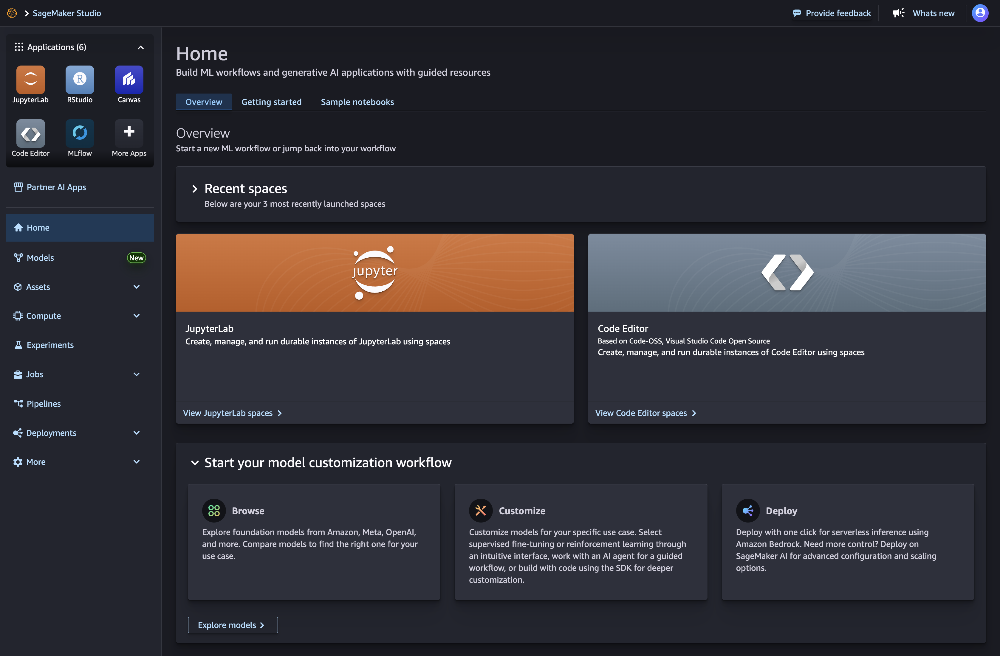
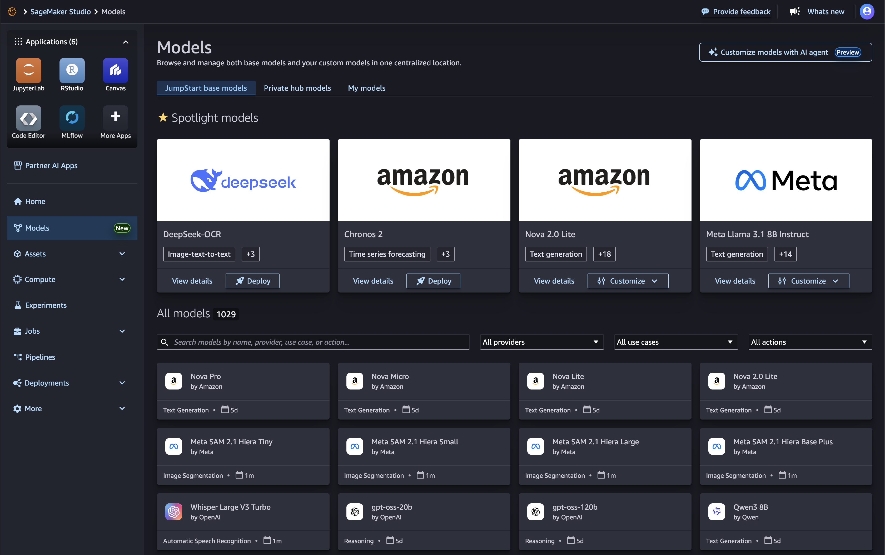
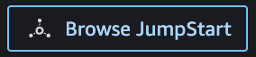
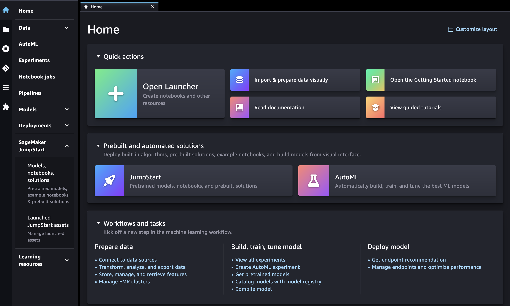
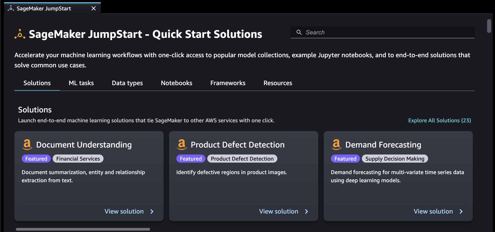

# SageMaker JumpStart pretrained models

Amazon SageMaker JumpStart provides pretrained, open-source models for a wide range of problem types
to help you get started with machine learning. You can incrementally train and tune these models
before deployment. JumpStart also provides solution templates that set up infrastructure for common
use cases, and executable example notebooks for machine learning with SageMaker AI.

You can deploy, fine-tune, and evaluate pretrained models from popular models hubs through
the Models landing page in the updated Studio experience.

You can also access pretrained models, solution templates, and examples through the Models
landing page in Amazon SageMaker Studio Classic.

The following steps show how to access JumpStart models using Amazon SageMaker Studio and Amazon SageMaker Studio Classic.

You can also access JumpStart models using the SageMaker Python SDK. For information about how to
use JumpStart models programmatically, see [Use SageMaker JumpStart Algorithms with Pretrained Models](https://sagemaker.readthedocs.io/en/stable/overview.html#use-sagemaker-jumpstart-algorithms-with-pretrained-models "https://sagemaker.readthedocs.io/en/stable/overview.html#use-sagemaker-jumpstart-algorithms-with-pretrained-models").

## Open JumpStart in Studio

In Amazon SageMaker Studio, open the Models landing page either through the
**Home** page or the **Models** item in the left-side
panel. This opens the **SageMaker Models** landing page where you can explore
models in the SageMakerPublicHub, models in Private Hubs or Curated Hubs, and customized models.

- From the **Home** page, choose **Explore models** in the
  **Start your model customization workflow** pane.
- From the menu in the left panel, navigate to the
  **Models** node.

For more information on getting started with Amazon SageMaker Studio, see [Amazon SageMaker Studio](studio-updated.md "studio-updated.md").

## Use JumpStart in Studio

###### Important

Before downloading or using third-party content: You are responsible for reviewing and
complying with any applicable license terms and making sure that they are acceptable for
your use case.

From the **SageMaker Models** landing page in Studio, you can explore
JumpStart base models from both proprietary and publicly available model providers. You can
search directly for models, filter by specific model provider, or filter based on a list of
provided use cases and actions.

Choose a model to see its model detail card. In the upper right-hand corner of the model
detail card, choose **Fine-tune**, **Customize**,
**Deploy**, or **Evaluate** to start working through the fine-tuning,
deployment, or evaluation workflows, respectively. Note that not all models are available for customization,
fine-tuning or evaluation. For more information on each of these options, see [Use foundation
models in Studio](jumpstart-foundation-models-use-studio-updated.md "jumpstart-foundation-models-use-studio-updated.md").

You can also access **Private or Curated Hub** models through a dedicated tab. These
work exactly like JumpStart base models, and clicking on a model card will take you to the details page, where
actions are available.

Additionally, select **My models** to access your fine-tuned and registered models. Outputs from
customization jobs can be found here, under the **Logged** models tab. **Deployable**
models can also be found here.

## Open and use JumpStart in Studio Classic

The following sections give information on how to open, use, and manage JumpStart from the
Amazon SageMaker Studio Classic UI.

###### Important

As of November 30, 2023, the previous Amazon SageMaker Studio experience is now named
Amazon SageMaker Studio Classic. The following section is specific to using the Studio Classic application. For
information about using the updated Studio experience, see [Amazon SageMaker Studio](studio-updated.md "studio-updated.md").

Studio Classic is still maintained for existing
workloads but is no longer available for onboarding. You can only stop or delete existing Studio Classic
applications and cannot create new ones. We recommend that you [migrate your workload to the new Studio experience](studio-updated-migrate.md "studio-updated-migrate.md").

### Open JumpStart in Studio Classic

In Amazon SageMaker Studio Classic, open the JumpStart landing page either through the
**Home** page or the **Home** menu on the left-side
panel.

- From the **Home** page you can either:
  - Choose **JumpStart** in the **Prebuilt and automated
    solutions** pane. This opens the **SageMaker JumpStart** landing
    page.
  - Choose a model directly in the **SageMaker JumpStart** landing page, or
    choose the **Explore All** option to see available solutions or
    models of a specific type.

- From the **Home** menu in the left panel you can either:
  - Navigate to the **SageMaker JumpStart** node, then choose
    **Models, notebooks, solutions**. This opens the **SageMaker
    JumpStart** landing page.
  - Navigate to the **JumpStart** node, then choose **Launched
    JumpStart assets**.

  The **Launched JumpStart assets** page lists your currently launched
  solutions, deployed model endpoints, and training jobs created with JumpStart. You can
  access the JumpStart landing page from this tab by clicking on the **Browse
  JumpStart** button at the top right of the tab.

The JumpStart landing page lists available end-to-end machine learning solutions, pretrained
models, and example notebooks. From any individual solution or model page, you can choose
the **Browse JumpStart** button (

) at the top right of the tab to return to the **SageMaker
JumpStart** page.

###### Important

Before downloading or using third-party content: You are responsible for reviewing and
complying with any applicable license terms and making sure that they are acceptable for
your use case.

### Use JumpStart in Studio Classic

From the **SageMaker JumpStart** landing page, you can browse for solutions,
models, notebooks, and other resources.

You can find JumpStart resources by using the search bar, or by browsing each category.
Use the tabs to filter the available solutions by categories:

- **Solutions** – In one step, launch comprehensive
  machine learning solutions that tie SageMaker AI to other AWS services. Select
  **Explore All Solutions** to view all available solutions.
- **Resources** – Use example notebooks, blogs, and
  video tutorials to learn and head start your problem types.
  - **Blogs** – Read details and solutions from
    machine learning experts.
  - **Video tutorials** – Watch video tutorials for
    SageMaker AI features and machine learning use cases from machine learning experts.
  - **Example notebooks** – Run example notebooks
    that use SageMaker AI features like Spot Instance training and experiments over a large
    variety of model types and use cases.

- **Data types** – Find a model by data type (e.g.,
  Vision, Text, Tabular, Audio, Text Generation). Select **Explore All
  Models** to view all available models.
- **ML tasks** – Find a model by problem type (e.g.,
  Image Classification, Image Embedding, Object Detection, Text Generation). Select
  **Explore All Models** to view all available models.
- **Notebooks** – Find example notebooks that use SageMaker AI
  features across multiple model types and use cases. Select **Explore All
  Notebooks** to view all available example notebooks.
- **Frameworks** – Find a model by framework (e.g.,
  PyTorch, TensorFlow, Hugging Face).

### Manage JumpStart in Studio Classic

From the **Home** menu in the left panel, navigate to **SageMaker
JumpStart**, then choose **Launched JumpStart assets** to list your
currently launched solutions, deployed model endpoints, and training jobs created with
JumpStart.

###### Topics

- [Amazon SageMaker JumpStart Foundation Models](jumpstart-foundation-models.md "jumpstart-foundation-models.md")
- [Private curated hubs for foundation model access control in JumpStart](jumpstart-curated-hubs.md "jumpstart-curated-hubs.md")
- [Amazon SageMaker JumpStart in Studio Classic](jumpstart-studio-classic.md "jumpstart-studio-classic.md")
