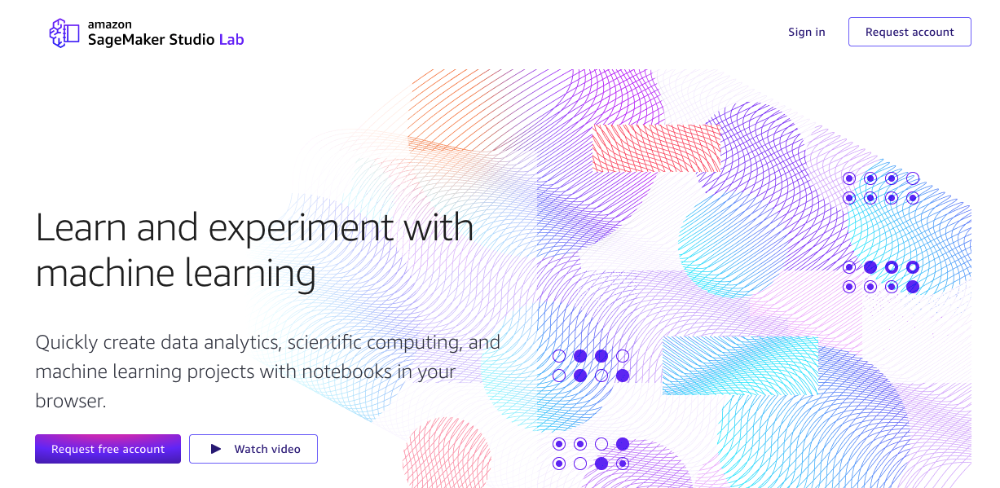
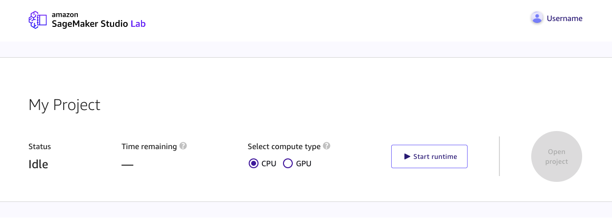

# Amazon SageMaker Studio Lab components overview

Amazon SageMaker Studio Lab consists of the following components. The following topics give more details
about these components.

###### Topics

- [Landing page](#studio-lab-overview-landing "#studio-lab-overview-landing")
- [Studio Lab account](#studio-lab-overview-account "#studio-lab-overview-account")
- [Project overview page](#studio-lab-overview-project-overview "#studio-lab-overview-project-overview")
- [Preview page](#studio-lab-overview-preview "#studio-lab-overview-preview")
- [Project](#studio-lab-overview-project "#studio-lab-overview-project")
- [Compute instance type](#studio-lab-overview-project-compute "#studio-lab-overview-project-compute")
- [Project runtime](#studio-lab-overview-runtime "#studio-lab-overview-runtime")
- [Session](#studio-lab-overview-session "#studio-lab-overview-session")

## Landing page

You can request an account and sign in to an existing account on your landing page. To
navigate to the landing page, see the [Amazon SageMaker Studio Lab website](https://studiolab.sagemaker.aws/ "https://studiolab.sagemaker.aws/"). For more information about creating a Studio Lab account, see
[Onboard to Amazon SageMaker Studio Lab](studio-lab-onboard.md "studio-lab-onboard.md").

The following screenshot shows the Studio Lab landing page interface for requesting a user
account and signing in.



## Studio Lab account

Your Studio Lab account gives you access to Studio Lab. For more information about creating a
user account, see [Onboard to Amazon SageMaker Studio Lab](studio-lab-onboard.md "studio-lab-onboard.md").

## Project overview page

You can launch a compute instance and view information about your project on this page. To
navigate to this page, you must sign in from the [Amazon SageMaker Studio Lab website](https://studiolab.sagemaker.aws/ "https://studiolab.sagemaker.aws/"). The URL takes the following format.

```
https://studiolab.sagemaker.aws/users/`<YOUR_USER_NAME>`
```

The following screenshot shows a project overview in the Studio Lab user interface.



## Preview page

On this page, you can access a read-only preview of a Jupyter notebook. You can not execute
the notebook from preview, but you can copy that notebook into your project. For many
customers, this may be the first Studio Lab page that customers see, as they may be opening a
notebook from GitHub notebook. For more information on how to use GitHub resources, see [Use GitHub resources](studio-lab-use-external.md#studio-lab-use-external-clone-github "studio-lab-use-external.md#studio-lab-use-external-clone-github").

To copy the notebook preview to your Studio Lab project:

1. Sign in to your Studio Lab account. For more information about creating a Studio Lab
   account, see [Onboard to Amazon SageMaker Studio Lab](studio-lab-onboard.md "studio-lab-onboard.md").
2. Under **Notebook compute instance**, choose a compute instance type.
   For more information about compute instance types, see [Compute instance type](#studio-lab-overview-project-compute "#studio-lab-overview-project-compute").
3. Choose **Start runtime**. You might be asked to solve a CAPTCHA
   puzzle. For more information on CAPTCHA, see [What is a CAPTCHA
   puzzle?](../../../waf/latest/developerguide/waf-captcha-puzzle.md "../../../waf/latest/developerguide/waf-captcha-puzzle.md")
4. One time setup, for first time starting runtime using your Studio Lab account:
   1. Enter a mobile phone number to associate with your Amazon SageMaker Studio Lab account and choose
      **Continue**.

   For information on supported countries and regions, see [Supported countries and regions (SMS channel)](../../../pinpoint/latest/userguide/channels-sms-countries.md "../../../pinpoint/latest/userguide/channels-sms-countries.md"). 2. Enter the 6-digit code sent to the associated mobile phone number and choose
   **Verify**.

5. Choose **Copy to project**.

## Project

Your project contains all of your files and folders, including your Jupyter notebooks. You
have full control over the files in your project. Your project also includes the
JupyterLab-based user interface. From this interface, you can interact with your Jupyter
notebooks, edit your source code files, integrate with GitHub, and connect to Amazon S3. For more
information, see [Use the Amazon SageMaker Studio Lab project runtime](studio-lab-use.md "studio-lab-use.md").

The following screenshot shows a Studio Lab project with the file browser open and the
Studio Lab Launcher displayed.


## Compute instance type

Your Amazon SageMaker Studio Lab project runtime is based on an EC2 instance. You are allotted 15 GB of
storage and 16 GB of RAM. Availability of compute instances is not guaranteed and is subject
to demand. If you require additional storage or compute resources, consider switching to
Studio. 

Amazon SageMaker Studio Lab offers the choice of a CPU (Central Processing Unit) and a GPU (Graphical
Processing Unit). The following sections give information about these two options, including
selection guidance.

**CPU**

A central processing unit (CPU) is designed to handle a wide range of tasks efficiently,
but is limited in how many tasks it can run concurrently. For machine learning, a CPU is
recommended for compute intensive algorithms, such as time series, forecasting, and tabular
data. 

The CPU compute type has up to 4 hours at a time with a limit of 8 hours in a 24-hour
period.

**GPU**

A graphics processing unit (GPU) is designed to render high-resolution images and video
concurrently. A GPU is recommended for deep learning tasks, especially for transformers and
computer vision.

The GPU compute type has up to 4 hours at a time with a limit of 4 hours in a 24-hour
period.

**Compute time**

When compute time for Studio Lab reaches its time limit, the instance stops all running
computations. Studio Lab does not support time limit increases.

Studio Lab automatically saves your environment when you update your environment and every
time you create a new file. Custom-installed extensions and packages persist even after your
runtime has ended.

File edits are periodically saved, but are not saved when your runtime ends. To ensure
that you do not lose your progress, save your work manually. If you have content in your
Studio Lab project that you don’t want to lose, we recommend that you back up your content
elsewhere. For more information about exporting your environment and files, see [Export an Amazon SageMaker Studio Lab environment to
Amazon SageMaker Studio Classic](studio-lab-use-migrate.md "studio-lab-use-migrate.md").

During long computation, you do not need to keep your project open. For example, you can
start training a model, then close your browser. The instance keeps running for up to the
compute type limit in a 24-hour period. You can then sign in later to continue your work. 

We recommend that you use checkpointing in your deep learning jobs. You can use saved
checkpoints to restart a job from the previously saved checkpoint. For more information, see
[File I/O](https://d2l.ai/chapter_deep-learning-computation/read-write.html?highlight=checkpointing "https://d2l.ai/chapter_deep-learning-computation/read-write.html?highlight=checkpointing").

## Project runtime

The project runtime is the period of time when your compute instance is running.

## Session

A user session begins every time you launch your project.
