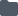

# Create or open an Amazon SageMaker Studio Lab notebook

When you create a notebook in Amazon SageMaker Studio Lab or open a notebook in Studio Lab, you must select a
kernel for the notebook. The following topics describe how to create and open notebooks in
Studio Lab.

For information about shutting down the notebook, see [Shut down Studio Lab resources](studio-lab-use-shutdown.md "studio-lab-use-shutdown.md").

###### Topics

- [Open a Studio Lab notebook](#studio-lab-use-create-open "#studio-lab-use-create-open")
- [Create a notebook from the file
  menu](#studio-lab-use-create-file "#studio-lab-use-create-file")
- [Create a notebook from the
  Launcher](#studio-lab-use-create-launcher "#studio-lab-use-create-launcher")

## Open a Studio Lab notebook

Studio Lab can only open notebooks listed in the Studio Lab file browser. To clone a
notebook into your file browser from an external repository, see [Use external resources in Amazon SageMaker Studio Lab](studio-lab-use-external.md "studio-lab-use-external.md").

###### To open a notebook

1. In the left sidebar, choose the **File Browser** icon (
   
   ) to display the file browser.
2. Browse to a notebook file and double-click it to open the notebook in a new
   tab.

## Create a notebook from the file

menu

###### To create a notebook from the File menu

1. From the Studio Lab menu, choose **File**, choose
   **New**, and then choose
   **Notebook**.
2. To use the default kernel, in the **Select Kernel** dialog
   box, choose **Select**. Otherwise, to select a different
   kernel, use the dropdown menu.

## Create a notebook from the

Launcher

###### To create a notebook from the Launcher

1. Open the Launcher by using the keyboard shortcut `Ctrl + Shift +
L`.

Alternatively, you can open Launcher from the left sidebar: Choose the
**File Browser** icon, and then choose the plus
(**+**) icon. 2. To use the default kernel from the Launcher, under
**Notebook**, choose **default:Python**.
Otherwise, select a different kernel.

After you choose the kernel, your notebook launches and opens in a new Studio Lab tab.

To view the notebook's kernel session, in the left sidebar, choose the
**Running Terminals and Kernels** icon (

). You can stop the notebook's kernel session from this view.
