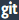

# Get notebook differences

###### Note

Amazon SageMaker Studio Lab is no longer open to new customers.
Existing customers can continue to use the service as normal. AWS continues to invest in security and availability improvements for
Studio Lab, but we do not plan to introduce new features. For more information, see [Studio Lab availability change](studio-lab-availability-change.md "studio-lab-availability-change.md").

You can display the difference between the current notebook and the last checkpoint, or
the last Git commit, using the Amazon SageMaker Studio Lab project UI.

###### Topics

- [Get the difference between the last checkpoint](#studio-lab-use-diff-checkpoint "#studio-lab-use-diff-checkpoint")
- [Get the difference between the last commit](#studio-lab-use-diff-git "#studio-lab-use-diff-git")

## Get the difference between the last checkpoint

When you create a notebook, a hidden checkpoint file that matches the notebook is
created. You can view changes between the notebook and the checkpoint file, or revert
the notebook to match the checkpoint file.

To save the Studio Lab notebook and update the checkpoint file to match: Choose the
**Save notebook and create checkpoint** icon (

). This is located on the Studio Lab menu's left side. The keyboard
shortcut for **Save notebook and create checkpoint** is `Ctrl +
 s`.

To view changes between the Studio Lab notebook and the checkpoint file: Choose the
**Checkpoint diff** icon (

), located in the center of the Studio Lab menu.

To revert the Studio Lab notebook to the checkpoint file: On the main Studio Lab menu,
choose **File**, and then **Revert Notebook to
Checkpoint**.

## Get the difference between the last commit

If a notebook is opened from a Git repository, you can view the difference between the
notebook and the last Git commit.

To view the changes in the notebook from the last Git commit: Choose the **Git
diff** icon (

) in the center of the notebook menu.
