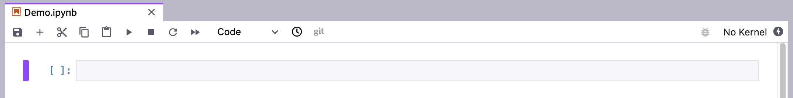

# Use the Amazon SageMaker Studio Lab notebook toolbar

Amazon SageMaker Studio Lab notebooks extend the JupyterLab interface. For an overview of the basic
JupyterLab interface, see [The JupyterLab
Interface](https://jupyterlab.readthedocs.io/en/latest/user/interface.html "https://jupyterlab.readthedocs.io/en/latest/user/interface.html").

The following image shows the toolbar and an empty cell from a Studio Lab notebook.

When you hover over a toolbar icon, a tooltip displays the icon function. You can find
additional notebook commands in the Studio Lab main menu. The toolbar includes the following
icons:

| Icon                                         | Description                                                                                                                                                                                                                                                                                       |
| -------------------------------------------- | ------------------------------------------------------------------------------------------------------------------------------------------------------------------------------------------------------------------------------------------------------------------------------------------------- |
| The Save and checkpoint icon.                | **Save and checkpoint** Saves the notebook and updates the checkpoint file.                                                                                                                                                                                                                       |
| The Insert cell icon.                        | **Insert cell** Inserts a code cell below the current cell. The current cell is noted by the blue vertical marker in the left margin.                                                                                                                                                             |
| The Cut, copy, and paste cells icon.         | **Cut, copy, and paste cells** Cuts, copies, and pastes the selected cells.                                                                                                                                                                                                                       |
| The Run cells icon.                          | **Run cells** Runs the selected cells. The cell that follows the last-selected cell becomes the new-selected cell.                                                                                                                                                                                |
| The Interrupt kernel icon.                   | **Interrupt kernel** Interrupts the kernel, which cancels the currently-running operation. The kernel remains active.                                                                                                                                                                             |
| The Restart kernel icon.                     | **Restart kernel** Restarts the kernel. Variables are reset. Unsaved information is not affected.                                                                                                                                                                                                 |
| The Restart kernel and re-run notebook icon. | **Restart kernel and re-run notebook** Restarts the kernel. Variables are reset. Unsaved information is not affected. Then re-runs the entire notebook.                                                                                                                                           |
| The Cell type icon.                          | **Cell type** Displays or changes the current cell type. The cell types are:  • Code – Code that the kernel runs.  • Markdown – Text rendered as markdown.  • Raw – Content, including Markdown markup, that's displayed as text.                                                        |
| The Checkpoint diff icon.                    | **Checkpoint diff** Opens a new tab that displays the difference between the notebook and the checkpoint file. For more information, see [Get notebook differences](studio-lab-use-diff.md "studio-lab-use-diff.md").                                                                             |
| The Git diff icon.                           | **Git diff** Only enabled if the notebook is opened from a Git repository. Opens a new tab that displays the difference between the notebook and the last Git commit. For more information, see [Get notebook differences](studio-lab-use-diff.md "studio-lab-use-diff.md").                      |
| **default**                                  | **Kernel** Displays or changes the kernel that processes the cells in the notebook. `No Kernel` indicates that the notebook was opened without specifying a kernel. You can edit the notebook, but you can't run any cells.                                                                       |
| The Kernel busy status icon.                 | **Kernel busy status** Displays a kernel's busy status by showing the circle's edge and its interior as the same color. The kernel is busy when it is starting and when it is processing cells. Additional kernel states are displayed in the status bar at the bottom-left corner of Studio Lab. |
