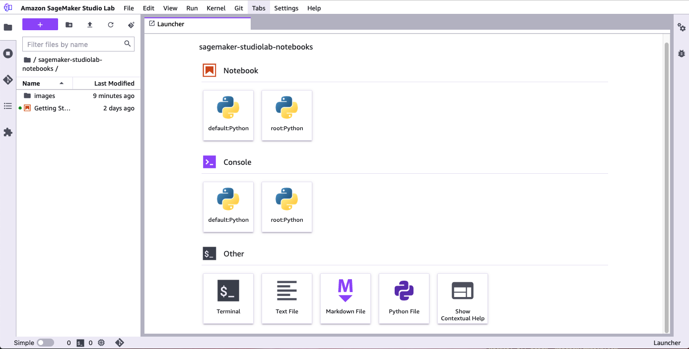

# Amazon SageMaker Studio Lab UI overview

Amazon SageMaker Studio Lab extends the JupyterLab interface. Previous users of JupyterLab will notice
similarities between the JupyterLab and Studio Lab UI, including the workspace. For an overview of
the basic JupyterLab interface, see [The JupyterLab
Interface](https://jupyterlab.readthedocs.io/en/latest/user/interface.html "https://jupyterlab.readthedocs.io/en/latest/user/interface.html").

The following image shows Studio Lab with the file browser open and the Studio Lab Launcher
displayed.

You will find the _menu bar_ at the top of the screen. The _left
sidebar_ contains icons to open file browsers, resource browsers, and tools. The
_status bar_ is located at the bottom-left corner of Studio Lab.

The main work area is divided horizontally into two panes. The left pane is the
_file and resource browser_. The right pane contains one or more tabs for
resources, such as notebooks and terminals.

###### Topics

- [Left sidebar](#studio-lab-use-ui-nav-bar "#studio-lab-use-ui-nav-bar")
- [File and resource browser](#studio-lab-use-ui-browser "#studio-lab-use-ui-browser")
- [Main work area](#studio-lab-use-ui-work "#studio-lab-use-ui-work")

## Left sidebar

The left sidebar includes the following icons. When you hover over an icon, a tooltip
displays the icon name. When you choose an icon, the file and resource browser displays the
described functionality. For hierarchical entries, a selectable breadcrumb at the top of the
browser shows your location in the hierarchy.

| Icon                                   | Description                                                                                                                                                                                                                                                                                                                                                                                                                                 |
| -------------------------------------- | ------------------------------------------------------------------------------------------------------------------------------------------------------------------------------------------------------------------------------------------------------------------------------------------------------------------------------------------------------------------------------------------------------------------------------------------- | ------------------------------------------------------------------------------------------------------------------------------------------------------------------------------------------------------------------------------------------------------------------------------------------------------------------------------------------------------------------------------------- |
| The File Browser icon                  | **File Browser** Choose the **Upload Files** icon ( Black square icon representing a placeholder or empty image. ) to add files to Studio Lab. Double-click a file to open the file in a new tab. To have adjacent files open, choose a tab that contains a notebook, Python, or text file, and then choose **New View for File**. Choose the plus (**+**) sign on the menu at the top of the file browser to open the Studio Lab Launcher. |
| The Running Terminals and Kernels icon | **Running Terminals and Kernels** You can see a list of all of the running terminals and kernels in your project. For more information, see [Shut down Studio Lab resources](studio-lab-use-shutdown.md "studio-lab-use-shutdown.md").                                                                                                                                                                                                      |
| The Git icon                           | **Git** You can connect to a Git repository and then access a full range of Git tools and operations. For more information, see [Use external resources in Amazon SageMaker Studio Lab](studio-lab-use-external.md "studio-lab-use-external.md").                                                                                                                                                                                           |
| The Table of Contents icon             | **Table of Contents** You can access the Table of Contents for your current Jupyter notebook.                                                                                                                                                                                                                                                                                                                                               |
| The Extension Manager icon             | **Extension Manager** You can enable and manage third-party JupyterLab extensions.                                                                                                                                                                                                                                                                                                                                                          | ## File and resource browser The file and resource browser shows lists of your notebooks and files. On the menu at the top of the file browser, choose the plus (**+**) sign to open the Studio Lab Launcher. The Launcher allows you to create a notebook or open a terminal. ## Main work area The main work area has multiple tabs that contain your open notebooks and terminals. |
