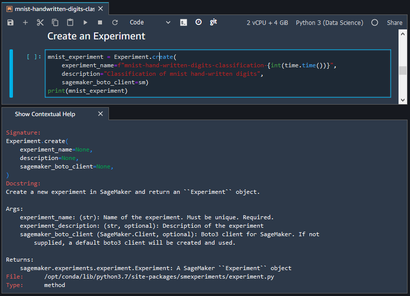

# Use the Amazon SageMaker Studio Classic Launcher

###### Important

As of November 30, 2023, the previous Amazon SageMaker Studio experience is now named
Amazon SageMaker Studio Classic. The following section is specific to using the Studio Classic application. For
information about using the updated Studio experience, see [Amazon SageMaker Studio](studio-updated.md "studio-updated.md").

Studio Classic is still maintained for existing
workloads but is no longer available for onboarding. You can only stop or delete existing Studio Classic
applications and cannot create new ones. We recommend that you [migrate your workload to the new Studio experience](studio-updated-migrate.md "studio-updated-migrate.md").

You can use the Amazon SageMaker Studio Classic Launcher to create notebooks and text files, and to launch
terminals and interactive Python shells.

You can open Studio Classic Launcher in any of the following ways:

- Choose **Amazon SageMaker Studio Classic** at the top left of the Studio Classic
  interface.
- Use the keyboard shortcut `Ctrl + Shift + L`.
- From the Studio Classic menu, choose **File** and then choose **New
  Launcher**.
- If the SageMaker AI file browser is open, choose the plus (**+**) sign in the
  Studio Classic file browser menu.
- In the **Quick actions** section of the **Home** tab,
  choose **Open Launcher**. The Launcher opens in a new tab. The
  **Quick actions** section is visible by default but can be toggled off.
  Choose **Customize Layout** to turn this section back on.

The Launcher consists of the following two sections:

###### Topics

- [Notebooks and compute resources](#studio-launcher-launch "#studio-launcher-launch")
- [Utilities and files](#studio-launcher-other "#studio-launcher-other")

## Notebooks and compute resources

In this section, you can create a notebook, open an image terminal, or open a Python
console.

To create or launch one of those items:

1. Choose **Change environment** to select a SageMaker image, a kernel, an
   instance type, and, optionally, add a lifecycle
   configuration script that runs on image start-up. For more information on
   lifecycle configuration scripts, see [Use Lifecycle Configurations to Customize Amazon SageMaker Studio Classic](studio-lcc.md "studio-lcc.md"). For
   more information about kernel updates, see [Change the Image or a Kernel for an Amazon SageMaker Studio Classic Notebook](notebooks-run-and-manage-change-image.md "notebooks-run-and-manage-change-image.md").
2. Select an item.

###### Note

When you choose an item from this section, you might incur additional usage charges. For more
information, see [Usage Metering for Amazon SageMaker Studio Classic Notebooks](notebooks-usage-metering.md "notebooks-usage-metering.md").

The following items are available:

- **Notebook**

Launches the notebook in a kernel session on the chosen SageMaker image.

Creates the notebook in the folder that you have currently selected in the file
browser. To view the file browser, in the left sidebar of Studio Classic, choose the
**File Browser** icon.

- **Console**

Launches the shell in a kernel session on the chosen SageMaker image.

Opens the shell in the folder that you have currently selected in the file browser.

- **Image terminal**

Launches the terminal in a terminal session on the chosen SageMaker image.

Opens the terminal in the root folder for the user (as shown by the
**Home** folder in the file browser).

###### Note

By default, CPU instances launch on a `ml.t3.medium` instance, while GPU instances
launch on a `ml.g4dn.xlarge` instance.

## Utilities and files

In this section, you can add contextual help in a notebook; create Python, Markdown and
text files; and open a system terminal.

###### Note

Items in this section run in the context of Amazon SageMaker Studio Classic and don't incur usage charges.

The following items are available:

- **Show Contextual Help**

Opens a new tab that displays contextual help for functions in a Studio Classic notebook. To display the
help, choose a function in an active notebook. To make it easier to see the help in context, drag
the help tab so that it's adjacent to the notebook tab. To open the help tab from within a notebook,
press `Ctrl + I`.

The following screenshot shows the contextual help for the
`Experiment.create` method.

- **System terminal**

Opens a `bash` shell in the root folder for the user (as shown by the
**Home** folder in the file browser).

- **Text File** and **Markdown File**

Creates a file of the associated type in the folder that you have currently selected in the file
browser. To view the file browser, in the left sidebar, choose the **File Browser**
icon (

).
