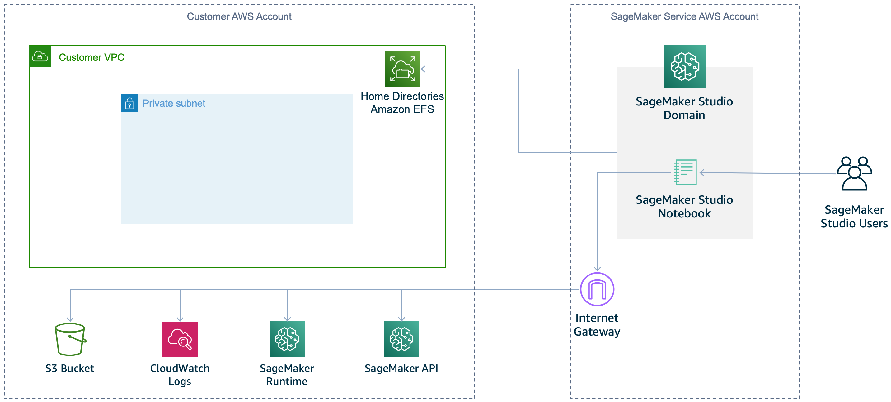
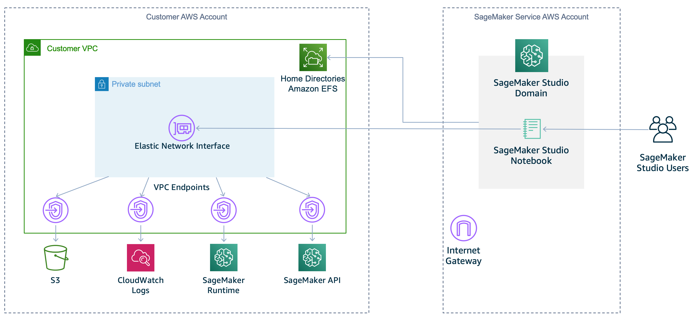

# Connect Studio notebooks in

a VPC to external resources

The following topic gives information about how to connect Studio Notebooks in a
VPC to external resources.

## Default communication

with the internet

By default, SageMaker Studio provides a network interface that allows
communication with the internet through a VPC managed by SageMaker AI. Traffic to AWS
services, like Amazon S3 and CloudWatch, goes through an internet gateway. Traffic that
accesses the SageMaker API and SageMaker AI runtime also goes through an internet gateway.
Traffic between the domain and Amazon EFS volume goes through the VPC that you identified
when you onboarded to Studio or called the [CreateDomain](../APIReference/API_CreateDomain.md "../APIReference/API_CreateDomain.md")
API. The following diagram shows the default configuration.

## `VPC only`

communication with the internet

To stop SageMaker AI from providing internet access to your Studio notebooks, disable
internet access by specifying the `VPC only` network access type. Specify
this network access type when you [onboard to Studio](onboard-vpc.md "onboard-vpc.md") or
call the [CreateDomain](../APIReference/API_CreateDomain.md "../APIReference/API_CreateDomain.md")
API. As a result, you won't be able to run a Studio notebook unless:

- your VPC has an interface endpoint to the SageMaker API and runtime, or a NAT
  gateway with internet access
- your security groups allow outbound connections

The following diagram shows a configuration for using VPC-only mode.

### Requirements to use `VPC only` mode

When you choose `VpcOnly`, follow these steps:

1. You must use private subnets only. You cannot use public subnets in `VpcOnly` mode.
2. Ensure your subnets have the required number of IP addresses needed.
   The expected number of IP addresses needed per user can vary based on
   use case. We recommend between 2 and 4 IP addresses per user. The total
   IP address capacity for a Studio domain is the sum of available IP
   addresses for each subnet provided when the domain is created. Make sure
   that your IP address usage isn't more than the capacity supported by the
   number of subnets you provide. Additionally, using subnets distributed
   across many availability zones can help with IP address availability.
   For more information, see [VPC and
   subnet sizing for IPv4](../../../vpc/latest/userguide/how-it-works.md#vpc-sizing-ipv4 "../../../vpc/latest/userguide/how-it-works.md#vpc-sizing-ipv4").

###### Note

You can configure only subnets with a default tenancy VPC in which
your instance runs on shared hardware. For more information on the
tenancy attribute for VPCs, see [Dedicated Instances](../../../AWSEC2/latest/UserGuide/dedicated-instance.md "../../../AWSEC2/latest/UserGuide/dedicated-instance.md"). 3. ###### Warning

When using `VpcOnly` mode, you partly own the networking configuration for the
domain. We recommend the security best practice of applying
least-privilege permissions to the inbound and outbound access that
security group rules provide. Overly permissive inbound rule
configurations could allow users with access to the VPC to interact
with the applications of other user profiles without
authentication.

Set up one or more security groups with inbound and outbound rules
that allow the following traffic:

    * [NFS traffic over TCP
     on port 2049](../../../efs/latest/ug/network-access.md "../../../efs/latest/ug/network-access.md") between the domain and the Amazon EFS
     volume.
    * [TCP traffic within the security group](../../../AWSEC2/latest/UserGuide/security-group-rules-reference.md#sg-rules-other-instances "../../../AWSEC2/latest/UserGuide/security-group-rules-reference.md#sg-rules-other-instances"). This is
     required for connectivity between the Jupyter
     Server application and the Kernel
     Gateway applications. You must allow access to at
     least ports in the range `8192-65535`.

Create a distinct security group for each user profile and add inbound
access from that same security group. We do not recommend reusing a
domain-level security group for user profiles. If the domain-level
security group allows inbound access to itself, all applications in the
domain have access to all other applications in the domain. 4. If you want to allow internet access, you must use a [NAT gateway](../../../vpc/latest/userguide/vpc-nat-gateway.md#nat-gateway-working-with "../../../vpc/latest/userguide/vpc-nat-gateway.md#nat-gateway-working-with") with access to the internet, for example
through an [internet
gateway](../../../vpc/latest/userguide/VPC_Internet_Gateway.md "../../../vpc/latest/userguide/VPC_Internet_Gateway.md"). 5. To remove internet access, [create
interface VPC endpoints](../../../vpc/latest/privatelink/create-interface-endpoint.md "../../../vpc/latest/privatelink/create-interface-endpoint.md") (AWS PrivateLink) to allow
Studio to access the following services with the corresponding
service names. You must also associate the security groups for your VPC
with these endpoints.

    * SageMaker API :
     `com.amazonaws.`region`.sagemaker.api`
    * SageMaker AI runtime:
     `com.amazonaws.`region`.sagemaker.runtime`.
     This is required to run Studio notebooks and to train and
     host models.
    * Amazon S3:
     `com.amazonaws.`region`.s3`.
    * To use SageMaker Projects:
     `com.amazonaws.`region`.servicecatalog`.
    * Any other AWS services you require.

If you use the [SageMaker Python SDK](https://sagemaker.readthedocs.io/en/stable/ "https://sagemaker.readthedocs.io/en/stable/") to run remote training jobs, you must also create the following Amazon VPC endpoints.

    * AWS Security Token Service:
     `com.amazonaws.`region`.sts`
    * Amazon CloudWatch:
     `com.amazonaws.`region`.logs`.
     This is required to allow SageMaker Python SDK to get the remote
     training job status from Amazon CloudWatch.

###### Note

For a customer working within VPC mode, company firewalls can cause
connection issues with SageMaker Studio or between JupyterServer and the
KernelGateway. Make the following checks if you run into one of these issues
when using SageMaker Studio from behind a firewall.

- Check that the Studio URL is in your networks allowlist.
- Check that the websocket connections are not blocked. Jupyter uses
  websocket under the hood. If the KernelGateway application is
  InService, JupyterServer may not be able to connect to the
  KernelGateway. You should see this problem when opening System
  Terminal as well.

###### For more information

- [Securing Amazon SageMaker Studio connectivity using a private
  VPC](https://aws.amazon.com/blogs/machine-learning/securing-amazon-sagemaker-studio-connectivity-using-a-private-vpc "https://aws.amazon.com/blogs/machine-learning/securing-amazon-sagemaker-studio-connectivity-using-a-private-vpc").
- [Security groups for
  your VPC](../../../vpc/latest/userguide/vpc-security-groups.md "../../../vpc/latest/userguide/vpc-security-groups.md")
- [Connect to SageMaker AI Within your VPC](interface-vpc-endpoint.md "interface-vpc-endpoint.md")
- [VPC with public and private subnets (NAT)](../../../vpc/latest/userguide/VPC_Scenario2.md "../../../vpc/latest/userguide/VPC_Scenario2.md")
