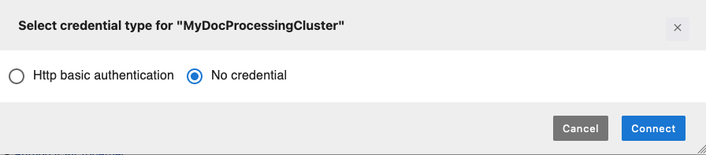

# Quickstart: Create a SageMaker AI sandbox

domain to launch Amazon EMR clusters in Studio

This section walks you through the quick set up of a complete test environment in
Amazon SageMaker Studio. You will be creating a new Studio domain that lets users launch new
Amazon EMR clusters directly from Studio. The steps provide an example notebook that you can
connect to an Amazon EMR cluster to start running Spark workloads. Using this
notebook, you will build a Retrieval Augmented Generation System (RAG) using Amazon EMR Spark
distributed processing and OpenSearch vector database.

###### Note

To get started, sign in to the AWS Management Console using an AWS Identity and Access Management (IAM)
user account with admin permissions. For information on how to sign up for an AWS
account and create a user with administrative access, see [Complete Amazon SageMaker AI prerequisites](gs-set-up.md "gs-set-up.md").

###### To set up your Studio test environment and start running

Spark jobs:

- [Step 1: Create a SageMaker AI domain for
  launching Amazon EMR clusters in Studio](#studio-notebooks-emr-cluster-quickstart-setup "#studio-notebooks-emr-cluster-quickstart-setup")
- [Step 2: Launch a new
  Amazon EMR cluster from Studio UI](#studio-notebooks-emr-cluster-quickstart-launch "#studio-notebooks-emr-cluster-quickstart-launch")
- [Step 3: Connect a
  JupyterLab notebook to the Amazon EMR cluster](#studio-notebooks-emr-cluster-quickstart-connect "#studio-notebooks-emr-cluster-quickstart-connect")
- [Step 4: Clean up
  your AWS CloudFormation stack](#studio-notebooks-emr-cluster-quickstart-clean-stack "#studio-notebooks-emr-cluster-quickstart-clean-stack")

## Step 1: Create a SageMaker AI domain for

launching Amazon EMR clusters in Studio

In the following steps, you apply a AWS CloudFormation stack to automatically create a new SageMaker AI
domain. The stack also creates a user profile and configures the needed environment and
permissions. The SageMaker AI domain is configured to let you directly launch Amazon EMR clusters
from Studio. For this example, the Amazon EMR clusters are created in the same AWS
account as SageMaker AI without authentication. You can find additional AWS CloudFormation stacks supporting
various authentication methods like Kerberos in the [getting_started](https://github.com/aws-samples/sagemaker-studio-emr/tree/main/cloudformation/getting_started "https://github.com/aws-samples/sagemaker-studio-emr/tree/main/cloudformation/getting_started") GitHub repository.

###### Note

SageMaker AI allows 5 Studio domains per AWS account and AWS Region by default.
Ensure your account has no more than 4 domains in your region before you create your
stack.

###### Follow these steps to set up a SageMaker AI domain for launching Amazon EMR clusters from

Studio.

1. Download the raw file of this [AWS CloudFormation template](https://github.com/aws-samples/sagemaker-studio-foundation-models/blob/main/workshop-artifacts/cfn/workshop-cfn.yaml "https://github.com/aws-samples/sagemaker-studio-foundation-models/blob/main/workshop-artifacts/cfn/workshop-cfn.yaml") from the `sagemaker-studio-emr` GitHub
   repository.
2. Go to the AWS CloudFormation console: [https://console.aws.amazon.com/cloudformation](https://console.aws.amazon.com/cloudformation/ "https://console.aws.amazon.com/cloudformation/")
3. Choose **Create stack** and select **With new
   resources (standard)** from the drop down menu.
4. In **Step 1**:
   1. In the **Prepare template** section, select
      **Choose an existing template**.
   2. In the **Specify template** section, choose
      **Upload a template file**.
   3. Upload the downloaded AWS CloudFormation template and choose
      **Next**.

5. In **Step 2**, enter a **Stack name** and a
   **SageMakerDomainName** then choose
   **Next**.
6. In **Step 3**, keep all default values and choose
   **Next**.
7. In **Step 4**, check the box to acknowledge resource creation
   and choose **Create stack**. This creates a Studio domain
   in your account and region.

## Step 2: Launch a new

Amazon EMR cluster from Studio UI

In the following steps, you create a new Amazon EMR cluster from the Studio UI.

1. Go to the SageMaker AI console at [https://console.aws.amazon.com/sagemaker/](https://console.aws.amazon.com/sagemaker/ "https://console.aws.amazon.com/sagemaker/") and choose
   **Domains** in the left menu.
2. Click on your domain name **GenerativeAIDomain** to open the
   **Domain details** page.
3. Launch Studio from the user profile `genai-user`.
4. In the left navigation pane, go to **Data** then
   **Amazon EMR Clusters**.
5. On the Amazon EMR clusters page, choose **Create**. Select the
   template **SageMaker Studio Domain No Auth EMR** created by the
   AWS CloudFormation stack and then choose **Next**.
6. Enter a name for the new Amazon EMR cluster. Optionally update other parameters
   such as the instance type of core and master nodes, idle timeout, or number of
   core nodes.
7. Choose **Create resource** to launch the new Amazon EMR cluster.

After creating the Amazon EMR cluster, follow the status on the **EMR
Clusters** page. When the status changes to
`Running/Waiting`, your Amazon EMR cluster is ready to use in
Studio.

## Step 3: Connect a

JupyterLab notebook to the Amazon EMR cluster

In the following steps, you connect a notebook in JupyterLab to your running Amazon EMR
cluster. For this example, you import a notebook allowing you to build a Retrieval
Augmented Generation (RAG) system using Amazon EMR Spark distributed processing and
OpenSearch vector database.

1. ###### Launch JupyterLab

From Studio, launch the JupyterLab application. 2. ###### Create a private space

If you have not created a space for your JupyterLab application, choose
**Create a JupyterLab space**. Enter a name for the space,
and keep the space as **Private**. Leave all other settings at
their default values, and then choose **Create space**.

Otherwise, run your JupyterLab space to launch a JupyterLab
application. 3. ###### Deploy your LLM and embedding models for inference

    * From the top menu, choose **File**,
     **New**, and then
     **Terminal**.
    * In the terminal, run the following command.


    ```
    wget --no-check-certificate https://raw.githubusercontent.com/aws-samples/sagemaker-studio-foundation-models/main/lab-00-setup/Lab_0_Warm_Up_Deploy_EmbeddingModel_Llama2_on_Nvidia.ipynb
    mkdir AWSGuides
    cd AWSGuides
    wget --no-check-certificate https://raw.githubusercontent.com/aws-samples/sagemaker-studio-foundation-models/main/lab-03-rag/AWSGuides/AmazonSageMakerDeveloperGuide.pdf
    wget --no-check-certificate https://raw.githubusercontent.com/aws-samples/sagemaker-studio-foundation-models/main/lab-03-rag/AWSGuides/EC2DeveloperGuide.pdf
    wget --no-check-certificate https://raw.githubusercontent.com/aws-samples/sagemaker-studio-foundation-models/main/lab-03-rag/AWSGuides/S3DeveloperGuide.pdf
    ```

    This retrieves the the
     `Lab_0_Warm_Up_Deploy_EmbeddingModel_Llama2_on_Nvidia.ipynb`
     notebook to your local directory and downloads three PDF files into a
     local `AWSGuides` folder.
    * Open
     `lab-00-setup/Lab_0_Warm_Up_Deploy_EmbeddingModel_Llama2_on_Nvidia.ipynb`,
     keep the `Python 3 (ipykernel)` kernel, and run each
     cell.


    ###### Warning

    In the **Llama 2 License Agreement** section,
     ensure to accept the Llama2 EULA before you continue.

    The notebook deploys two models, `Llama 2` and
     `all-MiniLM-L6-v2 Models`, on
     `ml.g5.2xlarge` for inference.


    The deployment of the models and the creation of the endpoints may
     take some time.

4. ###### Open your main notebook

In JupyterLab, open your terminal and run the following command.

```
cd ..
wget --no-check-certificate https://raw.githubusercontent.com/aws-samples/sagemaker-studio-foundation-models/main/lab-03-rag/Lab_3_RAG_on_SageMaker_Studio_using_EMR.ipynb

```

You should see the additional
`Lab_3_RAG_on_SageMaker_Studio_using_EMR.ipynb` notebook in the
left panel of JupyterLab. 5. ###### Choose a `PySpark` kernel

Open your `Lab_3_RAG_on_SageMaker_Studio_using_EMR.ipynb` notebook
and ensure that you are using the `SparkMagic PySpark` kernel. You
can switch kernel at the top right of your notebook. Choose the current kernel
name to open up a kernel selection modal, and then choose `SparkMagic
 PySpark`. 6. ###### Connect your notebook to the cluster

    1. At the top right of your notebook, choose
     **Cluster**. This action opens a modal window that
     lists all of the running clusters that you have permission to access.
    2. Select your cluster then choose **Connect**. A new
     credential type selection modal window opens up.
    3. Choose **No credential** and then
     **Connect**.


    
    4. A notebook cell automatically populates and runs. The notebook cell
     loads the `sagemaker_studio_analytics_extension.magics`
     extension, which provides functionality to connect to the Amazon EMR cluster.
     It then uses the `%sm_analytics` magic command to initiate
     the connection to your Amazon EMR cluster and the Spark application.


    ###### Note

    Ensure that the connection string to your Amazon EMR cluster has an
     authentication type set to `None`. This is illustrated by
     the value `--auth-type None` in the following example.
     You can modify the field if necessary.


    ```
    %load_ext sagemaker_studio_analytics_extension.magics
    %sm_analytics emr connect --verify-certificate False --cluster-id `your-cluster-id` --auth-type `None` --language python
    ```
    5. Once you successfully establish the connection, your connection cell
     output message should display your `SparkSession` details
     including your cluster ID, `YARN` application ID, and a link
     to the Spark UI to monitor your Spark
     jobs.

You are ready to use the `Lab_3_RAG_on_SageMaker_Studio_using_EMR.ipynb`
notebook. This example notebook runs distributed PySpark workloads for building a RAG
system using LangChain and OpenSearch.

## Step 4: Clean up

your AWS CloudFormation stack

After you are finished, make sure to terminate your two endpoints and delete your
AWS CloudFormation stack to prevent continued charges. Deleting the stack cleans up all the resources
that were provisioned by the stack.

###### To delete your AWS CloudFormation stack when you are done with it

1. Go to the AWS CloudFormation console: [https://console.aws.amazon.com/cloudformation](https://console.aws.amazon.com/cloudformation/ "https://console.aws.amazon.com/cloudformation/")
2. Select the stack you want to delete. You can search for it by name or find it
   in the list of stacks.
3. Click the **Delete** button to finalize deleting the stack
   and then **Delete** again to acknowledge that this will
   delete all resources created by the stack.

Wait for the stack deletion to complete. This can take a few minutes. AWS CloudFormation
automatically cleans up all resources defined in the stack template. 4. Verify that all resources created by the stack have been deleted. For example,
check for any leftover Amazon EMR cluster.

###### To remove the API endpoints for a model

1. Go to the SageMaker AI console: [https://console.aws.amazon.com/sagemaker/](https://console.aws.amazon.com/sagemaker/ "https://console.aws.amazon.com/sagemaker/").
2. In the left navigation pane, choose **Inference** and then
   **Endpoints**.
3. Select the endpoint `hf-allminil6v2-embedding-ep` and then choose
   **Delete** in the **Actions** drop down
   list. Repeat the step for the endpoint
   `meta-llama2-7b-chat-tg-ep`.
