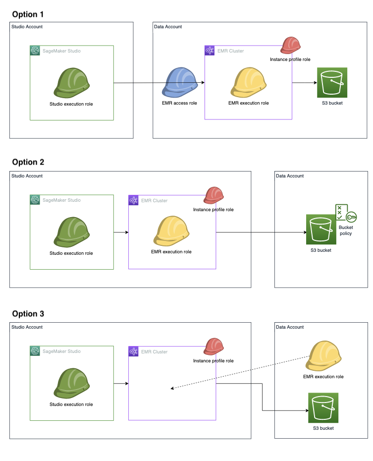

# Configure IAM runtime roles for Amazon EMR

cluster access in Studio

When you connect to an Amazon EMR cluster from your Studio or Studio Classic notebooks, you can
visually browse a list of IAM roles, known as runtime roles, and select one on the fly.
Subsequently, all your Apache Spark, Apache Hive, or Presto jobs created from your notebook
access only the data and resources permitted by policies attached to the runtime role. Also,
when data is accessed from data lakes managed with AWS Lake Formation, you can enforce table-level and
column-level access using policies attached to the runtime role.

With this capability, you and your teammates can connect to the same cluster, each using a
runtime role scoped with permissions matching your individual level of access to data. Your
sessions are also isolated from one another on the shared cluster.

To try out this feature using Studio Classic, see [Apply fine-grained data access controls with AWS Lake Formation and Amazon EMR from Amazon SageMaker Studio Classic](https://aws.amazon.com/blogs/machine-learning/apply-fine-grained-data-access-controls-with-aws-lake-formation-and-amazon-emr-from-amazon-sagemaker-studio/ "https://aws.amazon.com/blogs/machine-learning/apply-fine-grained-data-access-controls-with-aws-lake-formation-and-amazon-emr-from-amazon-sagemaker-studio/") . This blog post helps you set up a demo environment where you can try using
preconfigured runtime roles to connect to Amazon EMR clusters.

## Prerequisites

Before you get started, make sure you meet the following prerequisites:

- Use Amazon EMR version 6.9 or above.
- **For Studio Classic users**: Use JupyterLab version 3 in the
  Studio Classic Jupyter server application configuration. This version supports Studio Classic
  connection to Amazon EMR clusters using runtime roles.

**For Studio users**: Use a [SageMaker distribution image](sagemaker-distribution.md "sagemaker-distribution.md") version
`1.10` or above.

- Allow the use of runtime roles in your cluster's security configuration. For more
  information, see [Runtime roles for Amazon EMR
  steps](../../../emr/latest/ManagementGuide/emr-steps-runtime-roles.md "../../../emr/latest/ManagementGuide/emr-steps-runtime-roles.md").
- Create a notebook with any of the kernels listed in [Supported images and
  kernels to connect to an Amazon EMR cluster from Studio or Studio Classic](studio-emr-user-guide.md#studio-notebooks-emr-cluster-connect-kernels "studio-emr-user-guide.md#studio-notebooks-emr-cluster-connect-kernels").
- Make sure you review the instructions in [Set up Studio to use runtime IAM
  roles](#studio-notebooks-emr-cluster-iam "#studio-notebooks-emr-cluster-iam") to configure your runtime
  roles.

## Cross-account connection

scenarios

Runtime role authentication supports a variety of cross-account connection scenarios when
your data resides outside of your Studio account. The following image shows three
different ways you can assign your Amazon EMR cluster, data, and even Amazon EMR runtime execution role
between your Studio and data accounts:



In option 1, your Amazon EMR cluster and Amazon EMR runtime execution role are in a separate data
account from the Studio account. You define a separate Amazon EMR access role (also referred
to as `Assumable role`) permission policy which grants permission to Studio or
Studio Classic execution role to assume the Amazon EMR access role. The Amazon EMR access role then calls
the Amazon EMR API `GetClusterSessionCredentials` on behalf of your Studio or
Studio Classic execution role, giving you access to the cluster.

In option 2, your Amazon EMR cluster and Amazon EMR runtime execution role are in your Studio
account. Your Studio execution role has permission to use the Amazon EMR API
`GetClusterSessionCredentials` to gain access to your cluster. To access the Amazon S3
bucket, give the Amazon EMR runtime execution role cross-account Amazon S3 bucket access permissions
— you grant these permissions within your Amazon S3 bucket policy.

In option 3, your Amazon EMR clusters are in your Studio account, and the Amazon EMR runtime
execution role is in the data account. Your Studio or Studio Classic execution role has
permission to use the Amazon EMR API `GetClusterSessionCredentials` to gain access to
your cluster. Add the Amazon EMR runtime execution role into the execution role configuration JSON.
Then you can select the role in the UI when you choose your cluster. For details about how to
set up your execution role configuration JSON file, see [Preload your execution roles into
Studio or Studio Classic](#studio-notebooks-emr-cluster-iam-preload "#studio-notebooks-emr-cluster-iam-preload").

## Set up Studio to use runtime IAM

roles

To establish runtime role authentication for your Amazon EMR clusters, configure the required
IAM policies, network, and usability enhancements. Your setup depends on whether you handle
any cross-account arrangements if your Amazon EMR clusters, Amazon EMR runtime execution role, or both,
reside outside of your Studio account. The following section guides you through the
policies to install, how to configure the network to allow traffic between cross-accounts, and
the local configuration file to set up to automate your Amazon EMR connection.

### Configure runtime role

authentication when your Amazon EMR cluster and Studio are in the same account

If your Amazon EMR cluster resides in your Studio account, complete the following steps
to add necessary permissions to your Studio execution policy:

1. Add the required IAM policy to connect to Amazon EMR clusters. For details, see [Configure
   listing Amazon EMR clusters](studio-notebooks-configure-discoverability-emr-cluster.md "studio-notebooks-configure-discoverability-emr-cluster.md").
2. Grant permission to call the Amazon EMR API `GetClusterSessionCredentials`
   when you pass one or more permitted Amazon EMR runtime execution roles specified in the
   policy.
3. (Optional) Grant permission to pass IAM roles that follow any user-defined naming
   conventions.
4. (Optional) Grant permission to access Amazon EMR clusters that are tagged with specific
   user-defined strings.
5. Preload your IAM roles so you can select the role to use when you connect to your
   Amazon EMR cluster. For details about how to preload your IAM roles, see [Preload your execution roles into
   Studio or Studio Classic](#studio-notebooks-emr-cluster-iam-preload "#studio-notebooks-emr-cluster-iam-preload").

The following example policy permits Amazon EMR runtime execution roles belonging to the
modeling and training groups to call `GetClusterSessionCredentials`. In addition,
the policyholder can access Amazon EMR clusters tagged with the strings `modeling` or
`training`.

JSON

```
`{
 "Version":"2012-10-17",
 "Statement": [
 {
 "Sid": "VisualEditor0",
 "Effect": "Allow",
 "Action": "elasticmapreduce:GetClusterSessionCredentials",
 "Resource": "*",
 "Condition": {
 "ArnLike": {
 "elasticmapreduce:ExecutionRoleArn": [
 "arn:aws:iam::`111122223333`:role/emr-execution-role-ml-modeling*",
 "arn:aws:iam::`111122223333`:role/emr-execution-role-ml-training*"
 ]},
 "StringLike":{
 "elasticmapreduce:ResourceTag/group": [
 "*modeling*",
 "*training*"
 ]
 }
 }
 }
 ]
}`

```

### Configure runtime role

authentication when your cluster and Studio are in different accounts

If your Amazon EMR cluster is not in your Studio account, allow your SageMaker AI execution
role to assume the cross-account Amazon EMR access role so you can connect to the cluster.
Complete the following steps to set up your cross-account configuration:

1. Create your SageMaker AI execution role permission policy so that the execution role can
   assume the Amazon EMR access role. The following policy is an example:

JSON

```
`{
 "Version":"2012-10-17",
 "Statement": [
 {
 "Sid": "AllowAssumeCrossAccountEMRAccessRole",
 "Effect": "Allow",
 "Action": "sts:AssumeRole",
 "Resource": "arn:aws:iam::`111122223333`:role/`emr-access-role-name`"
 }
 ]
}`

```

2. Create the trust policy to specify which Studio account IDs are trusted to
   assume the Amazon EMR access role. The following policy is an example:

JSON

```
`{
 "Version":"2012-10-17",
 "Statement": [
 {
 "Sid": "AllowCrossAccountSageMakerExecutionRoleToAssumeThisRole",
 "Effect": "Allow",
 "Principal": {
 "AWS": "arn:aws:iam::`111122223333`:role/`studio_execution_role`"
 },
 "Action": "sts:AssumeRole"
 }
 ]
}`

```

3. Create the Amazon EMR access role permission policy, which grants the Amazon EMR runtime
   execution role the needed permissions to carry out the intended tasks on the cluster.
   Configure the Amazon EMR access role to call the API
   `GetClusterSessionCredentials` with the Amazon EMR runtime execution roles
   specified in the access role permission policy. The following policy is an
   example:

JSON

```
`{
 "Version":"2012-10-17",
 "Statement": [
 {
 "Sid": "AllowCallingEmrGetClusterSessionCredentialsAPI",
 "Effect": "Allow",
 "Action": "elasticmapreduce:GetClusterSessionCredentials",
 "Resource": "arn:aws:elasticmapreduce:`us-east-1`:`111122223333`:cluster/`cluster-id`",
 "Condition": {
 "StringLike": {
 "elasticmapreduce:ExecutionRoleArn": [
 "arn:aws:iam::`111122223333`:role/`emr-execution-role-name`"
 ]
 }
 }
 }
 ]
}`

```

4. Set up the cross-account network so that traffic can move back and forth between
   your accounts. For guided instruction, see _[Configure network access for your Amazon EMR cluster](studio-notebooks-emr-networking.md "studio-notebooks-emr-networking.md")Set up the_ . The steps in this
   section help you complete the following tasks:
   1. VPC-peer your Studio account and your Amazon EMR account to establish a
      connection.
   2. Manually add routes to the private subnet route tables in both accounts. This
      permits creation and connection of Amazon EMR clusters from the Studio account to
      the remote account's private subnet.
   3. Set up the security group attached to your Studio domain to allow outbound
      traffic and the security group of the Amazon EMR primary node to allow inbound TCP
      traffic from the Studio instance security group.

5. Preload your IAM runtime roles so you can select the role to use when you connect
   to your Amazon EMR cluster. For details about how to preload your IAM roles, see [Preload your execution roles into
   Studio or Studio Classic](#studio-notebooks-emr-cluster-iam-preload "#studio-notebooks-emr-cluster-iam-preload").

### Configure Lake Formation access

When you access data from data lakes managed by AWS Lake Formation, you can enforce table-level
and column-level access using policies attached to your runtime role. To configure
permission for Lake Formation access, see [Integrate Amazon EMR with
AWS Lake Formation](../../../emr/latest/ManagementGuide/emr-lake-formation.md "../../../emr/latest/ManagementGuide/emr-lake-formation.md").

### Preload your execution roles into

Studio or Studio Classic

You can preload your IAM runtime roles so you can select the role to use when you
connect to your Amazon EMR cluster. Users of JupyterLab in Studio can use the SageMaker AI console
or the provided script.

Preload runtime roles in JupyterLab using the SageMaker AI console
To associate your runtime roles with your user profile or domain using the
SageMaker AI console:

1. Navigate to the SageMaker AI console at [https://console.aws.amazon.com/sagemaker/](https://console.aws.amazon.com/sagemaker/ "https://console.aws.amazon.com/sagemaker/").
2. In the left navigation pane, choose **domain**, and then
   select the domain using the SageMaker AI execution role whose permissions you
   updated.
3. - To add your runtime (and access roles for cross-account use case) to your
     domain: In the **App Configurations** tab of the
     **Domain details** page, navigate to the
     **JupyterLab** section.
   - To add your runtime (and access roles for cross-account use case) to your
     user profile: On the **Domain details** page, chose the
     **User profiles** tab, select the user profile using the
     SageMaker AI execution role whose permissions you updated. In the **App
     Configurations** tab, navigate to the
     **JupyterLab** section.
4. Choose **Edit** and add the ARNs of your access role
   (assumable role) and EMR Serverless runtime execution roles.
5. Choose **Submit**.

When you next connect to an Amazon EMR server, the runtime roles should appear in a
drop-down menu for selection.

Preload runtime roles in JupyterLab using a Python script
In a JupyterLab application started from a space using the SageMaker AI execution role
whose permissions you updated, run the following command in a terminal. Replace the
`domainID`, `user-profile-name`,
`emr-accountID`, and `EMRServiceRole` with their proper
values. This code snippet updates a user profile settings
(`client.update_user_profile`) within a SageMaker AI domain in a cross account use
case. Specifically, it sets the service roles for Amazon EMR. It also allows the
JupyterLab application to assume a particular IAM role (`AssumableRole`
or `AccessRole`) for running Amazon EMR within the Amazon EMR account.

Alternatively, use `client.update_domain` to update the domain
settings if your space uses an execution role set at the domain level.

```
import botocore.session
import json
sess = botocore.session.get_session()
client = sess.create_client('sagemaker')

client.update_user_profile(
DomainId="`domainID`",
UserProfileName="`user-profile-name`",
UserSettings={
    'JupyterLabAppSettings': {
        'EmrSettings': {
            'AssumableRoleArns': ["arn:aws:iam::`emr-accountID`:role/`AssumableRole`"],
            'ExecutionRoleArns': ["arn:aws:iam::`emr-accountID`:role/`EMRServiceRole`",
                             "arn:aws:iam::`emr-accountID`:role/`AnotherServiceRole`"]
        }

    }
})
resp = client.describe_user_profile(DomainId="`domainID`", UserProfileName=`user-profile-name`")

resp['CreationTime'] = str(resp['CreationTime'])
resp['LastModifiedTime'] = str(resp['LastModifiedTime'])
print(json.dumps(resp, indent=2))
```

Preload runtime roles in Studio Classic
Provide the ARN of the `AccessRole` (`AssumableRole`) to
your SageMaker AI execution role. The ARN is loaded by the Jupyter server at launch. The
execution role used by Studio assumes that cross-account role to discover and
connect to Amazon EMR clusters in the _trusting
account_.

You can specify this information by using Lifecycle Configuration (LCC) scripts.
You can attach the LCC to your domain or a specific user profile. The LCC script
that you use must be a JupyterServer configuration. For more information on how to
create an LCC script, see [Use Lifecycle Configurations with
Studio Classic](studio-lcc.md "studio-lcc.md").

The following is an example LCC script. To modify the script, replace
`AssumableRole` and `emr-account` with their respective
values. The number of cross-accounts is limited to five.

The following snippet is an example LCC bash script you can apply if your
Studio Classic application and cluster are in the same account:

```
#!/bin/bash

set -eux

FILE_DIRECTORY="/home/sagemaker-user/.sagemaker-analytics-configuration-DO_NOT_DELETE"
FILE_NAME="emr-configurations-DO_NOT_DELETE.json"
FILE="$FILE_DIRECTORY/$FILE_NAME"

mkdir -p $FILE_DIRECTORY

cat << 'EOF' > "$FILE"
{
    "emr-execution-role-arns":
    {
      "123456789012": [
          "arn:aws:iam::123456789012:role/`emr-execution-role-1`",
          "arn:aws:iam::123456789012:role/`emr-execution-role-2`"
      ]
    }
}
EOF
```

If your Studio Classic application and clusters are in different accounts, specify the
Amazon EMR access roles that can use the cluster. In the following example policy,
_123456789012_ is the Amazon EMR cluster account ID, and
_212121212121_ and _434343434343_ are the ARNs for the permitted Amazon EMR access roles.

```
#!/bin/bash

set -eux

FILE_DIRECTORY="/home/sagemaker-user/.sagemaker-analytics-configuration-DO_NOT_DELETE"
FILE_NAME="emr-configurations-DO_NOT_DELETE.json"
FILE="$FILE_DIRECTORY/$FILE_NAME"

mkdir -p $FILE_DIRECTORY

cat << 'EOF' > "$FILE"
{
    "emr-execution-role-arns":
    {
      "123456789012": [
          "arn:aws:iam::212121212121:role/`emr-execution-role-1`",
          "arn:aws:iam::434343434343:role/`emr-execution-role-2`"
      ]
    }
}
EOF

# add your cross-account EMR access role
FILE_DIRECTORY="/home/sagemaker-user/.cross-account-configuration-DO_NOT_DELETE"
FILE_NAME="emr-discovery-iam-role-arns-DO_NOT_DELETE.json"
FILE="$FILE_DIRECTORY/$FILE_NAME"

mkdir -p $FILE_DIRECTORY

cat << 'EOF' > "$FILE"
{
    "123456789012": "arn:aws:iam::123456789012:role/`cross-account-emr-access-role`"
}
EOF
```
