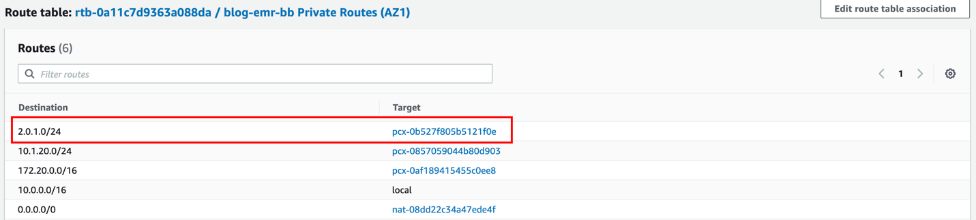
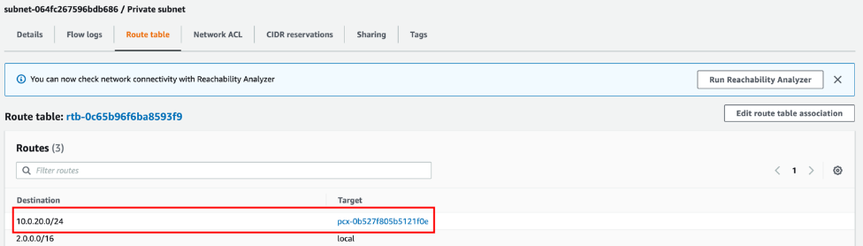

# Configure network access for your Amazon EMR cluster

Before you get started with using Amazon EMR or EMR Serverless for your data preparation
tasks in Studio, ensure that you or your administrator have configured your network
to allow communication between Studio and Amazon EMR. Once this communication is
enabled, you can choose to:

- [Prepare data using EMR Serverless](studio-notebooks-emr-serverless.md "studio-notebooks-emr-serverless.md")
- [Data preparation using Amazon EMR](studio-notebooks-emr-cluster.md "studio-notebooks-emr-cluster.md")

###### Note

For EMR Serverless users, the simplest setup involves creating your application
in the Studio UI without modifying the default settings for the
**Virtual private cloud (VPC)** option. This approach allows
the application to be created within your SageMaker domain's VPC, eliminating the
need for additional networking configuration. If you choose this option, you can
skip the following networking setup section.

The networking instructions vary based on whether Studio and Amazon EMR are deployed
within a private [Amazon Virtual Private Cloud](../../../vpc/latest/userguide/what-is-amazon-vpc.md "../../../vpc/latest/userguide/what-is-amazon-vpc.md") (VPC)
or communicate over the internet.

By default, Studio or Studio Classic run in an AWS managed VPC with [internet access](studio-notebooks-and-internet-access.md#studio-notebooks-and-internet-access-default "studio-notebooks-and-internet-access.md#studio-notebooks-and-internet-access-default"). When using an internet connection, Studio and
Studio Classic access AWS resources, such as Amazon S3 buckets, over the internet. However, if
you have security requirements to control access to your data and job containers, we
recommend that you configure Studio or Studio Classic and Amazon EMR so that your data and
containers aren’t accessible over the internet. To control access to your resources or
run Studio or Studio Classic without public internet access, you can specify the
`VPC only` network access type when you onboard to [Amazon SageMaker AI domain](gs-studio-onboard.md "gs-studio-onboard.md"). In this scenario, both
Studio and Studio Classic establish connections with other AWS services via private
[VPC
endpoints](../../../vpc/latest/privatelink/create-interface-endpoint.md "../../../vpc/latest/privatelink/create-interface-endpoint.md"). For information about configuring Studio or Studio Classic in
`VPC only` mode, see [Connect SageMaker Studio or Studio Classic notebooks in a VPC to external
resources.](studio-notebooks-and-internet-access.md#studio-notebooks-and-internet-access-vpc-only "studio-notebooks-and-internet-access.md#studio-notebooks-and-internet-access-vpc-only").

The first two sections describe how to ensure communication between Studio or
Studio Classic and Amazon EMR in VPCs without public internet access. The last section
covers how to ensure communication between Studio or Studio Classic and Amazon EMR using an
internet connection. Prior to connecting Studio or Studio Classic and Amazon EMR without
internet access, make sure to establish endpoints for Amazon Simple Storage Service (data storage), Amazon CloudWatch
(logging and monitoring), and Amazon SageMaker Runtime (fine-grained role-based access control
(RBAC)).

To connect Studio or Studio Classic and Amazon EMR:

- If Studio or Studio Classic and Amazon EMR are in separate VPCs, either in
  the same AWS account or in different accounts, see [Studio and Amazon EMR are in separate VPCs](#studio-notebooks-emr-networking-requirements-cross-vpc "#studio-notebooks-emr-networking-requirements-cross-vpc").
- If Studio or Studio Classic and Amazon EMR are in the same VPC, see [Studio
  and Amazon EMR are in the same VPC](#studio-notebooks-emr-networking-requirements-same-vpc "#studio-notebooks-emr-networking-requirements-same-vpc").
- If you chose to connect Studio or Studio Classic and Amazon EMR over public
  internet, see [Studio
  and Amazon EMR communicate over public internet](#studio-notebooks-emr-networking-requirements-internet "#studio-notebooks-emr-networking-requirements-internet").

##

Studio and Amazon EMR are in separate VPCs

To allow communication between Studio or Studio Classic and Amazon EMR when they are
deployed in separate VPCs:

1. Start by connecting your VPCs through a VPC peering
   connection.
2. Update your routing tables in each VPC to route the network
   traffic between Studio or Studio Classic subnets and Amazon EMR subnets both
   ways.
3. Configure your security groups to allow inbound and outbound
   traffic.

The steps to connect Studio or Studio Classic and Amazon EMR are the same whether the
resources are deployed in a single AWS account (Single account use case) or across
multiple AWS accounts (Cross-account use case).

1. ###### VPC peering

Create a [VPC
peering connection](../../../vpc/latest/peering/working-with-vpc-peering.md "../../../vpc/latest/peering/working-with-vpc-peering.md") to facilitate the networking between the two
VPCs (Studio or Studio Classic and Amazon EMR).

    1. From your Studio or Studio Classic account, on the VPC
     dashboard, choose **Peering connections**, then
     **Create peering connection**.
    2. Create your request to peer the Studio or Studio Classic
     VPC with the Amazon EMR VPC. When requesting peering in
     another AWS account, choose **Another account**
     in **Select another VPC to peer
     with**.

    For cross-account peering, the administrator must accept the
     request from the Amazon EMR account.

    When peering private subnets, you should enable private IP DNS
     resolution at the VPC peering connection level.

2. ###### Routing tables

Send the network traffic between Studio or Studio Classic subnets and
Amazon EMR subnets both ways.

After you establish the peering connection, the administrator (on each
account for cross-account access) can add routes to the private subnet route
tables to route the traffic between Studio or Studio Classic and the Amazon EMR
subnets. You can define those routes by going to the **Route
Tables** section of each VPC in the VPC
dashboard.

The following illustration of the route table of a Studio VPC
subnet shows an example of an outbound route from the Studio account to
the Amazon EMR VPC IP range (here `2.0.1.0/24`) through the
peering connection.

The following illustration of a route table of an Amazon EMR VPC subnet
shows an example of return routes from the Amazon EMR VPC to Studio
VPC IP range (here `10.0.20.0/24`) through the peering
connection.

 3. ###### Security groups

Lastly, the security group of your Studio or Studio Classic domain
must allow outbound traffic, and the security group of the Amazon EMR primary
node must allow inbound traffic on _Apache
Livy_, _Hive_, or _Presto_ TCP ports (respectively
`8998`, `10000`, and `8889`) from the
Studio or Studio Classic instance security group. [Apache Livy](https://livy.apache.org/ "https://livy.apache.org/") is a service that
enables interaction with Amazon EMR over a REST interface.

The following diagram shows an example of an Amazon VPC setup that enables JupyterLab
or Studio Classic notebooks to provision Amazon EMR clusters from CloudFormation templates in the Service Catalog
and then connect to an Amazon EMR cluster within the same AWS account. The diagram
provides an additional illustration of the required endpoints for a direct
connection to various AWS services, such as Amazon S3 or Amazon CloudWatch, when the VPCs have
no internet access. Alternatively, a [NAT
gateway](../../../vpc/latest/userguide/vpc-nat-gateway.md#nat-gateway-working-with "../../../vpc/latest/userguide/vpc-nat-gateway.md#nat-gateway-working-with") must be used to allow instances in private subnets of multiple
VPCs to share a single public IP address provided by the [internet gateway](../../../vpc/latest/userguide/VPC_Internet_Gateway.md "../../../vpc/latest/userguide/VPC_Internet_Gateway.md")
when accessing the internet.

![Architectural diagram illustrating an example of a simple Amazon VPC setup that enables Studio or Studio Classic notebooks to provision Amazon EMR clusters from CloudFormation templates in the Service Catalog and then connect to an Amazon EMR cluster within the same AWS account. The diagram provides an additional illustration of the required endpoints for a direct connection to various AWS services, such as Amazon S3 or Amazon CloudWatch, when the VPCs have no internet access. Alternatively, a NAT gateway must be used to allow instances in private subnets of multiple VPCs to share a single public IP address provided by the internet gateway when accessing the internet.](images/studio/emr/studio-notebooks-emr-architecture-singleaccount-vpcendpoints.png)

## Studio

and Amazon EMR are in the same VPC

If Studio or Studio Classic and Amazon EMR are in different subnets, add routes to
each private subnet route table to route the traffic between Studio or
Studio Classic and the Amazon EMR subnets. You can define those routes by going to the
**Route Tables** section of each VPC in the VPC
dashboard. If you deployed Studio or Studio Classic and Amazon EMR in the same
VPC and the same subnet, you do not need to route the traffic between the
Studio and the Amazon EMR.

Whether or not you needed to update your routing tables, the security group of
your Studio or Studio Classic domain must allow outbound traffic, and the
security group of the Amazon EMR primary node must allow inbound traffic on _Apache Livy_, _Hive_,or
_Presto_ TCP ports (respectively
`8998`, `10000`, and `8889`) from the
Studio or Studio Classic instance security group. [Apache Livy](https://livy.apache.org/ "https://livy.apache.org/") is a service that enables
interaction with a Amazon EMR over a REST interface.

## Studio

and Amazon EMR communicate over public internet

By default, Studio and Studio Classic provide a network interface that allows
communication with the internet through an internet gateway in the VPC
associated with the SageMaker domain. If you choose to connect to Amazon EMR through the
public internet, Amazon EMR needs to accept inbound traffic on _Apache Livy_, _Hive_,or _Presto_ TCP ports (respectively `8998`,
`10000`, and `8889`) from its internet gateway. [Apache Livy](https://livy.apache.org/ "https://livy.apache.org/") is a service that enables
interaction with Amazon EMR over a REST interface.

Keep in mind that any port on which you allow inbound traffic represents a
potential security vulnerability. Carefully review custom security groups to ensure
that you minimize vulnerabilities. For more information, see [Control network traffic with security groups](../../../emr/latest/ManagementGuide/emr-security-groups.md "../../../emr/latest/ManagementGuide/emr-security-groups.md").

Alternatively, see [Blogs and whitepapers](studio-notebooks-emr-resources.md "studio-notebooks-emr-resources.md") for a detailed walkthrough of
how to enable [Kerberos on Amazon EMR](../../../emr/latest/ManagementGuide/emr-kerberos.md "../../../emr/latest/ManagementGuide/emr-kerberos.md"),
set the cluster in a private subnet, and access the cluster using a [Network Load Balancer (NLB)](../../../elasticloadbalancing/latest/network/introduction.md "../../../elasticloadbalancing/latest/network/introduction.md") to expose only specific ports, which are
access-controlled via security groups.

###### Note

When connecting to your Apache Livy endpoint through the public internet, we
recommend that you secure communications between Studio or Studio Classic and
your Amazon EMR cluster using TLS.

For information on setting up HTTPS with Apache Livy, see [Enabling HTTPS with Apache Livy](../../../emr/latest/ReleaseGuide/enabling-https.md "../../../emr/latest/ReleaseGuide/enabling-https.md"). For information on setting an
Amazon EMR cluster with transit encryption enabled, see [Providing certificates for encrypting data in transit with Amazon EMR
encryption](../../../emr/latest/ManagementGuide/emr-encryption-enable.md#emr-encryption-certificates "../../../emr/latest/ManagementGuide/emr-encryption-enable.md#emr-encryption-certificates"). Additionally, you need to configure Studio or
Studio Classic to access your certificate key as specified in [Connect to an Amazon EMR cluster over
HTTPS](connect-emr-clusters.md#connect-emr-clusters-ssl "connect-emr-clusters.md#connect-emr-clusters-ssl").
