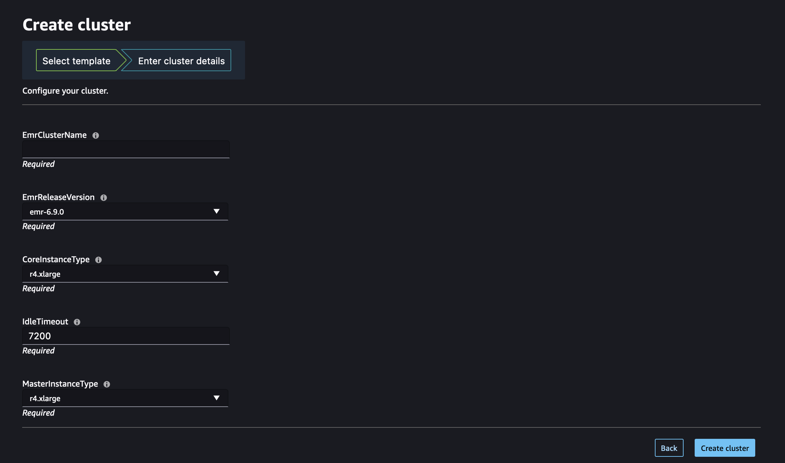

# Launch an Amazon EMR

cluster from Studio or Studio Classic

Data scientists and data engineers can self-provision Amazon EMR clusters from Studio
or Studio Classic using AWS CloudFormation templates set up by their administrators. Before users can
launch a cluster, administrators must have configured the necessary settings in the
Studio environment. For information on how administrators can configure a
Studio environment to allow self-provisioning Amazon EMR clusters, see [Configure Amazon EMR CloudFormation
templates in the Service Catalog](studio-notebooks-set-up-emr-templates.md "studio-notebooks-set-up-emr-templates.md").

To provision a new Amazon EMR cluster from Studio or Studio Classic:

1. In the Studio or Studio Classic UI's left-side panel, select the
   **Data** node in the left navigation menu. Navigate down to
   **Amazon EMR Clusters**. This opens up a page listing the Amazon EMR
   clusters that you can access from Studio or Studio Classic.
2. Choose the **Create** button at the top right corner. This
   opens up a new modal listing the cluster templates available to you.
3. Select a cluster template by choosing a template name and then choose
   **Next**.
4. Enter the cluster's details, such as a cluster name and any specific
   configurable parameter set by your administrator, and then choose
   **Create cluster**. The creation of the cluster might take
   a couple of minutes.

Once the cluster is provisioned, the Studio or Studio Classic UI displays a _The cluster has been successfully created_ message.

To connect to your cluster, see [Connect to an Amazon EMR cluster from SageMaker Studio
or Studio Classic](connect-emr-clusters.md "connect-emr-clusters.md")
