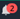

# Shut Down and Update Amazon SageMaker Studio Classic and Apps

###### Important

As of November 30, 2023, the previous Amazon SageMaker Studio experience is now named
Amazon SageMaker Studio Classic. The following section is specific to using the Studio Classic application. For
information about using the updated Studio experience, see [Amazon SageMaker Studio](studio-updated.md "studio-updated.md").

Studio Classic is still maintained for existing
workloads but is no longer available for onboarding. You can only stop or delete existing Studio Classic
applications and cannot create new ones. We recommend that you [migrate your workload to the new Studio experience](studio-updated-migrate.md "studio-updated-migrate.md").

The following topics show how to shut down and update SageMaker Studio Classic and Studio Classic
Apps.

Studio Classic provides a notification icon (

) in the upper-right corner of the Studio Classic UI. This notification icon
displays the number of unread notices. To read the notices, select the icon.

Studio Classic provides two types of notifications:

- Upgrade – Displayed when Studio Classic or one of the Studio Classic apps have released
  a new version. To update Studio Classic, see [Shut Down and Update Amazon SageMaker Studio Classic](studio-tasks-update-studio.md "studio-tasks-update-studio.md"). To update Studio Classic apps, see [Shut Down and Update Amazon SageMaker Studio Classic Apps](studio-tasks-update-apps.md "studio-tasks-update-apps.md").
- Information – Displayed for new features and other information.
  To reset the notification icon, you must select the link in each notice. Read
  notifications may still display in the icon. This does not indicate that updates are still
  needed after you have updated Studio Classic and Studio Classic Apps.

To learn how to update [Amazon SageMaker Data Wrangler](data-wrangler.md "data-wrangler.md"), see [Shut Down and Update Amazon SageMaker Studio Classic Apps](studio-tasks-update-apps.md "studio-tasks-update-apps.md").

To ensure that you have the most recent software updates, update Amazon SageMaker Studio Classic and your
Studio Classic apps using the methods outlined in the following topics.

###### Topics

- [Shut Down and Update Amazon SageMaker Studio Classic](studio-tasks-update-studio.md "studio-tasks-update-studio.md")
- [Shut Down and Update Amazon SageMaker Studio Classic Apps](studio-tasks-update-apps.md "studio-tasks-update-apps.md")
