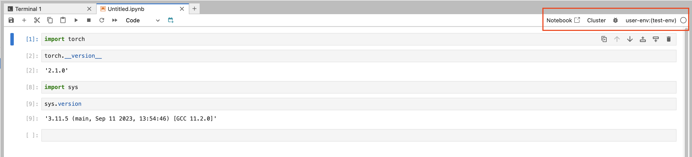
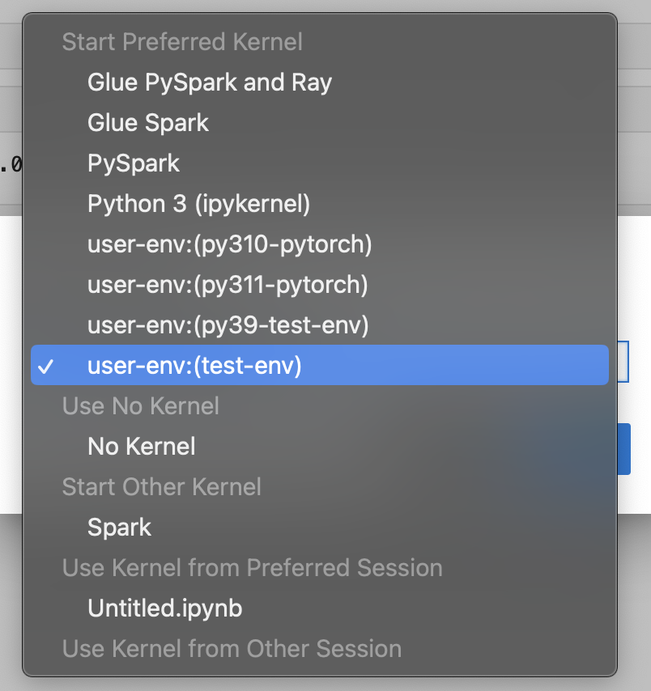

# Customize your

environment using a package manager

Use pip or conda to customize your environment. We recommend using package managers
instead of lifecycle configuration scripts.

## Create and activate your

custom environment

This section provides examples of different ways that you can configure an
environment in JupyterLab.

A basic conda environment has the minimum number of packages that are required for
your workflows in SageMaker AI. Use the following template to a create a basic conda
environment:

```

# initialize conda for shell interaction
conda init

# create a new fresh environment
conda create --name test-env

# check if your new environment is created successfully
conda info --envs

# activate the new environment
conda activate test-env

# install packages in your new conda environment
conda install pip boto3 pandas ipykernel

# list all packages install in your new environment
conda list

# parse env name information from your new environment
export CURRENT_ENV_NAME=$(conda info | grep "active environment" | cut -d : -f 2 | tr -d ' ')

# register your new environment as Jupyter Kernel for execution
python3 -m ipykernel install --user --name $CURRENT_ENV_NAME --display-name "user-env:($CURRENT_ENV_NAME)"

# to exit your new environment
conda deactivate

```

The following image shows the location of the environment that you've
created.



To change your environment, choose it and select an option from the dropdown
menu.



Choose **Select** to select a kernel for the environment.

## Create a conda environment

with a specific Python version

Cleaning up conda environments that you’re not using can help free up disk space
and improve performance. Use the following template to clean up a conda
environment:

```

# create a conda environment with a specific python version
conda create --name py38-test-env python=3.8.10

# activate and test your new python version
conda activate py38-test-env & python3 --version

# Install ipykernel to facilicate env registration
conda install ipykernel

# parse env name information from your new environment
export CURRENT_ENV_NAME=$(conda info | grep "active environment" | cut -d : -f 2 | tr -d ' ')

# register your new environment as Jupyter Kernel for execution
python3 -m ipykernel install --user --name $CURRENT_ENV_NAME --display-name "user-env:($CURRENT_ENV_NAME)"

# deactivate your py38 test environment
conda deactivate

```

## Create a conda

environment with a specific set of packages

Use the following template to create a conda environment with a specific version
of Python and set of packages:

```

# prefill your conda environment with a set of packages,
conda create --name py38-test-env python=3.8.10 pandas matplotlib=3.7 scipy ipykernel

# activate your conda environment and ensure these packages exist
conda activate py38-test-env

# check if these packages exist
conda list | grep -E 'pandas|matplotlib|scipy'

# parse env name information from your new environment
export CURRENT_ENV_NAME=$(conda info | grep "active environment" | cut -d : -f 2 | tr -d ' ')

# register your new environment as Jupyter Kernel for execution
python3 -m ipykernel install --user --name $CURRENT_ENV_NAME --display-name "user-env:($CURRENT_ENV_NAME)"

# deactivate your conda environment
conda deactivate

```

## Clone conda from an existing

environment

Clone your conda environment to preserve its working state. You experiment in the
cloned environment without having to worry about introducing breaking changes in
your test environment.

Use the following command to clone an environment.

```

# create a fresh env from a base environment
conda create --name py310-base-ext --clone base # replace 'base' with another env

# activate your conda environment and ensure these packages exist
conda activate py310-base-ext

# install ipykernel to register your env
conda install ipykernel

# parse env name information from your new environment
export CURRENT_ENV_NAME=$(conda info | grep "active environment" | cut -d : -f 2 | tr -d ' ')

# register your new environment as Jupyter Kernel for execution
python3 -m ipykernel install --user --name $CURRENT_ENV_NAME --display-name "user-env:($CURRENT_ENV_NAME)"

# deactivate your conda environment
conda deactivate

```

## Clone conda from a reference

YAML file

Create a conda environment from a reference YAML file. The following is an example
of a YAML file that you can use.

```

# anatomy of a reference environment.yml
name: py311-new-env
channels:
  - conda-forge
dependencies:
  - python=3.11
  - numpy
  - pandas
  - scipy
  - matplotlib
  - pip
  - ipykernel
  - pip:
      - git+https://github.com/huggingface/transformers

```

Under `pip`, we recommend specifying only the dependencies that aren't
available with conda.

Use the following commands to create a conda environment from a YAML file.

```

# create your conda environment
conda env create -f environment.yml

# activate your env
conda activate py311-new-env

```
