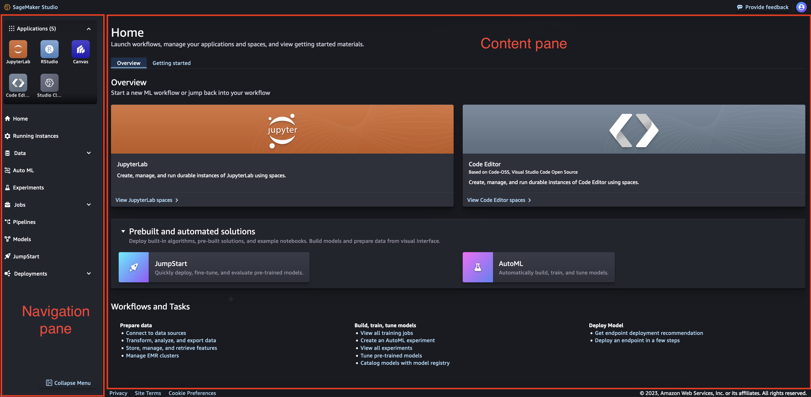

# Amazon SageMaker Studio UI overview

###### Important

As of November 30, 2023, the previous Amazon SageMaker Studio experience is now named
Amazon SageMaker Studio Classic. The following section is specific to using the updated Studio
experience. For information about using the Studio Classic application, see [Amazon SageMaker Studio Classic](studio.md "studio.md").

The Amazon SageMaker Studio user interface is split into three distinct parts. This page gives
information about the distinct parts and their components.

- Navigation bar– This section of the UI
  includes the URL, breadcrumbs, notifications, and user options.
- Navigation pane– This section of the UI
  includes a list of the applications that are supported in
  Studio and options for the main workflows in
  Studio.
- Content pane– The main working area that
  displays the current page of the Studio UI that you have open.

###### Topics

- [Amazon SageMaker Studio navigation bar](#studio-updated-ui-top "#studio-updated-ui-top")
- [Amazon SageMaker Studio navigation pane](#studio-updated-ui-left "#studio-updated-ui-left")
- [Studio content pane](#studio-updated-ui-working "#studio-updated-ui-working")

## Amazon SageMaker Studio navigation bar

The navigation bar of the Studio UI includes the URL, breadcrumbs,
notifications, and user options.

**URL Structure**

The URL of Studio changes as you navigate the UI. When you navigate to a
different page in the UI, the URL changes to reflect that page. With the updated URL,
you open any page in the Studio UI directly without navigating to the landing page
first.

**Breadcrumbs**

As you navigate through the Studio UI, the breadcrumbs keep track of the parent pages of the
current page. By choosing one of these breadcrumbs, you can navigate to parent pages in the UI.

**Notifications**

The notifications section of the UI gives information about important changes to Studio, updates
to applications, and issues to resolve.

**User options**

Choose the user options icon (

) to get information about the user profile that is currently using
Studio, and gives the option to sign out of Studio. 

## Amazon SageMaker Studio navigation pane

**Navigation pane**

The navigation pane of the UI includes a list of the applications that are supported
in Studio. It also provides options for the main workflows in Studio.

This section of the UI can be used in an expanded or collapsed state. To change
whether the section is expanded or collapsed, select the **Collapse** icon (

).

**Applications**

The applications section lists the applications that are available in Studio. If you choose one of
the application types, you are directed to the landing page for that application.

**Workflows**

The list of workflows includes all of the available actions that you can take in
Studio. Choose one of the options to navigate to the landing page for that
workflow. If there are multiple workflows available for that option, choosing the option
opens a dropdown menu where you can select the desired landing page.

The following list describes the options and provides a link for more information.

- Home– The main landing page with an
  overview, getting started, and what’s new.
- Running instances– All of the instances
  that are currently running in Studio. For more information, see [View your Studio running instances,
  applications, and spaces](studio-updated-running.md "studio-updated-running.md").
- Data– Data preparation options where you
  can collaborate to store, explore, prepare, transform, and share your data. 
  - For more information about Amazon SageMaker Data Wrangler, see [Data preparation](canvas-data-prep.md "canvas-data-prep.md").
  - For more information about Amazon SageMaker Feature Store, see [Create, store, and share features with Feature Store](feature-store.md "feature-store.md").
  - For more information about Amazon EMR clusters, see
    [Data preparation using Amazon EMR](studio-notebooks-emr-cluster.md "studio-notebooks-emr-cluster.md").

- Auto ML– Automatically build, train, tune,
  and deploy machine learning (ML) models. For more information, see [Amazon SageMaker Canvas](canvas.md "canvas.md").
- Experiments– Create, manage, analyze, and
  compare your machine learning experiments using Amazon SageMaker Experiments. For more
  information, see [Amazon SageMaker Experiments in Studio Classic](experiments.md "experiments.md").
- Jobs– View jobs created in Studio. 
  - For more information about training, see [Model training](train-model.md "train-model.md").
  - For more information about model evaluation, see [Understand options for evaluating large
    language models with SageMaker Clarify](clarify-foundation-model-evaluate.md "clarify-foundation-model-evaluate.md").

- Pipelines– Automate your ML workflow with
  Amazon SageMaker Pipelines, which provides resources to help you build, track, and manage your
  pipeline resources. For more information, see [Pipelines](pipelines.md "pipelines.md").
- Models– Organize your models into groups
  and collections in the model registry, where you can manage model versions, view
  metadata, and deploy models to production. For more information, see [Model Registration Deployment with Model Registry](model-registry.md "model-registry.md").
- JumpStart– Amazon SageMaker JumpStart provides
  pretrained, open-source models for a wide range of problem types to help you get
  started with machine learning. For more information, see [SageMaker JumpStart pretrained models](studio-jumpstart.md "studio-jumpstart.md").
- Deployments– Deploy your machine learning
  (ML) models for inference.
  - For more information about Amazon SageMaker Inference Recommender, see [Amazon SageMaker Inference Recommender](inference-recommender.md "inference-recommender.md").
  - For more information about endpoints, see [Deploy models for inference](deploy-model.md "deploy-model.md").

## Studio content pane

The main working area is also called the content pane. It displays the current page
of the Studio UI that you have open.

**Studio home page**

The Studio home page is the primary landing page in the main working area. The
home page includes two distinct tabs. There is an **Overview** tab and
a **Getting started** tab.

**Overview**

The **Overview** tab includes options to start spaces for popular
application types, get started with pre-built and automated solutions for ML workflows,
and links to common tasks in the Studio UI.

**Getting started**

The **Getting started** tab includes information, guidance, and
resources on how to begin with Studio. This includes a guided tour of the
Studio UI, a link to documentation about Studio, and a selection of quick
tips.
