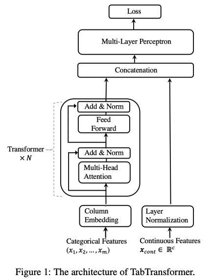

# How TabTransformer works

TabTransformer is a novel deep tabular data modeling architecture for supervised
learning. The TabTransformer is built upon self-attention based Transformers. The
Transformer layers transform the embeddings of categorical features into robust
contextual embeddings to achieve higher prediction accuracy. Furthermore, the contextual
embeddings learned from TabTransformer are highly robust against both missing and noisy
data features, and provide better interpretability.

TabTransformer performs well in machine learning competitions because of its robust
handling of a variety of data types, relationships, distributions, and the diversity of
hyperparameters that you can fine-tune. You can use TabTransformer for regression,
classification (binary and multiclass), and ranking problems.

The following diagram illustrates the TabTransformer architecture.

For more information, see _[TabTransformer: Tabular Data Modeling Using Contextual Embeddings](https://arxiv.org/abs/2012.06678 "https://arxiv.org/abs/2012.06678")_.
