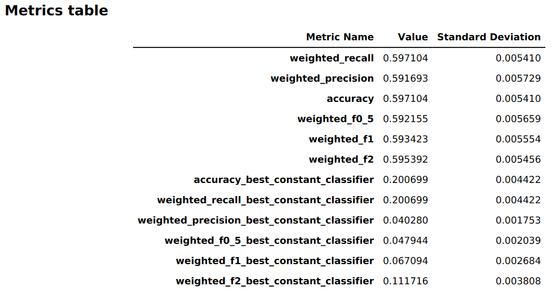
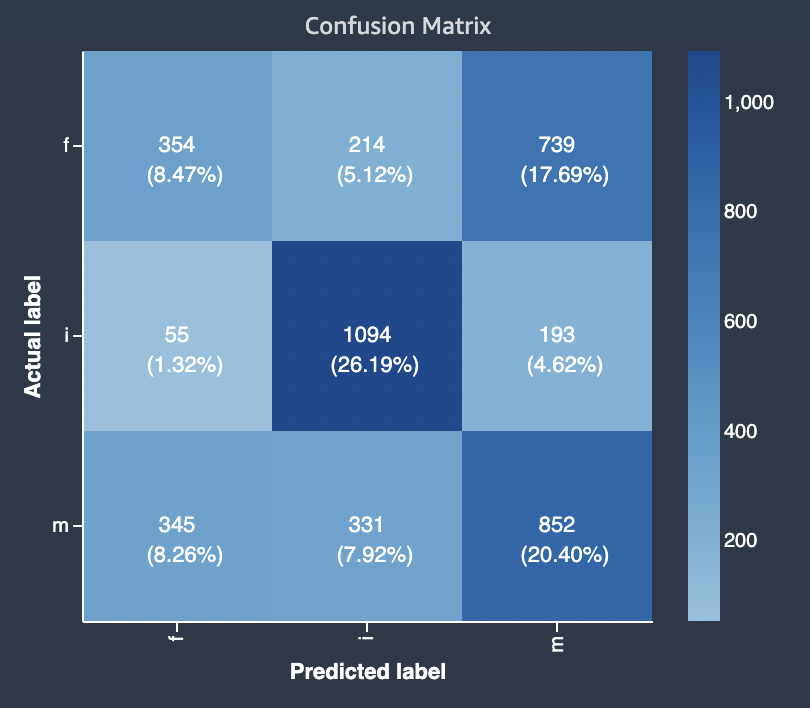

# Model performance

report

An Amazon SageMaker AI model quality report (also referred to as performance report) provides
insights and quality information for the best model candidate generated by an AutoML job. This
includes information about the job details, model problem type, objective function, and
various metrics. This section details the content of a performance report for text
classification problems and explains how to access the metrics as raw data in a JSON
file.

You can find the Amazon S3 prefix to the model quality report artifacts generated for the best
candidate in the response to `DescribeAutoMLJobV2` at `BestCandidate.CandidateProperties.CandidateArtifactLocations.ModelInsights`.

The performance report contains two sections:

- The first section contains details about the Autopilot job that produced the
  model.
- The second section contains a model quality report with various performance
  metrics.

## Autopilot job

details

This first section of the report gives some general information about the Autopilot job
that produced the model. These details include the following information:

- Autopilot candidate name: The name of the best model candidate.
- Autopilot job name: The name of the job.
- Problem type: The problem type. In our case, _text
  classification_.
- Objective metric: The objective metric used to optimize the performance of the
  model. In our case, _Accuracy_.
- Optimization direction: Indicates whether to minimize or maximize the objective
  metric.

## Model quality

report

Model quality information is generated by Autopilot model insights. The report's content
that is generated depends on the problem type it addressed. The report specifies the number
of rows that were included in the evaluation dataset and the time at which the evaluation
occurred.

### Metrics tables

The first part of the model quality report contains metrics tables. These are
appropriate for the type of problem that the model addressed.

The following image is an example of a metrics table generated by Autopilot for an image
or text classification problem. It shows the metric name, value, and standard
deviation.

### Graphical model

performance information

The second part of the model quality report contains graphical information to help you
evaluate model performance. The contents of this section depend on the selected problem
type.

#### Confusion

matrix

A confusion matrix provides a way to visualize the accuracy of the predictions made
by a model for binary and multiclass classification for different problems.

A summary of the graph's components of **false positive rate** (FPR) and **true positive rate** (TPR) are
defined as follows.

- Correct predictions
  - **True positive** (TP): The predicted the value
    is 1, and the true value is 1.
  - **True negative** (TN): The predicted the value
    is 0, and the true value is 0.

- Erroneous predictions
  - **False positive** (FP): The predicted the
    value is 1, but the true value is 0.
  - **False negative** (FN): The predicted the
    value is 0, but the true value is 1.

The confusion matrix in the model quality report contains the following.

- The number and percentage of correct and incorrect predictions for the actual
  labels
- The number and percentage of accurate predictions on the diagonal from the
  upper-left to the lower-right corner
- The number and percentage of inaccurate predictions on the diagonal from the
  upper-right to the lower-left corner

The incorrect predictions on a confusion matrix are the confusion values.

The following diagram is an example of a confusion matrix for a multi-class
classification problem. The confusion matrix in the model quality report contains the
following.

- The vertical axis is divided into three rows containing three different actual
  labels.
- The horizontal axis is divided into three columns containing labels that were
  predicted by the model.
- The color bar assigns a darker tone to a larger number of samples to visually
  indicate the number of values that were classified in each category.

In the example below, the model correctly predicted actual 354 values for label
**f**, 1094 values for label **i** and 852 values
for label **m**. The difference in tone indicates that the dataset is
not balanced because there are many more labels for the value **i**
than for **f** or **m**.

The confusion matrix in the model quality report provided can accommodate a maximum
of 15 labels for multiclass classification problem types. If a row corresponding to a
label shows a `Nan` value, it means that the validation dataset used to check
model predictions does not contain data with that label.
