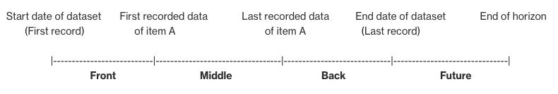

# Time-series datasets format and missing

values filling methods

Time-series data refers to a collection of observations or measurements recorded over
regular intervals of time. In this type of data, each observation is associated with a
specific timestamp or time period, creating a sequence of data points ordered
chronologically.

The specific columns you include in your time-series dataset depend on the goals of your
analysis and the data available to you. At a minimum, the time-series data is composed of a
3-column table where:

- One column contains unique identifiers assigned to individual items to refer to their
  value at a specific moment.
- Another column represents the point-in-time value or **target** to log the value of a given item at a specific moment. After the
  model is trained on those target values, this target column contains the values that the
  model predicts at a specified frequency within a defined horizon.
- And a timestamp column is included to record the date and time when the value was
  measured.
- Additional columns can contain other factors that may influence the forecast
  performance. For example, in a time-series dataset for retail where the target is the
  sales or revenue, you might include features that provide information about units sold,
  product ID, store location, customer count, inventory levels, as well as covariate
  indicators such as weather data or demographic information.

###### Note

You can add a feature-engineered dataset of national holiday information to your
time-series. By including holidays in your time series model, you can capture the periodic
patterns that holidays create. This helps your forecasts better reflect the underlying
seasonality of your data. For information on the available calendars per country, see [National holiday
calendars](autopilot-timeseries-forecasting-holiday-calendars.md "autopilot-timeseries-forecasting-holiday-calendars.md")

## Datasets format for time-series forecasting

Autopilot supports numeric, categorical, text, and datetime data types. The data type of
the target column must be numeric.

Autopilot supports time-series data formatted as CSV (default) files or as Parquet
files.

- **CSV** (comma-separated-values) is a row-based file
  format that stores data in human readable plaintext which a popular choice for data
  exchange as they are supported by a wide range of applications.
- **Parquet** is a column-based file format where the
  data is stored and processed more efficiently than row-based file formats. This makes
  them a better option for big data problems.

For more information about the resource limits on time-series datasets for forecasting
in Autopilot, see [Time-series forecasting resource
limits for Autopilot](timeseries-forecasting-limits.md "timeseries-forecasting-limits.md").

## Handle missing values

A common issue in time-series forecasting data is the presence of missing values. Your
data might contain missing values for a number of reasons, including measurement failures,
formatting problems, human errors, or a lack of information to record. For instance, if you
are forecasting product demand for a retail store and an item is sold out or unavailable,
there would be no sales data to record while that item is out of stock. If prevalent enough,
missing values can significantly impact a model's accuracy.

Autopilot provides a number of filling methods to handle missing values, with distinct
approaches for the target column and other additional columns. Filling is the process of
adding standardized values to missing entries in your dataset.

Refer to [How to handle missing values
in your input datasets](autopilot-create-experiment-timeseries-forecasting.md#timeseries-forecasting-fill-missing-values "autopilot-create-experiment-timeseries-forecasting.md#timeseries-forecasting-fill-missing-values") to learn how to set the
method for filling missing values in your time-series dataset.

Autopilot supports the following filling methods:

- **Front filling:** Fills any missing values between the
  earliest recorded data point among all items and the starting point of each item (each
  item can start at a different time). This ensures that the data for each item is
  complete and spans from the earliest recorded data point to its respective starting
  point.
- **Middle filling:** Fills any missing values between
  the start and end dates of the items in the dataset.
- **Back filling:** Fills any missing values between the
  last data point of each item (each item can stop at a different time) and the last
  recorded data point among all items.
- **Future filling:** Fills any missing values between
  the last recorded data point among all items and the end of the forecast horizon.

The following image provides a visual representation of the different filling
methods.

### Choose a filling logic

When choosing a filling logic, you should consider how the logic will be interpreted
by your model. For instance, in a retail scenario, recording 0 sales of an available item
is different from recording 0 sales of an unavailable item, as the latter does not imply a
lack of customer interest in the item. Because of this, `0` filling in the
target column of the time-series might cause the predictor to be under-biased in its
predictions, while `NaN` filling might ignore actual occurrences of 0 available
items being sold and cause the predictor to be over-biased.

### Filling logic

You can perform filling on the target column and other numeric columns in your
datasets. Target columns have different filling guidelines and restrictions than the rest
of the numeric columns.

Filling Guidelines

| Column type               | Filling by default? | Supported filling methods        | Default filling logic | Accepted filling logic                                                                                                                                                                                                                                                                                                    |
| ------------------------- | ------------------- | -------------------------------- | --------------------- | ------------------------------------------------------------------------------------------------------------------------------------------------------------------------------------------------------------------------------------------------------------------------------------------------------------------------- | ---------------------------------------------------------------------------------------------------------------------------------------------------------------------------------------------------- |
| **Target column**         | Yes                 | Middle and back filling          | 0                     |  • `zero` - 0 filling.  • `value` - an integer or float number.  • `nan` - not a number.  • `mean` - the mean value from the data series.  • `median` - the median value from the data series.  • `min` - the minimum value from the data series.  • `max` - the maximum value from the data series. |
| **Other numeric columns** | No                  | Middle, back, and future filling | No default            |  • `zero` - 0 filling.  • `value` - an integer or float value.  • `mean` - the mean value from the data series.  • `median` - the median value from the data series.  • `min` - the minimum value from the data series.  • `max` - the maximum value from the data series.                              | ###### Note For both the target and other numeric columns, `mean`, `median`, `min`, and `max` are calculated based on a rolling window of the 64 most recent data entries before the missing values. |
