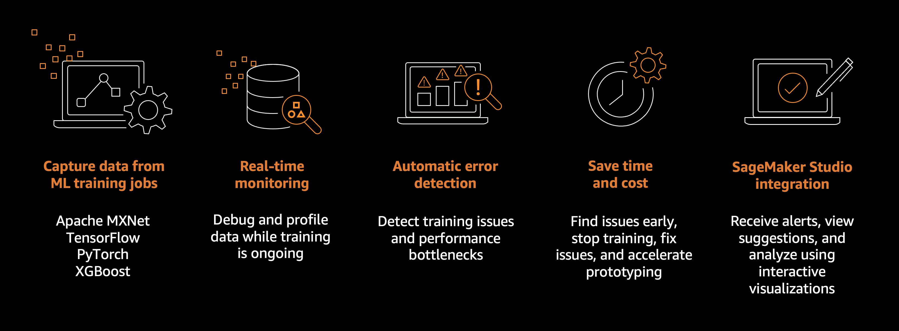

# Amazon SageMaker Debugger

Debug model output tensors from machine learning training jobs in real time and detect
non-converging issues using Amazon SageMaker Debugger.

## Amazon SageMaker Debugger features

A machine learning (ML) training job can have problems such as overfitting, saturated
activation functions, and vanishing gradients, which can compromise model
performance.

SageMaker Debugger provides tools to debug training jobs and resolve such problems to improve
the performance of your model. Debugger also offers tools to send alerts when training
anomalies are found, take actions against the problems, and identify the root cause of
them by visualizing collected metrics and tensors.

SageMaker Debugger supports the Apache MXNet, PyTorch, TensorFlow, and XGBoost frameworks.
For more information about available frameworks and versions supported by SageMaker Debugger,
see [Supported frameworks and
algorithms](debugger-supported-frameworks.md "debugger-supported-frameworks.md").

The high-level Debugger workflow is as follows:

1. Modify your training script with the `sagemaker-debugger` Python
   SDK if needed.
2. Configure a SageMaker training job with SageMaker Debugger.
   - Configure using the SageMaker AI Estimator API (for Python SDK).
   - Configure using the SageMaker AI [`CreateTrainingJob` request (for Boto3 or
     CLI)](debugger-createtrainingjob-api.md "debugger-createtrainingjob-api.md").
   - Configure [custom
     training containers](debugger-bring-your-own-container.md "debugger-bring-your-own-container.md") with SageMaker Debugger.

3. Start a training job and monitor training issues in real time.
   - [List of Debugger built-in rules](debugger-built-in-rules.md "debugger-built-in-rules.md").

4. Get alerts and take prompt actions against the training issues.
   - Receive texts and emails and stop training jobs when training issues
     are found using [Use Debugger built-in actions for
     rules](debugger-built-in-actions.md "debugger-built-in-actions.md").
   - Set up your own actions using [Amazon CloudWatch Events and
     AWS Lambda](debugger-cloudwatch-lambda.md "debugger-cloudwatch-lambda.md").

5. Explore deep analysis of the training issues.
   - For debugging model output tensors, see [Visualize Debugger Output
     Tensors in TensorBoard](debugger-enable-tensorboard-summaries.md "debugger-enable-tensorboard-summaries.md").

6. Fix the issues, consider the suggestions provided by Debugger, and repeat steps
   1–5 until you optimize your model and achieve target accuracy.

The SageMaker Debugger developer guide walks you through the following topics.

###### Topics

- [Supported frameworks and
  algorithms](debugger-supported-frameworks.md "debugger-supported-frameworks.md")
- [Amazon SageMaker Debugger architecture](debugger-how-it-works.md "debugger-how-it-works.md")
- [Debugger tutorials](debugger-tutorial.md "debugger-tutorial.md")
- [Debugging training jobs using Amazon SageMaker Debugger](debugger-debug-training-jobs.md "debugger-debug-training-jobs.md")
- [List of Debugger built-in rules](debugger-built-in-rules.md "debugger-built-in-rules.md")
- [Creating custom rules using the Debugger client
  library](debugger-custom-rules.md "debugger-custom-rules.md")
- [Use Debugger with custom training
  containers](debugger-bring-your-own-container.md "debugger-bring-your-own-container.md")
- [Configure Debugger using SageMaker API](debugger-createtrainingjob-api.md "debugger-createtrainingjob-api.md")
- [Amazon SageMaker Debugger references](debugger-reference.md "debugger-reference.md")
