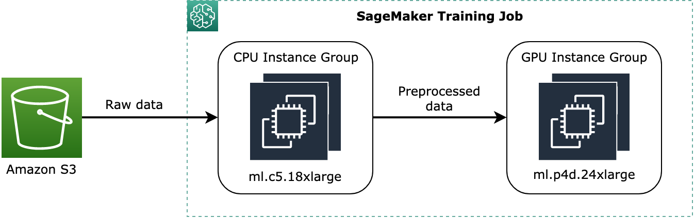

# Configure a training job with a

heterogeneous cluster in Amazon SageMaker AI

This section provides instructions on how to run a training job using a heterogeneous
cluster that consists of multiple instance types.

Note the following before you start.

- All instance groups share the same Docker image and training script.
  Therefore, your training script should be modified to detect which instance
  group it belongs to and fork execution accordingly.
- The heterogeneous cluster feature is not compatable with SageMaker AI local
  mode.
- The Amazon CloudWatch log streams of a heterogeneous cluster training job are not
  grouped by instance groups. You need to figure out from the logs which nodes are
  in which group.

###### Topics

- [Option 1: Using the
  SageMaker Python SDK](#train-heterogeneous-cluster-configure-pysdk "#train-heterogeneous-cluster-configure-pysdk")
- [Option 2: Using the
  low-level SageMaker APIs](#train-heterogeneous-cluster-configure-api "#train-heterogeneous-cluster-configure-api")

## Option 1: Using the

SageMaker Python SDK

Follow instructions on how to configure instance groups for a heterogeneous
cluster using the SageMaker Python SDK.

1. To configure instance groups of a heterogeneous cluster for a training
   job, use the `sagemaker.instance_group.InstanceGroup` class. You
   can specify a custom name for each instance group, the instance type, and
   the number of instances for each instance group. For more information, see
   [sagemaker.instance_group.InstanceGroup](https://sagemaker.readthedocs.io/en/stable/api/utility/instance_group.html "https://sagemaker.readthedocs.io/en/stable/api/utility/instance_group.html") in the _SageMaker AI
   Python SDK documentation_.

###### Note

For more information about available instance types and the maximum
number of instance groups that you can configure in a heterogeneous
cluster, see the [InstanceGroup](../APIReference/API_InstanceGroup.md "../APIReference/API_InstanceGroup.md") API reference.

The following code example shows how to set up two instance groups that
consists of two `ml.c5.18xlarge` CPU-only instances named
`instance_group_1` and one `ml.p3dn.24xlarge` GPU
instance named `instance_group_2`, as shown in the following
diagram.



The preceding diagram shows a conceptual example of
how pre-training processes, such as data preprocessing, can be assigned
to the CPU instance group and stream the preprocessed data to the GPU
instance group.

```
from sagemaker.instance_group import InstanceGroup

instance_group_1 = InstanceGroup(
    "`instance_group_1`", "`ml.c5.18xlarge`", `2`
)
instance_group_2 = InstanceGroup(
    "`instance_group_2`", "`ml.p3dn.24xlarge`", `1`
)
```

2. Using the instance group objects, set up training input channels and
   assign instance groups to the channels through the
   `instance_group_names` argument of the [sagemaker.inputs.TrainingInput](https://sagemaker.readthedocs.io/en/stable/api/utility/inputs.html "https://sagemaker.readthedocs.io/en/stable/api/utility/inputs.html") class. The
   `instance_group_names` argument accepts a list of strings of
   instance group names.

The following example shows how to set two training input channels and
assign the instance groups created in the example of the previous step. You
can also specify Amazon S3 bucket paths to the `s3_data`
argument for the instance groups to process data for your usage
purposes.

```
from sagemaker.inputs import TrainingInput

training_input_channel_1 = TrainingInput(
    s3_data_type='`S3Prefix`', # Available Options: S3Prefix | ManifestFile | AugmentedManifestFile
    s3_data='`s3://your-training-data-storage/folder1`',
    distribution='`FullyReplicated`', # Available Options: FullyReplicated | ShardedByS3Key
    input_mode='`File`', # Available Options: File | Pipe | FastFile
    instance_groups=["`instance_group_1`"]
)

training_input_channel_2 = TrainingInput(
    s3_data_type='`S3Prefix`',
    s3_data='`s3://your-training-data-storage/folder2`',
    distribution='`FullyReplicated`',
    input_mode='`File`',
    instance_groups=["`instance_group_2`"]
)
```

For more information about the arguments of `TrainingInput`,
see the following links.

    * The [sagemaker.inputs.TrainingInput](https://sagemaker.readthedocs.io/en/stable/api/utility/inputs.html "https://sagemaker.readthedocs.io/en/stable/api/utility/inputs.html") class in the *SageMaker Python SDK documentation*
    * The [S3DataSource](../APIReference/API_S3DataSource.md "../APIReference/API_S3DataSource.md") API in the *SageMaker AI
     API Reference*

3. Configure a SageMaker AI estimator with the `instance_groups` argument
   as shown in the following code example. The `instance_groups`
   argument accepts a list of `InstanceGroup` objects.

###### Note

The heterogeneous cluster feature is available through the SageMaker AI [PyTorch](https://sagemaker.readthedocs.io/en/stable/frameworks/pytorch/sagemaker.pytorch.html "https://sagemaker.readthedocs.io/en/stable/frameworks/pytorch/sagemaker.pytorch.html") and [TensorFlow](https://sagemaker.readthedocs.io/en/stable/frameworks/tensorflow/sagemaker.tensorflow.html#tensorflow-estimator "https://sagemaker.readthedocs.io/en/stable/frameworks/tensorflow/sagemaker.tensorflow.html#tensorflow-estimator") framework estimator classes. Supported
frameworks are PyTorch v1.10 or later and TensorFlow v2.6 or later. To
find a complete list of available framework containers, framework
versions, and Python versions, see [SageMaker AI Framework Containers](https://github.com/aws/deep-learning-containers/blob/master/available_images.md#sagemaker-framework-containers-sm-support-only "https://github.com/aws/deep-learning-containers/blob/master/available_images.md#sagemaker-framework-containers-sm-support-only") in the AWS Deep Learning
Container GitHub repository.

PyTorch

```
from sagemaker.`pytorch` import `PyTorch`

estimator = `PyTorch`(
    ...
    entry_point='`my-training-script.py`',
    framework_version='`x.y.z`',    # 1.10.0 or later
    py_version='py`xy`',
    job_name='`my-training-job-with-heterogeneous-cluster`',
    instance_groups=[`instance_group_1`, `instance_group_2`]
)
```

TensorFlow

```
from sagemaker.`tensorflow` import `TensorFlow`

estimator = `TensorFlow`(
    ...
    entry_point='`my-training-script.py`',
    framework_version='`x.y.z`', # 2.6.0 or later
    py_version='py`xy`',
    job_name='`my-training-job-with-heterogeneous-cluster`',
    instance_groups=[`instance_group_1`, `instance_group_2`]
)
```

###### Note

The `instance_type` and `instance_count`
argument pair and the `instance_groups` argument of the SageMaker AI
estimator class are mutually exclusive. For homogeneous cluster
training, use the `instance_type` and
`instance_count` argument pair. For heterogeneous cluster
training, use `instance_groups`.

###### Note

To find a complete list of available framework containers, framework
versions, and Python versions, see [SageMaker AI Framework Containers](https://github.com/aws/deep-learning-containers/blob/master/available_images.md#sagemaker-framework-containers-sm-support-only "https://github.com/aws/deep-learning-containers/blob/master/available_images.md#sagemaker-framework-containers-sm-support-only") in the AWS Deep Learning
Container GitHub repository. 4. Configure the `estimator.fit` method with the training input
channels configured with the instance groups and start the training
job.

```
estimator.fit(
    inputs={
        'training': `training_input_channel_1`,
        '`dummy-input-channel`': `training_input_channel_2`
    }
)
```

## Option 2: Using the

low-level SageMaker APIs

If you use the AWS Command Line Interface or AWS SDK for Python (Boto3) and want to use low-level SageMaker APIs for
submitting a training job request with a heterogeneous cluster, see the following
API references.

- [CreateTrainingJob](../APIReference/API_CreateTrainingJob.md "../APIReference/API_CreateTrainingJob.md")
- [ResourceConfig](../APIReference/API_ResourceConfig.md "../APIReference/API_ResourceConfig.md")
- [InstanceGroup](../APIReference/API_InstanceGroup.md "../APIReference/API_InstanceGroup.md")
- [S3DataSource](../APIReference/API_S3DataSource.md "../APIReference/API_S3DataSource.md")
