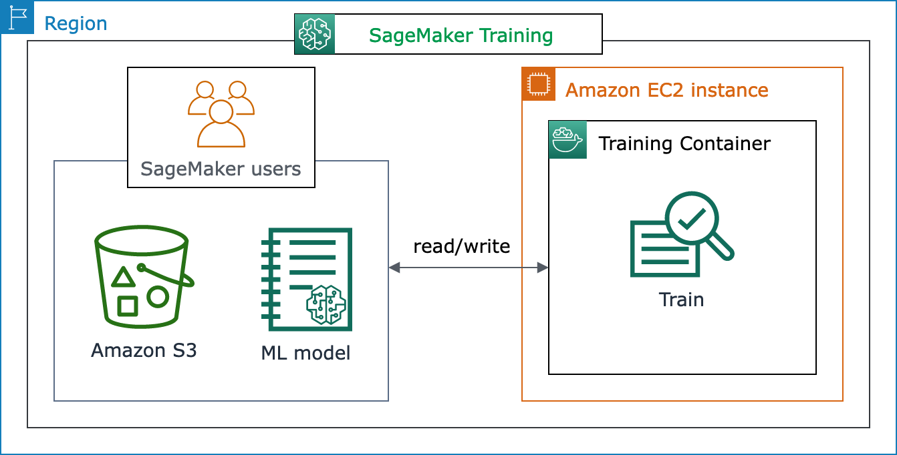
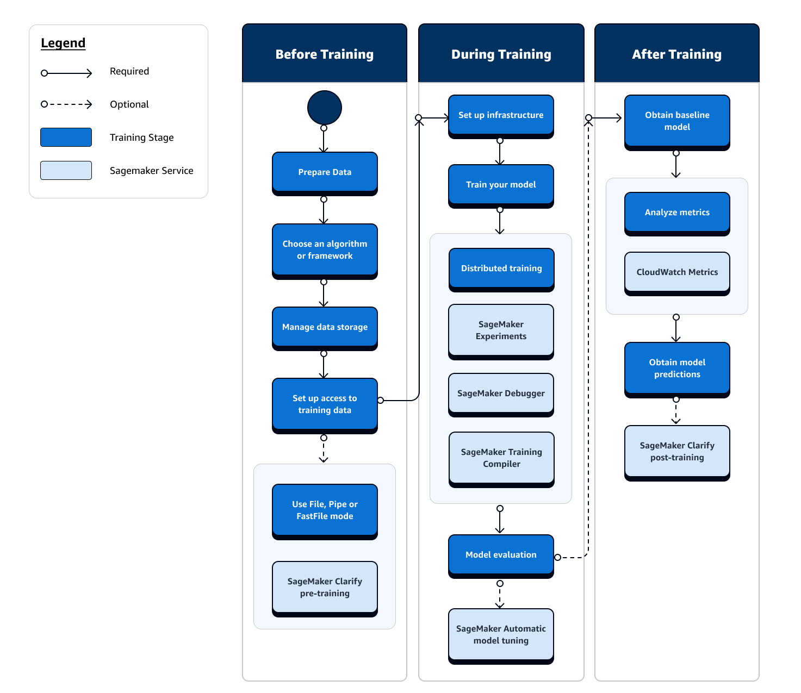
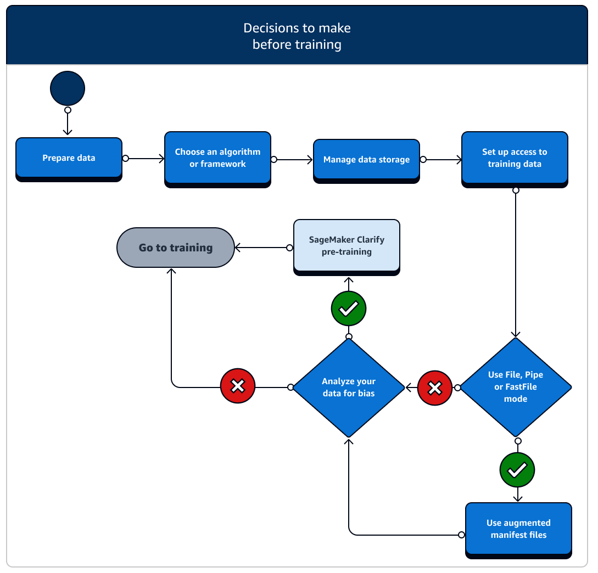
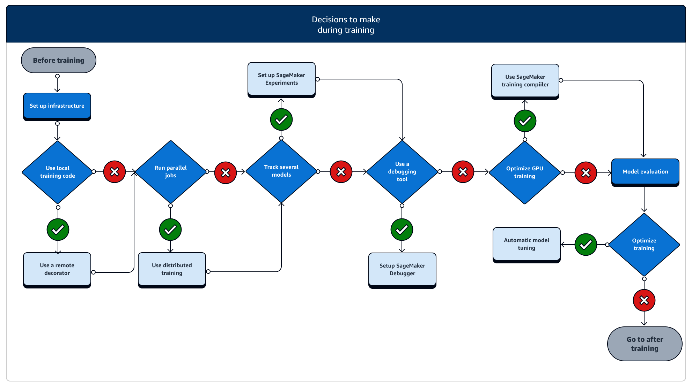
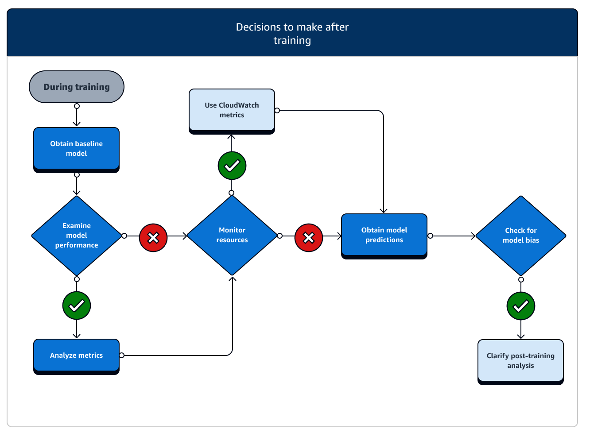

# Model training

The training stage of the full machine learning (ML) lifecycle spans from accessing your
training dataset to generating a final model and selecting the best performing model for
deployment. The following sections provide an overview of available SageMaker training features
and resources with in-depth technical information for each.

## The basic architecture of SageMaker Training

If you’re using SageMaker AI for the first time and want to find a quick ML solution to train
a model on your dataset, consider using a no-code or low-code solution such as [SageMaker Canvas](canvas.md "canvas.md"), [JumpStart
within SageMaker Studio Classic](studio-jumpstart.md "studio-jumpstart.md"), or [SageMaker Autopilot](autopilot-automate-model-development.md "autopilot-automate-model-development.md").

For intermediate coding experiences, consider using a [SageMaker Studio Classic notebook](notebooks.md "notebooks.md") or [SageMaker Notebook
Instances](nbi.md "nbi.md"). To get started, follow the instructions at [Train a Model](ex1-train-model.md "ex1-train-model.md") of the SageMaker AI _Getting
Started_ guide. We recommend this for use cases in which you create your
own model and training script using an ML framework.

The core of SageMaker AI jobs is the containerization of ML workloads and the capability
of managing compute resources. The SageMaker Training platform takes care of the heavy
lifting associated with setting up and managing infrastructure for ML training workloads.
With SageMaker Training, you can focus on developing, training, and fine-tuning your model.

The following architecture diagram shows how SageMaker AI manages ML training jobs and
provisions Amazon EC2 instances on behalf of SageMaker AI users. You as a SageMaker AI user can bring your
own training dataset, saving it to Amazon S3. You can choose an ML model training from
available SageMaker AI built-in algorithms, or bring your own training script with a model built
with popular machine learning frameworks.

## Full view of the SageMaker Training workflow and

features

The full journey of ML training involves tasks beyond data ingestion to ML models,
training models on compute instances, and obtaining model artifacts and outputs. You
need to evaluate every phase of before, during, and after training to make sure your
model is trained well to meet the target accuracy for your objectives.

The following flow chart shows a high-level overview of your actions (in blue boxes)
and available SageMaker Training features (in light blue boxes) throughout the training phase
of the ML lifecycle.

The following sections walk you through each phase of training depicted in the
previous flow chart and useful features offered by SageMaker AI throughout the three sub-stages
of the ML training.

###### Topics

- [Before training](#train-model-full-view-before-training "#train-model-full-view-before-training")
- [During training](#train-model-full-view-during-training "#train-model-full-view-during-training")
- [After training](#train-model-full-view-after-training "#train-model-full-view-after-training")

### Before training

There are a number of scenarios of setting up data resources and access you need
to consider before training. Refer to the following diagram and details of each
before-training stage to get a sense of what decisions you need to make.

- **Prepare data:** Before training, you must
  have finished data cleaning and feature engineering during the data
  preparation stage. SageMaker AI has several labeling and feature engineering tools
  to help you. See [Label Data](data-label.md "data-label.md"), [Prepare
  and Analyze Datasets](data-prep.md "data-prep.md"), [Process Data](processing-job.md "processing-job.md"), and
  [Create, Store, and Share Features](feature-store.md "feature-store.md") for more information.
- **Choose an algorithm or framework:**
  Depending on how much customization you need, there are different options
  for algorithms and frameworks.
  - If you prefer a low-code implementation of a pre-built algorithm,
    use one of the built-in algorithms offered by SageMaker AI. For more
    information, see [Choose an
    Algorithm](algorithms-choose.md "algorithms-choose.md").
  - If you need more flexibility to customize your model, run your
    training script using your preferred frameworks and toolkits within
    SageMaker AI. For more information, see [ML Frameworks and
    Toolkits](frameworks.md "frameworks.md").
  - To extend pre-built SageMaker AI Docker images as the base image of your
    own container, see [Use
    Pre-built SageMaker AI Docker images](docker-containers-prebuilt.md "docker-containers-prebuilt.md").
  - To bring your custom Docker container to SageMaker AI, see [Adapting your own Docker container to work with SageMaker AI](docker-containers-adapt-your-own.md "docker-containers-adapt-your-own.md").
    You need to install the [sagemaker-training-toolkit](https://github.com/aws/sagemaker-training-toolkit "https://github.com/aws/sagemaker-training-toolkit") to your container.

- **Manage data storage:** Understand mapping
  between the data storage (such as Amazon S3, Amazon EFS, or Amazon FSx) and
  the training container that runs in the Amazon EC2 compute instance. SageMaker AI helps
  map the storage paths and local paths in the training container. You can
  also manually specify them. After mapping is done, consider using one of the
  data transmission modes: File, Pipe, and FastFile mode. To learn how SageMaker AI
  maps storage paths, see [Training Storage
  Folders](model-train-storage.md "model-train-storage.md").
- **Set up access to training data:** Use
  Amazon SageMaker AI domain, a domain user profile, IAM, Amazon VPC, and AWS KMS to meet
  the requirements of the most security-sensitive organizations.
  - For account administration, see [Amazon SageMaker AI domain](sm-domain.md "sm-domain.md").
  - For a complete reference about IAM policies and security, see
    [Security in
    Amazon SageMaker AI](security.md "security.md").

- **Stream your input data:** SageMaker AI provides
  three data input modes, _File_, _Pipe_, and _FastFile_. The default input mode is File mode, which loads
  the entire dataset during initializing the training job. To learn about
  general best practices for streaming data from your data storage to the
  training container, see [Access
  Training Data](model-access-training-data.md "model-access-training-data.md").

In case of [Pipe mode](cdf-training.md "cdf-training.md"), you can
also consider using an augmented manifest file to stream your data directly
from Amazon Simple Storage Service (Amazon S3) and train your model. Using pipe mode reduces disk
space because Amazon Elastic Block Store only needs to store your final model artifacts,
rather than storing your full training dataset. For more information, see
[Provide Dataset
Metadata to Training Jobs with an Augmented Manifest
File](augmented-manifest.md "augmented-manifest.md").

- **Analyze your data for bias:** Before
  training, you can analyze your dataset and model for bias against a
  disfavored group so that you can check that your model learns an unbiased
  dataset using [SageMaker Clarify](clarify-detect-data-bias.md "clarify-detect-data-bias.md").
- **Choose which SageMaker SDK to use:** There are
  two ways to launch a training job in SageMaker AI: using the high-level SageMaker AI Python
  SDK, or using the low-level SageMaker APIs for the SDK for Python (Boto3) or the AWS CLI. The
  SageMaker Python SDK abstracts the low-level SageMaker API to provide convenient
  tools. As aforementioned in [The basic architecture of SageMaker Training](#train-model-simple-case "#train-model-simple-case"), you
  can also pursue no-code or minimal-code options using [SageMaker Canvas](canvas.md "canvas.md"), [JumpStart within
  SageMaker Studio Classic](studio-jumpstart.md "studio-jumpstart.md"), or [SageMaker AI
  Autopilot](autopilot-automate-model-development.md "autopilot-automate-model-development.md").

### During training

During training, you need to continuously improve training stability, training
speed, training efficiency while scaling compute resources, cost optimization, and,
most importantly, model performance. Read on for more information about
during-training stages and relevant SageMaker Training features.

- **Set up infrastructure:** Choose the right
  instance type and infrastructure management tools for your use case. You can
  start from a small instance and scale up depending on your workload. For
  training a model on a tabular dataset, start with the smallest CPU instance
  of the C4 or C5 instance families. For training a large model for computer
  vision or natural language processing, start with the smallest GPU instance
  of the P2, P3, G4dn or G5 instance families. You can also mix different
  instance types in a cluster, or keep instances in warm pools using the
  following instance management tools offered by SageMaker AI. You can also use
  persistent cache to reduce latency and billable time on iterative training
  jobs over the latency reduction from warm pools alone. To learn more, see
  the following topics.

      + [Running training jobs on a heterogeneous
       cluster](train-heterogeneous-cluster.md "train-heterogeneous-cluster.md")
      + [SageMaker AI Managed Warm Pools](train-warm-pools.md "train-warm-pools.md")
      + [Using persistent cache](train-warm-pools.md#train-warm-pools-persistent-cache "train-warm-pools.md#train-warm-pools-persistent-cache")

  You must have sufficient quota to run a training job. If you run your
  training job on an instance where you have insufficient quota, you will
  receive a `ResourceLimitExceeded` error. To check the currently
  available quotas in your account, use your [Service Quotas console](https://console.aws.amazon.com/servicequotas/home/services/sagemaker/quotas "https://console.aws.amazon.com/servicequotas/home/services/sagemaker/quotas"). To learn how to request a quota
  increase, see [Supported Regions and
  Quotas](regions-quotas.md "regions-quotas.md"). Also, to find pricing information and available instance
  types depending on the AWS Regions, look up the tables in the [Amazon SageMaker Pricing](https://aws.amazon.com/sagemaker/pricing/ "https://aws.amazon.com/sagemaker/pricing/")
  page.

- **Run a training job from a local code:** You
  can annotate your local code with a remote decorator to run your code as a
  SageMaker training job from inside Amazon SageMaker Studio Classic, an Amazon SageMaker notebook or
  from your local integrated development environment. For more information,
  see [Run your local code as a SageMaker training job](train-remote-decorator.md "train-remote-decorator.md").
- **Track training jobs:** Monitor and track
  your training jobs using SageMaker Experiments, SageMaker Debugger, or Amazon CloudWatch. You can
  watch the model performance in terms of accuracy and convergence, and run
  comparative analysis of metrics between multiple training jobs by using SageMaker AI
  Experiments. You can watch the compute resource utilization rate by using
  SageMaker Debugger’s profiling tools or Amazon CloudWatch. To learn more, see the following
  topics.

      + [Manage Machine
       Learning with Amazon SageMaker Experiments](experiments.md "experiments.md")
      + [Profile Training Jobs Using Amazon SageMaker Debugger](debugger-profile-training-jobs.md "debugger-profile-training-jobs.md")
      + [Monitor and
       Analyze Using CloudWatch Metrics](training-metrics.md "training-metrics.md")

  Additionally, for deep learning tasks, use the [Amazon SageMaker Debugger model
  debugging tools](debugger-debug-training-jobs.md "debugger-debug-training-jobs.md") and [built-in
  rules](debugger-built-in-rules.md "debugger-built-in-rules.md") to identify more complex issues in model convergence and
  weight update processes.

- **Distributed training:** If your training
  job is going into a stable stage without breaking due to misconfiguration of
  the training infrastructure or out-of-memory issues, you might want to find
  more options to scale your job and run over an extended period of time for
  days and even months. When you’re ready to scale up, consider distributed
  training. SageMaker AI provides various options for distributed computation from
  light ML workloads to heavy deep learning workloads.

For deep learning tasks that involve training very large models on very
large datasets, consider using one of the [SageMaker AI distributed
training strategies](distributed-training.md "distributed-training.md") to scale up and achieve data parallelism,
model parallelism, or a combination of the two. You can also use [SageMaker Training Compiler](training-compiler.md "training-compiler.md") for compiling and optimizing model
graphs on GPU instances. These SageMaker AI features support deep learning
frameworks such as PyTorch, TensorFlow, and Hugging Face Transformers.

- **Model hyperparameter tuning:** Tune your
  model hyperparameters using [Automatic Model
  Tuning with SageMaker AI](automatic-model-tuning.md "automatic-model-tuning.md"). SageMaker AI provides hyperparameter tuning methods
  such as grid search and Bayesian search, launching parallel hyperparameter
  tuning jobs with early-stopping functionality for non-improving
  hyperparameter tuning jobs.
- **Checkpointing and cost saving with Spot
  instances:** If training time is not a big concern, you might
  consider optimizing model training costs with managed Spot instances. Note
  that you must activate checkpointing for Spot training to keep restoring
  from intermittent job pauses due to Spot instance replacements. You can also
  use the checkpointing functionality to back up your models in case of
  unexpected training job termination. To learn more, see the following
  topics.
  - [Managed Spot Training](model-managed-spot-training.md "model-managed-spot-training.md")
  - [Use
    Checkpoints](model-checkpoints.md "model-checkpoints.md")

### After training

After training, you obtain a final model artifact to use for model deployment and
inference. There are additional actions involved in the after-training phase as
shown in the following diagram.

- **Obtain baseline model:** After you have the
  model artifact, you can set it as a baseline model. Consider the following
  post-training actions and using SageMaker AI features before moving on to model
  deployment to production.
- **Examine model performance and check for
  bias:** Use Amazon CloudWatch Metrics and [SageMaker Clarify
  for post-training bias](clarify-detect-post-training-bias.md "clarify-detect-post-training-bias.md") to detect any bias in incoming data and
  model over time against the baseline. You need to evaluate your new data and
  model predictions against the new data regularly or in real time. Using
  these features, you can receive alerts about any acute changes or anomalies,
  as well as gradual changes or drifts in data and model.
- You can also use the [Incremental
  Training](incremental-training.md "incremental-training.md") functionality of SageMaker AI to load and update your model (or
  fine-tune) with an expanded dataset.
- You can register model training as a step in your [SageMaker AI
  Pipeline](pipelines.md "pipelines.md") or as part of other [Workflow](workflows.md "workflows.md") features
  offered by SageMaker AI in order to orchestrate the full ML lifecycle.
