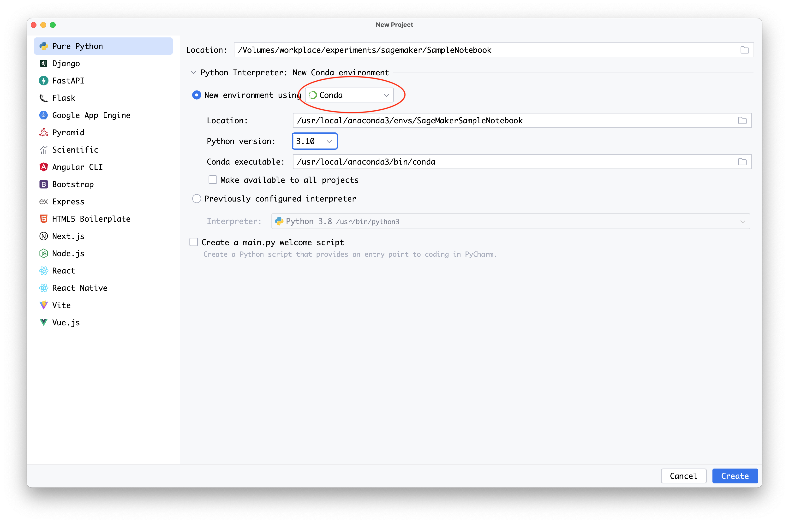

# Run your local code as a SageMaker training job

You can run your local machine learning (ML) Python code as a large single-node Amazon SageMaker
training job or as multiple parallel jobs. You can do this by annotating your code with an
@remote decorator, as shown in the following code example. [Distributed training](distributed-training.md "distributed-training.md") (across
multiple instances) are not supported with remote functions.

```
@remote(**settings)
def divide(x, y):
    return x / y
```

The SageMaker Python SDK will automatically translate your existing workspace environment and
any associated data processing code and datasets into a SageMaker training job that runs on the
SageMaker training platform. You can also activate a persistent cache feature, which will further
reduce job start latency by caching previously downloaded dependency packages. This
reduction in job latency is greater than the reduction in latency from using SageMaker AI managed
warm pools alone. For more information, see [Using persistent cache](train-warm-pools.md#train-warm-pools-persistent-cache "train-warm-pools.md#train-warm-pools-persistent-cache").

###### Note

Distributed training jobs are not supported by remote functions.

The following sections show how to annotate your local ML code with an @remote decorator
and tailor your experience for your use case. This includes customizing your environment and
integrating with SageMaker Experiments.

###### Topics

- [Set up your environment](#train-remote-decorator-env "#train-remote-decorator-env")
- [Invoke a remote function](train-remote-decorator-invocation.md "train-remote-decorator-invocation.md")
- [Configuration file](train-remote-decorator-config.md "train-remote-decorator-config.md")
- [Customize your runtime
  environment](train-remote-decorator-customize.md "train-remote-decorator-customize.md")
- [Container image compatibility](train-remote-decorator-container.md "train-remote-decorator-container.md")
- [Logging parameters and metrics with
  Amazon SageMaker Experiments](train-remote-decorator-experiments.md "train-remote-decorator-experiments.md")
- [Using modular code with the @remote
  decorator](train-remote-decorator-modular.md "train-remote-decorator-modular.md")
- [Private repository for runtime
  dependencies](train-remote-decorator-private.md "train-remote-decorator-private.md")
- [Example notebooks](train-remote-decorator-examples.md "train-remote-decorator-examples.md")

## Set up your environment

Choose one of the following three options to set up your environment.

You can annotate and run your local ML code from SageMaker Studio Classic by creating a
SageMaker Notebook and attaching any image available on SageMaker Studio Classic image. The
following instructions help you create a SageMaker Notebook, install the SageMaker Python
SDK, and annotate your code with the decorator.

1. Create a SageMaker Notebook and attach an image in SageMaker Studio Classic as
   follows:
   1. Follow the instructions in [Launch Amazon SageMaker
      Studio Classic](studio-launch.md "studio-launch.md") in the _Amazon SageMaker AI Developer
      Guide_.
   2. Select **Studio** from the left navigation
      pane. This opens a new window.
   3. In the **Get Started** dialog box, select a
      user profile from the down arrow. This opens a new
      window.
   4. Select **Open Studio Classic**.
   5. Select **Open Launcher** from the main
      working area. This opens a new page.
   6. Select **Create notebook** from the main
      working area.
   7. Select **Base Python 3.0** from the down
      arrow next to **Image** in the **Change
      environment** dialog box.

   The @remote decorator automatically detects the image attached
   to the SageMaker Studio Classic notebook and uses it to run the SageMaker
   training job. If `image_uri` is specified either as
   an argument in the decorator or in the configuration file, then
   the value specified in `image_uri` will be used
   instead of the detected image.

   For more information about how to create a notebook in SageMaker
   Studio Classic, see the **Create a Notebook from
   the File Menu** section in [Create or Open an Amazon SageMaker Studio Classic
   Notebook](notebooks-create-open.md#notebooks-create-file-menu "notebooks-create-open.md#notebooks-create-file-menu").

   For a list of available images, see [Supported Docker images](train-remote-decorator-container.md "train-remote-decorator-container.md").

2. Install the SageMaker Python SDK.

To annotate your code with the @remote function inside a SageMaker
Studio Classic Notebook, you must have the SageMaker Python SDK installed.
Install the SageMaker Python SDK, as shown in the following code
example.

```
!pip install sagemaker
```

3. Use @remote decorator to run functions in a SageMaker training job.

To run your local ML code, first create a dependencies file to
instruct SageMaker AI where to locate your local code. To do so, follow these
steps:

    1. From the SageMaker Studio Classic Launcher main working area, in
     **Utilities and files**, choose
     **Text file**. This opens a new tab with a
     text file called `untitled.txt.`


    For more information about the SageMaker Studio Classic user interface
     (UI), see [Amazon SageMaker Studio Classic UI
     Overview](studio-ui.md "studio-ui.md").
    2. Rename `untitled.txt` to
     `requirements.txt`.
    3. Add all the dependencies required for the code along with the
     SageMaker AI library to `requirements.txt`.


    A minimal code example for `requirements.txt` for
     the example `divide` function is provided in the
     following section, as follows.


    ```
    sagemaker
    ```
    4. Run your code with the remote decorator by passing the
     dependencies file, as follows.


    ```
    from sagemaker.remote_function import remote

    @remote(instance_type="ml.m5.xlarge", dependencies='./requirements.txt')
    def divide(x, y):
        return x / y

    divide(2, 3.0)
    ```

    For additional code examples, see the sample notebook [quick\_start.ipynb](https://github.com/aws/amazon-sagemaker-examples/blob/main/sagemaker-remote-function/quick_start/quick_start.ipynb "https://github.com/aws/amazon-sagemaker-examples/blob/main/sagemaker-remote-function/quick_start/quick_start.ipynb").


    If you’re already running a SageMaker Studio Classic notebook, and you
     install the Python SDK as instructed in **2.
     Install the SageMaker Python SDK**, you must restart
     your kernel. For more information, see [Use the SageMaker
     Studio Classic Notebook Toolbar](notebooks-menu.md "notebooks-menu.md") in the
     *Amazon SageMaker AI Developer Guide*.

You can annotate your local ML code from a SageMaker notebook instance. The
following instructions show how to create a notebook instance with a custom
kernel, install the SageMaker Python SDK, and annotate your code with the
decorator.

1. Create a notebook instance with a custom `conda`
   kernel.

You can annotate your local ML code with an @remote decorator to use
inside of a SageMaker training job. First you must create and customize a
SageMaker notebook instance to use a kernel with Python version 3.7 or
higher, up to 3.10.x. To do so, follow these steps:

    1. Open the SageMaker AI console at [https://console.aws.amazon.com/sagemaker/](https://console.aws.amazon.com/sagemaker/ "https://console.aws.amazon.com/sagemaker/").
    2. In the left navigation panel, choose
     **Notebook** to expand its options.
    3. Choose **Notebook Instances** from the
     expanded options.
    4. Choose the **Create Notebook Instance**
     button. This opens a new page.
    5. For **Notebook instance name**, enter a name
     with a maximum of 63 characters and no spaces. Valid characters:
     **A-Z**, **a-z**, **0-9**, and
     **.****:****+****=****@** **\_****%****-**
     (hyphen).
    6. In the **Notebook instance settings** dialog
     box, expand the right arrow next to **Additional
     Configuration**.
    7. Under **Lifecycle configuration - optional**,
     expand the down arrow and select **Create a new
     lifecycle configuration**. This opens a new dialog
     box.
    8. Under **Name**, enter a name for your
     configuration setting.
    9. In the **Scripts** dialog box, in the
     **Start notebook** tab, replace the
     existing contents of the text box with the following
     script.


    ```
    #!/bin/bash

    set -e

    sudo -u ec2-user -i <<'EOF'
    unset SUDO_UID
    WORKING_DIR=/home/ec2-user/SageMaker/custom-miniconda/
    source "$WORKING_DIR/miniconda/bin/activate"
    for env in $WORKING_DIR/miniconda/envs/*; do
        BASENAME=$(basename "$env")
        source activate "$BASENAME"
        python -m ipykernel install --user --name "$BASENAME" --display-name "Custom ($BASENAME)"
    done
    EOF

    echo "Restarting the Jupyter server.."
    # restart command is dependent on current running Amazon Linux and JupyterLab
    CURR_VERSION_AL=$(cat /etc/system-release)
    CURR_VERSION_JS=$(jupyter --version)

    if [[ $CURR_VERSION_JS == *$"jupyter_core     : 4.9.1"* ]] && [[ $CURR_VERSION_AL == *$" release 2018"* ]]; then
     sudo initctl restart jupyter-server --no-wait
    else
     sudo systemctl --no-block restart jupyter-server.service
    fi
    ```
    10. In the **Scripts** dialog box, in the
     **Create notebook** tab, replace the
     existing contents of the text box with the following
     script.


    ```
    #!/bin/bash

    set -e

    sudo -u ec2-user -i <<'EOF'
    unset SUDO_UID
    # Install a separate conda installation via Miniconda
    WORKING_DIR=/home/ec2-user/SageMaker/custom-miniconda
    mkdir -p "$WORKING_DIR"
    wget https://repo.anaconda.com/miniconda/Miniconda3-4.6.14-Linux-x86_64.sh -O "$WORKING_DIR/miniconda.sh"
    bash "$WORKING_DIR/miniconda.sh" -b -u -p "$WORKING_DIR/miniconda"
    rm -rf "$WORKING_DIR/miniconda.sh"
    # Create a custom conda environment
    source "$WORKING_DIR/miniconda/bin/activate"
    KERNEL_NAME="custom_python310"
    PYTHON="3.10"
    conda create --yes --name "$KERNEL_NAME" python="$PYTHON" pip
    conda activate "$KERNEL_NAME"
    pip install --quiet ipykernel
    # Customize these lines as necessary to install the required packages
    EOF
    ```
    11. Choose the **Create configuration** button on
     the bottom right of the window.
    12. Choose the **Create notebook instance**
     button on the bottom right of the window.
    13. Wait for the notebook instance **Status** to
     change from **Pending** to
     **InService**.

2. Create a Jupyter notebook in the notebook instance.

The following instructions show how to create a Jupyter notebook using
Python 3.10 in your newly created SageMaker instance.

    1. After the notebook instance **Status** from
     the previous step is **InService**, do the
     following:


    	1. Select **Open Jupyter** under
    	 **Actions** in the row containing
    	 your newly created notebook instance
    	 **Name**. This opens a new Jupyter
    	 server.
    2. In the Jupyter server, select **New** from
     the top right menu.
    3. From the down arrow, select
     **conda\_custom\_python310**. This creates a
     new Jupyter notebook that uses a Python 3.10 kernel. This new
     Jupyter notebook can now be used similarly to a local Jupyter
     notebook.

3. Install the SageMaker Python SDK.

After your virtual environment is running, install the SageMaker Python SDK
by using the following code example.

```
!pip install sagemaker
```

4. Use an @remote decorator to run functions in a SageMaker training
   job.

When you annotate your local ML code with an @remote decorator inside
the SageMaker notebook, SageMaker training will automatically interpret the
function of your code and run it as a SageMaker training job. Set up your
notebook by doing the following:

    1. Select the kernel name in the notebook menu from the SageMaker
     notebook instance that you created in step 1, **Create a SageMaker Notebook instance with a custom
     kernel**.


    For more information, see [Change an Image or a Kernel](notebooks-run-and-manage-change-image.md "notebooks-run-and-manage-change-image.md").
    2. From the down arrow, choose the a custom `conda`
     kernel that uses a version of Python that is 3.7 or higher.


    As an example, selecting `conda_custom_python310`
     chooses the kernel for Python 3.10.
    3. Choose **Select**.
    4. Wait for the kernel’s status to show as idle, which indicates
     that the kernel has started.
    5. In the Jupyter Server Home, select **New**
     from the top right menu.
    6. Next to the down arrow, select **Text file**.
     This creates a new text file called
     `untitled.txt.`
    7. Rename `untitled.txt` to
     `requirements.txt` and add any dependencies
     required for the code along with `sagemaker`.
    8. Run your code with the remote decorator by passing the
     dependencies file as shown below.


    ```
    from sagemaker.remote_function import remote

    @remote(instance_type="`ml.m5.xlarge`", dependencies='./requirements.txt')
    def divide(x, y):
        return x / y

    divide(2, 3.0)
    ```

    See the sample notebook [quick\_start.ipnyb](https://github.com/aws/amazon-sagemaker-examples/blob/main/sagemaker-remote-function/quick_start/quick_start.ipynb "https://github.com/aws/amazon-sagemaker-examples/blob/main/sagemaker-remote-function/quick_start/quick_start.ipynb") for additional code
     examples.

You can annotate your local ML code with an @remote decorator inside your
preferred local IDE. The following steps show the necessary prerequisites, how
to install the Python SDK, and how to annotate your code with the @remote
decorator.

1. Install prerequisites by setting up the AWS Command Line Interface (AWS CLI) and creating
   a role, as follows:
   - Onboard to a SageMaker AI domain following the instructions in the
     **AWS CLI Prerequisites** section
     of [Set
     Up Amazon SageMaker AI Prerequisites](gs-set-up.md#gs-cli-prereq "gs-set-up.md#gs-cli-prereq").
   - Create an IAM role following the **Create execution role** section of [SageMaker AI
     Roles](sagemaker-roles.md "sagemaker-roles.md").

2. Create a virtual environment by using either PyCharm or
   `conda` and using Python version 3.7 or higher, up to
   3.10.x.
   - Set up a virtual environment using PyCharm as follows:
     1. Select **File** from the main
        menu.
     2. Choose **New Project**.
     3. Choose **Conda** from the down arrow
        under **New environment using**.
     4. In the field for **Python version**
        use the down arrow to select a version of Python that is
        3.7 or above. You can go up to 3.10.x from the
        list.

     

   - If you have Anaconda installed, you can set up a virtual
     environment using `conda`, as follows:
     - Open an Anaconda prompt terminal interface.
     - Create and activate a new `conda`
       environment using a Python version of 3.7 or higher, up
       to 3.10x. The following code example shows how to create
       a `conda` environment using Python version
       3.10.

     ```
     conda create -n `sagemaker_jobs_quick_start` python=3.10 pip
     conda activate `sagemaker_jobs_quick_start`
     ```

3. Install the SageMaker Python SDK.

To package your code from your preferred IDE, you must have a virtual
environment set up using Python 3.7 or higher, up to 3.10x. You also
need a compatible container image. Install the SageMaker Python SDK using the
following code example.

```
pip install sagemaker
```

4. Wrap your code inside the @remote decorator. The SageMaker Python SDK will
   automatically interpret the function of your code and run it as a SageMaker
   training job. The following code examples show how to import the
   necessary libraries, set up a SageMaker session, and annotate a function with
   the @remote decorator.

You can run your code by either providing the dependencies needed
directly, or by using dependencies from the active `conda`
environment.

    * To provide the dependencies directly, do the following:


    	+ Create a `requirements.txt` file in the
    	 working directory that the code resides in.
    	+ Add all of the dependencies required for the code
    	 along with the SageMaker library. The following section
    	 provides a minimal code example for
    	 `requirements.txt` for the example
    	 `divide` function.


    	```
    	sagemaker
    	```
    	+ Run your code with the @remote decorator by passing
    	 the dependencies file. In the following code example,
    	 replace `The IAM role name` with an
    	 AWS Identity and Access Management (IAM) role ARN that you would like SageMaker to
    	 use to run your job.


    	```
    	import boto3
    	import sagemaker
    	from sagemaker.remote_function import remote

    	sm_session = sagemaker.Session(boto_session=boto3.session.Session(region_name="`us-west-2`"))
    	settings = dict(
    	    sagemaker_session=sm_session,
    	    role=`<The IAM role name>`,
    	    instance_type="`ml.m5.xlarge`",
    	    dependencies='./requirements.txt'
    	)

    	@remote(**settings)
    	def divide(x, y):
    	    return x / y


    	if __name__ == "__main__":
    	    print(divide(2, 3.0))
    	```
    * To use dependencies from the active `conda`
     environment, use the value `auto_capture` for the
     `dependencies` parameter, as shown in the
     following.


    ```
    import boto3
    import sagemaker
    from sagemaker.remote_function import remote

    sm_session = sagemaker.Session(boto_session=boto3.session.Session(region_name="`us-west-2`"))
    settings = dict(
        sagemaker_session=sm_session,
        role=`<The IAM role name>`,
        instance_type="`ml.m5.xlarge`",
        dependencies="auto_capture"
    )

    @remote(**settings)
    def divide(x, y):
        return x / y


    if __name__ == "__main__":
        print(divide(2, 3.0))
    ```

    ###### Note

    You can also implement the previous code inside a Jupyter
     notebook. PyCharm Professional Edition supports Jupyter
     natively. For more guidance, see [Jupyter notebook support](https://www.jetbrains.com/help/pycharm/ipython-notebook-support.html "https://www.jetbrains.com/help/pycharm/ipython-notebook-support.html") in PyCharm's
     documentation.
