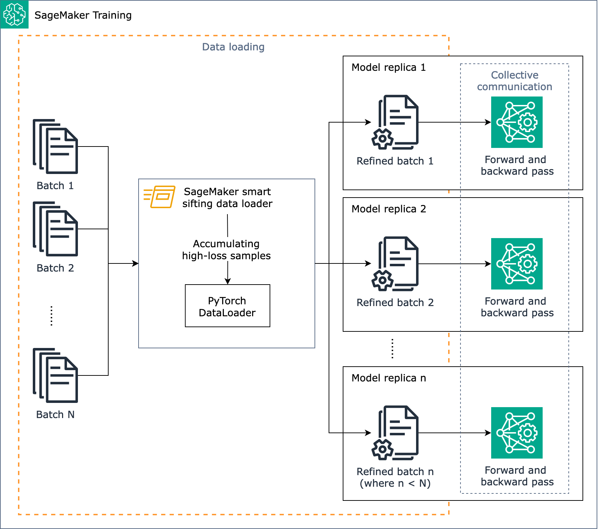

# How SageMaker smart sifting works

The goal of SageMaker smart sifting is to sift through your training data during the training
process and only feed more informative samples to the model. During typical training
with PyTorch, data is iteratively sent in batches to the training loop and to
accelerator devices (such as GPUs or Trainium chips) by the [PyTorch
`DataLoader`](https://pytorch.org/docs/stable/data.html "https://pytorch.org/docs/stable/data.html"). SageMaker smart sifting is implemented at this data loading
stage and is thus independent of any upstream data pre-processing in your training
pipeline. SageMaker smart sifting uses your model and its user-specified loss function to do an
evaluative forward pass of each data sample as it is loaded. Samples that return
_low-loss_ values have less of an impact on the
model's learning and are thus excluded from training, because it is already _easy_ for the model to make the right prediction about them
with high confidence. Meanwhile, those relatively high-loss samples are what the model
still needs to learn, so these are kept for training. A key input you can set for
SageMaker smart sifting is the proportion of data to exclude. For example, by setting the proportion
to 25%, samples distributed in the lowest quartile of the distribution of loss (taken
from a user-specified number of previous samples) are excluded from training. High-loss
samples are accumulated in a refined data batch. The refined data batch is sent to the
training loop (forward and backward pass), and the model learns and trains on the
refined data batch.

The following diagram shows an overview of how the SageMaker smart sifting algorithm is
designed.

In short, SageMaker smart sifting operates during training as data is loaded. The SageMaker smart sifting
algorithm runs loss calculation over the batches, and sifts non-improving data out
before the forward and backward pass of each iteration. The refined data batch is then
used for the forward and backward pass.

###### Note

Smart sifting of data on SageMaker AI uses additional forward passes to analyze and filter
your training data. In turn, there are fewer backward passes as less impactful data
is excluded from your training job. Because of this, models which have long or
expensive backward passes see the greatest efficiency gains when using smart
sifting. Meanwhile, if your model's forward pass takes longer than its backward
pass, overhead could increase total training time. To measure the time spent by each
pass, you can run a pilot training job and collect logs that record the time on the
processes. Also consider using SageMaker Profiler that provides profiling tools and UI
application. To learn more, see [Amazon SageMaker Profiler](train-use-sagemaker-profiler.md "train-use-sagemaker-profiler.md").

SageMaker smart sifting works for PyTorch-based training jobs with classic distributed data
parallelism, which makes model replicas on each GPU worker and performs
`AllReduce`. It works with PyTorch DDP and the SageMaker AI distributed data
parallel library.
