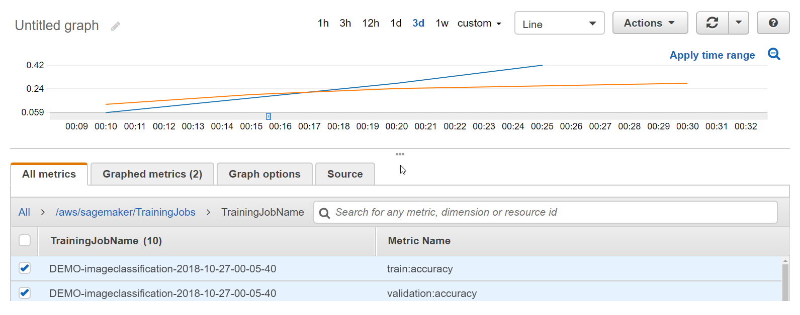

# Example: Viewing a Training and Validation

Curve

Typically, you split the data on which you train your model into training and
validation datasets. You use the training set to train the model parameters that are
used to make predictions on the training dataset. Then you test how well the model makes
predictions by calculating predictions for the validation set. To analyze the
performance of a training job, you commonly plot a training curve against a validation
curve.

Viewing a graph that shows the accuracy for both the training and validation sets over
time can help you to improve the performance of your model. For example, if training
accuracy continues to increase over time, but, at some point, validation accuracy starts
to decrease, you are likely overfitting your model. To address this, you can make
adjustments to your model, such as increasing [regularization](../../../glossary/latest/reference/glos-chap.md#regularization "../../../glossary/latest/reference/glos-chap.md#regularization").

For
this example, you can use the
**Image-classification-full-training** example in the
**Example notebooks** section of your SageMaker AI notebook instance. If
you don't have a SageMaker notebook instance, create one by following the instructions at
[Create an Amazon SageMaker Notebook Instance for the
tutorial](gs-setup-working-env.md "gs-setup-working-env.md"). If you
prefer, you can follow along with the [End-to-End Multiclass Image Classification Example](https://sagemaker-examples.readthedocs.io/en/latest/introduction_to_amazon_algorithms/imageclassification_caltech/Image-classification-fulltraining.html "https://sagemaker-examples.readthedocs.io/en/latest/introduction_to_amazon_algorithms/imageclassification_caltech/Image-classification-fulltraining.html") in the example notebook
on GitHub. You also need an Amazon S3 bucket to store the training data and for the model
output.

###### To view training and validation error curves

1. Open the SageMaker AI console at [https://console.aws.amazon.com/sagemaker](https://console.aws.amazon.com/sagemaker "https://console.aws.amazon.com/sagemaker").
2. Choose **Notebooks**, and then choose **Notebook
   instances**.
3. Choose the notebook instance that you want to use, and then choose
   **Open**.
4. On the dashboard for your notebook instance, choose **SageMaker AI
   Examples**.
5. Expand the **Introduction to Amazon Algorithms** section, and
   then choose **Use** next to
   **Image-classification-fulltraining.ipynb**.
6. Choose **Create copy**. SageMaker AI creates an editable copy of the
   **Image-classification-fulltraining.ipynb** notebook in
   your notebook instance.
7. Run all of the cells in the notebook up to the **Inference**
   section. You don't need to deploy an endpoint or get inference for this
   example.
8. After the training job starts, open the CloudWatch console at [https://console.aws.amazon.com/cloudwatch](https://console.aws.amazon.com/cloudwatch "https://console.aws.amazon.com/cloudwatch").
9. Choose **Metrics**, then choose
   **/aws/sagemaker/TrainingJobs**.
10. Choose **TrainingJobName**.
11. On the **All metrics** tab, choose the
    **train:accuracy** and
    **validation:accuracy** metrics for the training job that
    you created in the notebook.
12. On the graph, choose an area that the metric's values to zoom in. You should
    see something like the following example.

