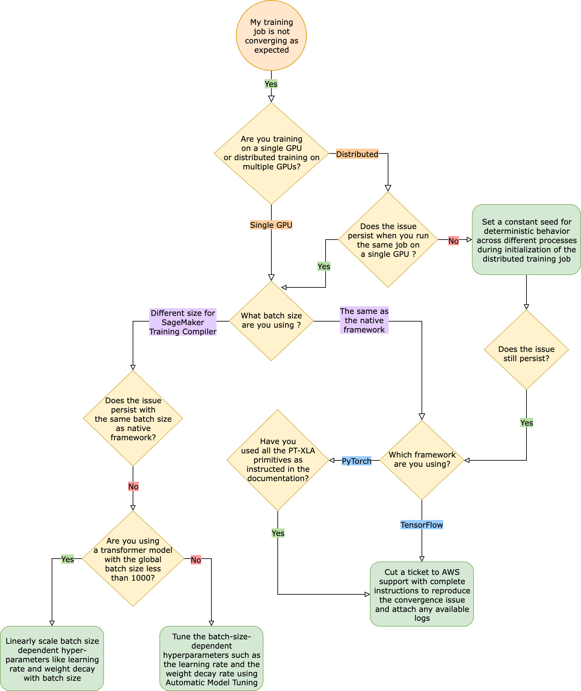

# SageMaker Training Compiler Troubleshooting

###### Important

Amazon Web Services (AWS) announces that there will be no new releases or
versions of SageMaker Training Compiler. You can continue to utilize SageMaker Training Compiler through the existing AWS
Deep Learning Containers (DLCs) for SageMaker Training. It is important to note that
while the existing DLCs remain accessible, they will no longer receive patches or
updates from AWS, in accordance with the [AWS Deep Learning Containers Framework Support Policy](../../../deep-learning-containers/latest/devguide/support-policy.md "../../../deep-learning-containers/latest/devguide/support-policy.md").

If you run into an error, you can use the following list to try to troubleshoot your
training job. If you need further support, reach out to the SageMaker AI team through [AWS Support](https://console.aws.amazon.com/support/ "https://console.aws.amazon.com/support/") or [AWS Developer Forums
for Amazon SageMaker AI](https://forums.aws.amazon.com/forum.jspa?forumID=285 "https://forums.aws.amazon.com/forum.jspa?forumID=285").

## Training job

is not converging as expected when compared to the native framework training
job

Convergence issues range from “the model is not learning when SageMaker Training Compiler is turned
on” to “the model is learning but slower than the native framework”. In this
troubleshooting guide, we assume your convergence is fine without SageMaker Training Compiler (in the
native framework) and consider this the baseline.

When faced with such convergence issues, the first step is to identify if the
issue is limited to distributed training or stems from single-GPU training.
Distributed training with SageMaker Training Compiler is an extension of single-GPU
training with additional steps.

1. Set up a cluster with multiple instances or GPUs.
2. Distribute input data to all workers.
3. Synchronize the model updates from all workers.

Therefore, any convergence issue in single-GPU training propagates to distributed
training with multiple workers.



### Convergence issues occurring in single-GPU training

If your convergence issue stems from single-GPU training, this is likely due
to improper settings for hyperparameters or the `torch_xla`
APIs.

**Check the hyperparameters**

Training with SageMaker Training Compiler leads to change in the memory footprint of a model. The
compiler intelligently arbitrates between re-use and re-compute leading to a
corresponding increase or decrease in memory consumption. To leverage this, it
is essential to re-tune the batch size and associated hyperparameters when
migrating a training job to SageMaker Training Compiler. However, incorrect hyperparameter settings
often cause oscillation in training loss and possibly a slower convergence as a
result. In rare cases, aggressive hyperparameters might result in the model not
learning (the training loss metric doesn’t decrease or returns
`NaN`). To identify if the convergence issue is due to the
hyperparameters, do a side-by-side test of two training jobs with and without
SageMaker Training Compiler while keeping all the hyperparameters the same.

**Check if the `torch_xla` APIs are properly
set up for single-GPU training**

If the convergence issue persists with the baseline hyperparameters, you need
to check if there’s any improper usage of the `torch_xla` APIs,
specifically the ones for updating the model. Fundamentally,
`torch_xla` continues to accumulate instructions (deferring
execution) in the form of graph until it is explicitly instructed to run the
accumulated graph. The `torch_xla.core.xla_model.mark_step()`
function facilitates the execution of the accumulated graph. The graph execution
should be synchronized using this function **_after each model update_** and **_before printing and logging any
variables_**. If it lacks the synchronization step,
the model might use stale values from memory during prints, logs, and the
subsequent forward passes, instead of using the most recent values that have to
be synchronized after every iteration and model update.

It can be more complicated when using SageMaker Training Compiler with gradient scaling (possibly
from the use of AMP) or gradient clipping techniques. The appropriate order of
gradient computation with AMP is as follows.

1. Gradient computation with scaling
2. Gradient un-scaling, gradient clipping, and then scaling
3. Model update
4. Synchronizing the graph execution with `mark_step()`

To find the right APIs for the operations mentioned in the list, see the guide
for [migrating
your training script to SageMaker Training Compiler](training-compiler-pytorch-models.md "training-compiler-pytorch-models.md").

**Consider using Automatic Model Tuning**

If the convergence issue arises when re-tuning the batch size and associated
hyperparameters such as the learning rate while using SageMaker Training Compiler, consider using [Automatic Model Tuning](automatic-model-tuning.md "automatic-model-tuning.md") to tune your hyperparameters. You can refer
to the [example notebook on tuning hyperparameters with SageMaker Training Compiler](https://github.com/aws/amazon-sagemaker-examples/blob/main/sagemaker-training-compiler/tensorflow/single_gpu_single_node/hyper-parameter-tuning.ipynb "https://github.com/aws/amazon-sagemaker-examples/blob/main/sagemaker-training-compiler/tensorflow/single_gpu_single_node/hyper-parameter-tuning.ipynb").

### Convergence issues occurring in distributed training

If your convergence issue persists in distributed training, this is likely due
to improper settings for weight initialization or the `torch_xla`
APIs.

**Check weight initialization across the
workers**

If the convergence issue arises when running a distributed training job with
multiple workers, ensure there is a uniform deterministic behavior across all
workers by setting a constant seed where applicable. Beware of techniques such
as weight initialization, which involves randomization. Each worker might end up
training a different model in the absence of a constant seed.

**Check if the `torch_xla` APIs are properly
set up for distributed training**

If the issue still persists, this is likely due to improper use of the
`torch_xla` APIs for distributed training. Make sure that you add
the following in your estimator to set up a cluster for distributed training
with SageMaker Training Compiler.

```
distribution={'torchxla': {'enabled': True}}
```

This should be accompanied by a function `_mp_fn(index)` in your
training script, which is invoked once per worker. Without the
`mp_fn(index)` function, you might end up letting each of the
workers train the model independently without sharing model updates.

Next, make sure that you use the
`torch_xla.distributed.parallel_loader.MpDeviceLoader` API along
with the distributed data sampler, as guided in the documentation about [migrating
your training script to SageMaker Training Compiler](training-compiler-pytorch-models.md "training-compiler-pytorch-models.md"), as in the following example.

```
torch.utils.data.distributed.DistributedSampler()
```

This ensures that the input data is properly distributed across all workers.

Finally, to synchronize model updates from all workers, use
`torch_xla.core.xla_model._fetch_gradients` to gather gradients
from all workers and `torch_xla.core.xla_model.all_reduce` to combine
all the gathered gradients into a single update.

It can be more complicated when using SageMaker Training Compiler with gradient scaling (possibly
from use of AMP) or gradient clipping techniques. The appropriate order of
gradient computation with AMP is as follows.

1. Gradient computation with scaling
2. Gradient synchronization across all workers
3. Gradient un-scaling, gradient clipping, and then gradient
   scaling
4. Model update
5. Synchronizing the graph execution with `mark_step()`

Note that this checklist has an additional item for synchronizing all workers,
compared to the checklist for single-GPU training.

## Training job

fails due to missing PyTorch/XLA configuration

If a training job fails with the `Missing XLA configuration` error
message, it might be due to a misconfiguration in the number of GPUs per instance
that you use.

XLA requires additional environment variables to compile the training job. The
most common missing environment variable is `GPU_NUM_DEVICES`. For the
compiler to work properly, you must set this environment variable equal to the
number of GPUs per instance.

There are three approaches to set the `GPU_NUM_DEVICES` environment
variable:

- **Approach 1** – Use the
  `environment` argument of the SageMaker AI estimator class. For
  example, if you use an `ml.p3.8xlarge` instance that has four
  GPUs, do the following:

```
# Using the SageMaker Python SDK's HuggingFace estimator

hf_estimator=HuggingFace(
    ...
    instance_type="`ml.p3.8xlarge`",
    hyperparameters={...},
    environment={
        ...
        **"GPU\_NUM\_DEVICES": "`4`"** # corresponds to number of GPUs on the specified instance
    },
)
```

- **Approach 2** – Use the
  `hyperparameters` argument of the SageMaker AI estimator class and
  parse it in your training script.
  1.  To specify the number of GPUs, add a key-value pair to the
      `hyperparameters` argument.

  For example, if you use an `ml.p3.8xlarge` instance
  that has four GPUs, do the following:

  ```
  # Using the SageMaker Python SDK's HuggingFace estimator

  hf_estimator=HuggingFace(
      ...
      entry_point = "`train.py`"
      instance_type= "`ml.p3.8xlarge`",
      hyperparameters = {
          ...
          **"n\_gpus": `4`** # corresponds to number of GPUs on specified instance
      }
  )
  hf_estimator.fit()
  ```

  2.  In your training script, parse the `n_gpus`
      hyperparameter and specify it as an input for the
      `GPU_NUM_DEVICES` environment variable.

  ```
  # train.py
  import os, argparse

  if __name__ == "__main__":
      parser = argparse.ArgumentParser()
      ...
      # Data, model, and output directories
      parser.add_argument("--output_data_dir", type=str, default=os.environ["SM_OUTPUT_DATA_DIR"])
      parser.add_argument("--model_dir", type=str, default=os.environ["SM_MODEL_DIR"])
      parser.add_argument("--training_dir", type=str, default=os.environ["SM_CHANNEL_TRAIN"])
      parser.add_argument("--test_dir", type=str, default=os.environ["SM_CHANNEL_TEST"])
      **parser.add\_argument("--n\_gpus", type=str, default=os.environ["SM\_NUM\_GPUS"])**

      args, _ = parser.parse_known_args()

      **os.environ["GPU\_NUM\_DEVICES"] = args.n\_gpus**
  ```

- **Approach 3** – Hard-code the
  `GPU_NUM_DEVICES` environment variable in your training
  script. For example, add the following to your script if you use an instance
  that has four GPUs.

```
# train.py

import os
os.environ["GPU_NUM_DEVICES"] = `4`
```

###### Tip

To find the number of GPU devices on machine learning instances that you want
to use, see [Accelerated Computing](https://aws.amazon.com/ec2/instance-types/#Accelerated_Computing "https://aws.amazon.com/ec2/instance-types/#Accelerated_Computing") in the _Amazon EC2 Instance Types
page_.

## SageMaker Training Compiler doesn't reduce the total training time

If the total training time does not decrease with SageMaker Training Compiler, we highly recommend you
to go over the [SageMaker Training Compiler Best Practices and
Considerations](training-compiler-tips-pitfalls.md "training-compiler-tips-pitfalls.md") page to check your training
configuration, padding strategy for the input tensor shape, and hyperparameters.
