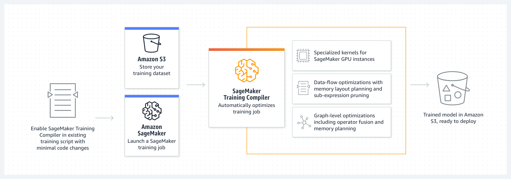

# Amazon SageMaker Training Compiler

###### Important

Amazon Web Services (AWS) announces that there will be no new releases or versions
of SageMaker Training Compiler. You can continue to utilize SageMaker Training Compiler through the existing AWS Deep Learning
Containers (DLCs) for SageMaker Training. It is important to note that while the existing
DLCs remain accessible, they will no longer receive patches or updates from AWS, in
accordance with the [AWS Deep Learning Containers Framework Support Policy](../../../deep-learning-containers/latest/devguide/support-policy.md "../../../deep-learning-containers/latest/devguide/support-policy.md").

Use Amazon SageMaker Training Compiler to train deep learning (DL) models faster on scalable GPU instances managed by
SageMaker AI.

## What Is SageMaker Training Compiler?

State-of-the-art deep learning (DL) models consist of complex multi-layered neural
networks with billions of parameters that can take thousands of GPU hours to train.
Optimizing such models on training infrastructure requires extensive knowledge of DL and
systems engineering; this is challenging even for narrow use cases. Although there are
open-source implementations of compilers that optimize the DL training process, they can
lack the flexibility to integrate DL frameworks with some hardware such as GPU
instances.

SageMaker Training Compiler is a capability of SageMaker AI that makes these hard-to-implement optimizations to
reduce training time on GPU instances. The compiler optimizes DL models to accelerate
training by more efficiently using SageMaker AI machine learning (ML) GPU instances. SageMaker Training Compiler is
available at no additional charge within SageMaker AI and can help reduce total billable time as
it accelerates training.

SageMaker Training Compiler is integrated into the AWS Deep Learning Containers (DLCs). Using the
SageMaker Training Compiler–enabled AWS DLCs, you can compile and optimize training jobs on GPU
instances with minimal changes to your code. Bring your deep learning models to SageMaker AI and
enable SageMaker Training Compiler to accelerate the speed of your training job on SageMaker AI ML instances for
accelerated computing.

## How It Works

SageMaker Training Compiler converts DL models from their high-level language representation to
hardware-optimized instructions. Specifically, SageMaker Training Compiler applies graph-level
optimizations, dataflow-level optimizations, and backend optimizations to produce an
optimized model that efficiently uses hardware resources. As a result, you can train
your models faster than when you train them without compilation.

It is a two-step process to activate SageMaker Training Compiler for your training job:

1.  Bring your own DL script and, if needed, adapt to compile and train with
    SageMaker Training Compiler. To learn more, see [Bring Your Own Deep Learning
    Model](training-compiler-modify-scripts.md "training-compiler-modify-scripts.md").
2.  Create a SageMaker AI estimator object with the compiler configuration parameter using
    the SageMaker Python SDK.

        1. Turn on SageMaker Training Compiler by adding
         `compiler_config=TrainingCompilerConfig()` to the SageMaker AI
         estimator class.
        2. Adjust hyperparameters (`batch_size` and
         `learning_rate`) to maximize the benefit that SageMaker Training Compiler
         provides.

        Compilation through SageMaker Training Compiler changes the memory footprint of the model.
         Most commonly, this manifests as a reduction in memory utilization and a
         consequent increase in the largest batch size that can fit on the GPU.
         In some cases, the compiler intelligently promotes caching which leads
         to a decrease in the largest batch size that can fit on the GPU. Note
         that if you want to change the batch size, you must adjust the learning
         rate appropriately.

        For a reference for `batch_size` tested for popular models,
         see [Tested Models](training-compiler-support.md#training-compiler-tested-models "training-compiler-support.md#training-compiler-tested-models").

        When you adjust the batch size, you also have to adjust the
         `learning_rate` appropriately. For best practices for
         adjusting the learning rate along with the change in batch size, see
         [SageMaker Training Compiler Best Practices and
         Considerations](training-compiler-tips-pitfalls.md "training-compiler-tips-pitfalls.md").
        3. By running the `estimator.fit()` class method, SageMaker AI
         compiles your model and starts the training job.

    For instructions on how to launch a training job, see [Enable SageMaker Training Compiler](training-compiler-enable.md "training-compiler-enable.md").

SageMaker Training Compiler does not alter the final trained model, while allowing you to accelerate the
training job by more efficiently using the GPU memory and fitting a larger batch size
per iteration. The final trained model from the compiler-accelerated training job is
identical to the one from the ordinary training job.

###### Tip

SageMaker Training Compiler only compiles DL models for training on [supported GPU instances](training-compiler-support.md#training-compiler-supported-instance-types "training-compiler-support.md#training-compiler-supported-instance-types") managed by SageMaker AI. To compile your model for
inference and deploy it to run anywhere in the cloud and at the edge, use [SageMaker Neo
compiler](neo.md "neo.md").

###### Topics

- [Supported Frameworks, AWS Regions,
  Instance Types, and Tested Models](training-compiler-support.md "training-compiler-support.md")
- [Bring Your Own Deep Learning
  Model](training-compiler-modify-scripts.md "training-compiler-modify-scripts.md")
- [Enable SageMaker Training Compiler](training-compiler-enable.md "training-compiler-enable.md")
- [SageMaker Training Compiler Example Notebooks and
  Blogs](training-compiler-examples-and-blogs.md "training-compiler-examples-and-blogs.md")
- [SageMaker Training Compiler Best Practices and
  Considerations](training-compiler-tips-pitfalls.md "training-compiler-tips-pitfalls.md")
- [SageMaker Training Compiler FAQ](training-compiler-faq.md "training-compiler-faq.md")
- [SageMaker Training Compiler Troubleshooting](training-compiler-troubleshooting.md "training-compiler-troubleshooting.md")
- [Amazon SageMaker Training Compiler Release Notes](training-compiler-release-notes.md "training-compiler-release-notes.md")
