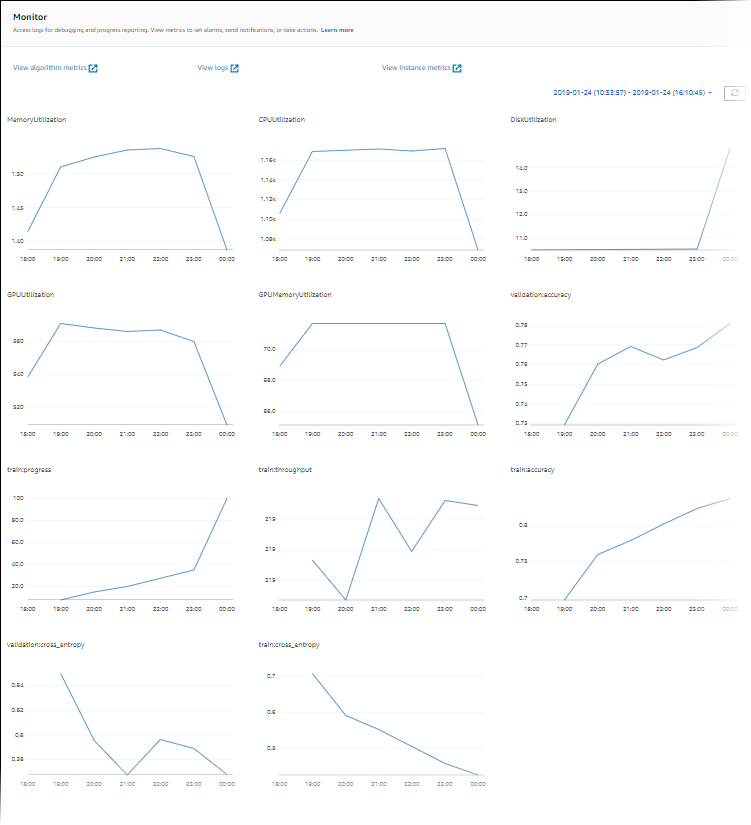

# View training job metrics

You can view the metrics emitted from your Amazon SageMaker training jobs in either the Amazon CloudWatch
or SageMaker AI console.

## Monitor training job metrics (CloudWatch console)

You can monitor the metrics that a training job emits in real time in the CloudWatch
console.

###### To monitor training job metrics (CloudWatch console)

1. Open the CloudWatch console at [https://console.aws.amazon.com/cloudwatch](https://console.aws.amazon.com/cloudwatch "https://console.aws.amazon.com/cloudwatch").
2. Choose **Metrics**, then choose
   **/aws/sagemaker/TrainingJobs**.
3. Choose **TrainingJobName**.
4. On the **All metrics** tab, choose the names of the training
   metrics that you want to monitor.
5. On the **Graphed metrics** tab, configure the graph options.
   For more information about using CloudWatch graphs, see [Graph Metrics](../../../AmazonCloudWatch/latest/monitoring/graph_metrics.md "../../../AmazonCloudWatch/latest/monitoring/graph_metrics.md") in the _Amazon CloudWatch User
   Guide_.

## Monitor training job metrics (SageMaker AI

console)

You can monitor the metrics that a training job emits in real time by using the SageMaker AI
console.

###### To monitor training job metrics (SageMaker AI console)

1. Open the SageMaker AI console at [https://console.aws.amazon.com/sagemaker](https://console.aws.amazon.com/sagemaker "https://console.aws.amazon.com/sagemaker").
2. Choose **Training jobs**, then choose the training job whose
   metrics you want to see.
3. Choose **TrainingJobName**.
4. In the **Monitor** section, you can review the graphs of
   instance utilization and algorithm metrics.

